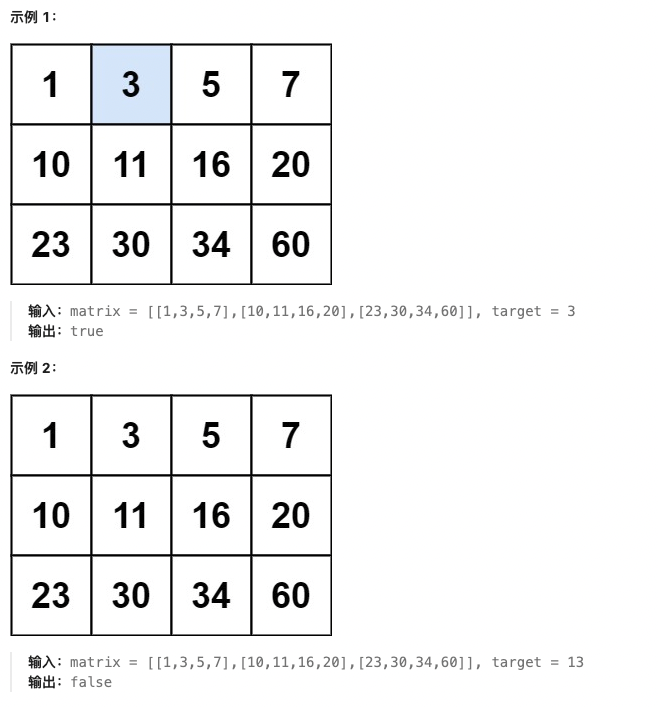

# 二分查找专题

## 🔍 二分查找基础知识

### 📖 定义

**二分查找**（Binary Search）是一种在有序数组中查找特定元素的算法。每次查找时，通过将查找区间分成两半，并只在其中一半继续查找，将查找范围缩小一半。

### ⚡ 核心特征

1. **有序性**：数组必须是有序的（升序或降序）
2. **对数时间**：时间复杂度为O(log n)
3. **区间缩小**：每次比较后，搜索区间缩小一半

### 🎯 二分查找的类型

#### 1. 基本二分查找
```python
# 查找目标值
def binary_search(nums, target):
    left, right = 0, len(nums) - 1
    
    while left <= right:
        mid = (left + right) // 2
        if nums[mid] == target:
            return mid
        elif nums[mid] < target:
            left = mid + 1
        else:
            right = mid - 1
    
    return -1
```

#### 2. 左边界查找（第一个等于target的位置）
```python
# 查找第一个 >= target 的位置
def left_bound(nums, target):
    left, right = 0, len(nums) - 1
    
    while left <= right:
        mid = (left + right) // 2
        if nums[mid] < target:
            left = mid + 1
        else:
            right = mid - 1
    
    return left
```

#### 3. 右边界查找（最后一个等于target的位置）
```python
# 查找最后一个 <= target 的位置
def right_bound(nums, target):
    left, right = 0, len(nums) - 1
    
    while left <= right:
        mid = (left + right) // 2
        if nums[mid] <= target:
            left = mid + 1
        else:
            right = mid - 1
    
    return right
```

### 🐍 Python实现要点

```python
# 防止整数溢出的mid计算
mid = left + (right - left) // 2

# 循环条件：left <= right
# 退出时：left > right

# 查找区间：[left, right]
# 左边界：left = mid + 1 或 right = mid - 1
# 右边界：left = mid + 1 或 right = mid - 1
```

### 📏 二分查找的应用场景

- **查找特定元素**：在有序数组中查找目标值
- **查找插入位置**：找到元素应该插入的位置
- **查找边界**：找到第一个/最后一个满足条件的位置
- **旋转数组查找**：在旋转排序数组中查找元素
- **矩阵搜索**：在有序矩阵中查找元素

---

## 📋 题目目录

| 题号 | 题目名称 | 难度 | 核心技巧 |
|------|----------|------|----------|
| 35 | 搜索插入位置 | 简单 | 基本二分查找 |
| 74 | 搜索二维矩阵 | 中等 | 二维二分查找 |
| 34 | 查找元素的第一个和最后一个位置 | 中等 | 左右边界查找 |
| 33 | 搜索旋转排序数组 | 中等 | 旋转数组二分查找 |
| 153 | 寻找旋转排序数组中的最小值 | 中等 | 旋转数组最小值 |
| 4 | 寻找两个正序数组的中位数 | 困难 | 分治法 |

---

## 35. 搜索插入位置

**题目描述：**

给定一个排序数组和一个目标值，在数组中找到目标值，并返回其索引。如果目标值不存在于数组中，返回它将会被按顺序插入的位置。

请必须使用时间复杂度为 O(log n) 的算法。

**测试用例：**

```
示例 1：
输入: nums = [1,3,5,6], target = 5
输出: 2

示例 2：
输入: nums = [1,3,5,6], target = 2
输出: 1

示例 3：
输入: nums = [1,3,5,6], target = 7
输出: 4
```

**最简单实现：**

```python
def searchInsert(nums, target):
    """
    二分查找插入位置
    
    思路：
    1. 使用二分查找找到第一个 >= target 的位置
    2. 这个位置就是target应该插入的位置
    3. 如果target存在，返回其索引；否则返回插入位置
    
    时间复杂度：O(log n)
    空间复杂度：O(1)
    """
    if not nums:
        return 0
    
    left, right = 0, len(nums) - 1
    
    while left <= right:
        mid = (left + right) // 2
        
        if nums[mid] == target:
            return mid
        elif nums[mid] < target:
            left = mid + 1
        else:
            right = mid - 1
    
    # 此时left就是插入位置
    return left

# 测试用例
print(searchInsert([1,3,5,6], 5))  # 输出: 2
print(searchInsert([1,3,5,6], 2))  # 输出: 1
print(searchInsert([1,3,5,6], 7))  # 输出: 4
print(searchInsert([1,3,5,6], 0))  # 输出: 0
```

**解题思路详解：**

这道题的核心是使用**二分查找**：

**核心原理：**
- 在有序数组中查找目标值
- 如果找到，返回索引
- 如果没找到，返回应该插入的位置

**算法流程：**
1. 初始化left=0, right=len(nums)-1
2. while left <= right:
   - mid = (left + right) // 2
   - 如果nums[mid] == target，返回mid
   - 如果nums[mid] < target，left = mid + 1
   - 如果nums[mid] > target，right = mid - 1
3. 循环结束后，left就是插入位置

**为什么left是插入位置？**
- 当循环退出时，left > right
- left指向第一个 >= target 的位置
- 如果target存在，这个位置就是target的位置
- 如果target不存在，这个位置就是插入位置

**举例说明：**
```
nums = [1,3,5,6], target = 2

初始化：left=0, right=3

第一次循环：
mid = (0+3)//2 = 1, nums[1]=3 > 2
right = 1-1 = 0

第二次循环：
left=0, right=0
mid = (0+0)//2 = 0, nums[0]=1 < 2
left = 0+1 = 1

第三次循环：left=1 > right=0，退出
返回left=1 ✓
```

**时间复杂度证明：**
- 每次循环，搜索区间缩小一半
- 最坏情况：O(log n)
- 总复杂度：O(log n)

---

## 74. 搜索二维矩阵

**题目描述：**

给你一个满足下述两条属性的 m x n 整数矩阵：

- 每行中的整数从左到右按非严格递增顺序排列。
- 每行的第一个整数大于前一行的最后一个整数。

给你一个整数 target ，如果 target 在矩阵中，返回 true ；否则，返回 false 。



**测试用例：**

```
示例 1：
输入：matrix = [[1,3,5,7],[10,11,16,20],[23,30,34,60]], target = 3
输出：true

示例 2：
输入：matrix = [[1,3,5,7],[10,11,16,20],[23,30,34,60]], target = 13
输出：false
```

**最简单实现：**

```python
def searchMatrix(matrix, target):
    """
    搜索二维矩阵：两次二分查找
    
    思路：
    1. 先对行进行二分查找，找到可能包含target的行
    2. 然后在该行中进行二分查找
    
    时间复杂度：O(log m + log n) = O(log(m*n))
    空间复杂度：O(1)
    """
    if not matrix or not matrix[0]:
        return False
    
    m, n = len(matrix), len(matrix[0])
    
    # 第一步：二分查找行
    # 找到最后一行的第一个元素 <= target 的行
    top, bottom = 0, m - 1
    
    while top <= bottom:
        mid_row = (top + bottom) // 2
        if matrix[mid_row][0] <= target:
            # 如果这一行的最后一个元素 >= target，说明找到了
            if matrix[mid_row][-1] >= target:
                # 第二步：在这一行中二分查找
                left, right = 0, n - 1
                while left <= right:
                    mid_col = (left + right) // 2
                    if matrix[mid_row][mid_col] == target:
                        return True
                    elif matrix[mid_row][mid_col] < target:
                        left = mid_col + 1
                    else:
                        right = mid_col - 1
                return False
            else:
                # 这一行的最大值都 < target，继续向下找
                top = mid_row + 1
        else:
            # 这一行的最小值都 > target，向上找
            bottom = mid_row - 1
    
    return False

# 更简洁的实现：将二维矩阵当作一维数组
def searchMatrixSimple(matrix, target):
    """
    将二维矩阵当作一维有序数组进行二分查找
    
    时间复杂度：O(log(m*n))
    空间复杂度：O(1)
    """
    if not matrix or not matrix[0]:
        return False
    
    m, n = len(matrix), len(matrix[0])
    left, right = 0, m * n - 1
    
    while left <= right:
        mid = (left + right) // 2
        # 将一维索引转换为二维索引
        row = mid // n
        col = mid % n
        
        if matrix[row][col] == target:
            return True
        elif matrix[row][col] < target:
            left = mid + 1
        else:
            right = mid - 1
    
    return False

# 测试用例
matrix = [[1,3,5,7],[10,11,16,20],[23,30,34,60]]
print(searchMatrix(matrix, 3))   # 输出: True
print(searchMatrix(matrix, 13))  # 输出: False
print(searchMatrix(matrix, 60))  # 输出: True
```

**解题思路详解：**

这道题的核心是利用矩阵的**有序性**进行二分查找：

**核心原理：**
- 矩阵整体有序：每行递增，每行的第一个元素大于上一行的最后一个元素
- 可以将二维矩阵当作一维有序数组处理

**方法一：两次二分查找**
1. 先对行进行二分查找，找到可能包含target的行
2. 然后在该行中进行二分查找

**方法二：当作一维数组**
1. 将二维矩阵当作一维有序数组
2. 使用二分查找：mid → (row, col) = (mid // n, mid % n)
3. 直接比较matrix[row][col]与target

**举例说明：**
```
matrix = [[1,3,5,7],[10,11,16,20],[23,30,34,60]], target = 3

方法二：当作一维数组 [1,3,5,7,10,11,16,20,23,30,34,60]

left=0, right=11
mid=5, matrix[5//4][5%4] = matrix[1][1] = 11 > 3
right=5-1=4

mid=2, matrix[0][2] = 5 > 3
right=2-1=1

mid=0, matrix[0][0] = 1 < 3
left=0+1=1

mid=1, matrix[0][1] = 3 == 3
返回True ✓
```

**时间复杂度证明：**
- 方法一：O(log m + log n)
- 方法二：O(log(m*n))
- 都是对数时间复杂度

---

## 34. 在排序数组中查找元素的第一个和最后一个位置

**题目描述：**

给你一个按照非递减顺序排列的整数数组 nums，和一个目标值 target。请你找出给定目标值在数组中的开始位置和结束位置。

如果数组中不存在目标值 target，返回 [-1, -1]。

你必须设计并实现时间复杂度为 O(log n) 的算法解决此问题。

**测试用例：**

```
示例 1：
输入：nums = [5,7,7,8,8,10], target = 8
输出：[3,4]

示例 2：
输入：nums = [5,7,7,8,8,10], target = 6
输出：[-1,-1]

示例 3：
输入：nums = [], target = 0
输出：[-1,-1]
```

**最简单实现：**

```python
def searchRange(nums, target):
    """
    查找第一个和最后一个位置：两次二分查找
    
    思路：
    1. 第一次二分查找：找到第一个 >= target 的位置
    2. 第二次二分查找：找到第一个 > target 的位置
    3. 然后判断这两个位置之间的元素是否都等于target
    
    时间复杂度：O(log n)
    空间复杂度：O(1)
    """
    if not nums:
        return [-1, -1]
    
    # 查找左边界：第一个 >= target 的位置
    def find_left_bound():
        left, right = 0, len(nums) - 1
        while left <= right:
            mid = (left + right) // 2
            if nums[mid] < target:
                left = mid + 1
            else:
                right = mid - 1
        return left
    
    # 查找右边界：第一个 > target 的位置
    def find_right_bound():
        left, right = 0, len(nums) - 1
        while left <= right:
            mid = (left + right) // 2
            if nums[mid] <= target:
                left = mid + 1
            else:
                right = mid - 1
        return right
    
    left_bound = find_left_bound()
    right_bound = find_right_bound()
    
    # 检查是否找到了target
    if left_bound <= right_bound and nums[left_bound] == target:
        return [left_bound, right_bound]
    else:
        return [-1, -1]

# 测试用例
print(searchRange([5,7,7,8,8,10], 8))  # 输出: [3,4]
print(searchRange([5,7,7,8,8,10], 6))  # 输出: [-1,-1]
print(searchRange([], 0))               # 输出: [-1,-1]
```

**解题思路详解：**

这道题的核心是使用**两次二分查找**分别找到左右边界：

**核心原理：**
- 左边界：第一个 >= target 的位置
- 右边界：最后一个 <= target 的位置（第一个 > target 的位置 - 1）

**算法流程：**
1. find_left_bound()：找到第一个 >= target 的位置
2. find_right_bound()：找到第一个 > target 的位置
3. 验证：如果left_bound位置的值等于target，且left_bound <= right_bound，返回[left_bound, right_bound]

**左右边界的查找：**
- 左边界：当nums[mid] < target时，left = mid + 1；否则right = mid - 1
- 右边界：当nums[mid] <= target时，left = mid + 1；否则right = mid - 1

**举例说明：**
```
nums = [5,7,7,8,8,10], target = 8

左边界查找：
left=0, right=5
mid=2, nums[2]=7 < 8, left=3
mid=4, nums[4]=8 >= 8, right=3
mid=3, nums[3]=8 >= 8, right=2
退出，left=3

右边界查找：
left=0, right=5
mid=2, nums[2]=7 <= 8, left=3
mid=4, nums[4]=8 <= 8, left=5
mid=5, nums[5]=10 > 8, right=4
退出，right=4

返回[3,4] ✓
```

**时间复杂度证明：**
- 两次二分查找：2 * O(log n)
- 总复杂度：O(log n)

---

## 33. 搜索旋转排序数组

**题目描述：**

整数数组 nums 按升序排列，数组中的值 互不相同 。

在传递给函数之前，nums 在预先未知的某个下标 k（0 <= k < nums.length）上进行了 向左旋转，使数组变为 [nums[k], nums[k+1], ..., nums[n-1], nums[0], nums[1], ..., nums[k-1]]（下标 从 0 开始 计数）。例如， [0,1,2,4,5,6,7] 下标 3 上向左旋转后可能变为 [4,5,6,7,0,1,2] 。

给你 旋转后 的数组 nums 和一个整数 target ，如果 nums 中存在这个目标值 target ，则返回它的下标，否则返回 -1 。

你必须设计一个时间复杂度为 O(log n) 的算法解决此问题。

**测试用例：**

```
示例 1：
输入：nums = [4,5,6,7,0,1,2], target = 0
输出：4

示例 2：
输入：nums = [4,5,6,7,0,1,2], target = 3
输出：-1

示例 3：
输入：nums = [1], target = 0
输出：-1
```

**最简单实现：**

```python
def search(nums, target):
    """
    搜索旋转排序数组：二分查找变体
    
    思路：
    1. 数组被分成两个有序部分：左半部分和右半部分
    2. 通过比较mid与right，判断mid在哪个有序部分
    3. 然后判断target是否在该有序部分
    
    时间复杂度：O(log n)
    空间复杂度：O(1)
    """
    if not nums:
        return -1
    
    left, right = 0, len(nums) - 1
    
    while left <= right:
        mid = (left + right) // 2
        
        if nums[mid] == target:
            return mid
        
        # 判断mid在哪个有序部分
        if nums[mid] >= nums[left]:  # mid在左半部分（包含等于的情况）
            # 左半部分有序
            if nums[left] <= target < nums[mid]:
                # target在左半部分
                right = mid - 1
            else:
                # target在右半部分
                left = mid + 1
        else:  # mid在右半部分
            # 右半部分有序
            if nums[mid] < target <= nums[right]:
                # target在右半部分
                left = mid + 1
            else:
                # target在左半部分
                right = mid - 1
    
    return -1

# 测试用例
print(search([4,5,6,7,0,1,2], 0))  # 输出: 4
print(search([4,5,6,7,0,1,2], 3))  # 输出: -1
print(search([1], 0))               # 输出: -1
```

**解题思路详解：**

这道题的核心是**二分查找在旋转数组上的应用**：

**核心原理：**
- 旋转数组被分成两个有序部分
- 通过mid值判断它属于哪个有序部分
- 然后在对应的有序部分中查找target

**关键判断：**
- 如果nums[mid] >= nums[left]：mid在左半部分（升序）
- 否则：mid在右半部分（升序）

**查找逻辑：**
- 当mid在左半部分时：
  - 如果target在[nums[left], nums[mid])范围内，在左半部分查找
  - 否则在右半部分查找
- 当mid在右半部分时：
  - 如果target在(nums[mid], nums[right]]范围内，在右半部分查找
  - 否则在左半部分查找

**举例说明：**
```
nums = [4,5,6,7,0,1,2], target = 0

left=0, right=6, mid=3, nums[3]=7
nums[3]=7 >= nums[0]=4，mid在左半部分
target=0不在[4,7)范围内，去右半部分查找
left=4

left=4, right=6, mid=5, nums[5]=1
nums[5]=1 < nums[4]=0，mid在右半部分
target=0不在(1,2]范围内，去左半部分查找
right=4

left=4, right=4, mid=4, nums[4]=0 == target
返回4 ✓
```

**时间复杂度证明：**
- 每次循环，搜索区间缩小一半
- 最坏情况：O(log n)
- 总复杂度：O(log n)

---

## 153. 寻找旋转排序数组中的最小值

**题目描述：**

已知一个长度为 n 的数组，预先按照升序排列，经由 1 到 n 次 旋转 后，得到输入数组。例如，原数组 nums = [0,1,2,4,5,6,7] 在变化后可能得到：
- 若旋转 4 次，则可以得到 [4,5,6,7,0,1,2]
- 若旋转 7 次，则可以得到 [0,1,2,4,5,6,7]

注意，数组 [a[0], a[1], a[2], ..., a[n-1]] 旋转一次 的结果为数组 [a[n-1], a[0], a[1], a[2], ..., a[n-2]] 。

给你一个元素值 互不相同 的数组 nums ，它原来是一个升序排列的数组，并按上述情形进行了多次旋转。请你找出并返回数组中的 最小元素 。

你必须设计一个时间复杂度为 O(log n) 的算法解决此问题。

**测试用例：**

```
示例 1：
输入：nums = [3,4,5,1,2]
输出：1

示例 2：
输入：nums = [4,5,6,7,0,1,2]
输出：0

示例 3：
输入：nums = [11,13,15,17]
输出：11
```

**最简单实现：**

```python
def findMin(nums):
    """
    寻找旋转排序数组中的最小值：二分查找
    
    思路：
    1. 旋转数组的最小值是唯一一个比前一个元素小的元素
    2. 使用二分查找：
       - 如果nums[mid] > nums[right]，最小值在右半部分
       - 否则，最小值在左半部分（包含mid）
    
    时间复杂度：O(log n)
    空间复杂度：O(1)
    """
    if not nums:
        return -1
    
    left, right = 0, len(nums) - 1
    
    # 如果数组没有旋转（完全升序），返回第一个元素
    if nums[left] <= nums[right]:
        return nums[left]
    
    while left < right:
        mid = (left + right) // 2
        
        # 如果nums[mid] > nums[right]，说明最小值在右半部分
        if nums[mid] > nums[right]:
            left = mid + 1
        else:
            # 最小值在左半部分（包含mid）
            right = mid
    
    return nums[left]

# 测试用例
print(findMin([3,4,5,1,2]))     # 输出: 1
print(findMin([4,5,6,7,0,1,2])) # 输出: 0
print(findMin([11,13,15,17]))   # 输出: 11
```

**解题思路详解：**

这道题的核心是使用**二分查找**找到旋转点：

**核心原理：**
- 旋转数组的最小值是唯一一个比其前一个元素小的元素
- 可以通过二分查找快速定位这个位置

**算法流程：**
1. 处理特殊情况：如果数组完全升序，返回nums[0]
2. 二分查找：
   - 如果nums[mid] > nums[right]，最小值在右半部分，left = mid + 1
   - 否则，最小值在左半部分（包含mid），right = mid
3. 循环结束时，left指向最小值位置

**为什么这样判断？**
- 在旋转数组中，最小值左侧的元素都大于等于nums[right]
- 最大值右侧的元素都小于等于nums[left]
- 通过比较nums[mid]和nums[right]可以确定最小值的位置

**举例说明：**
```
nums = [4,5,6,7,0,1,2]

left=0, right=6, mid=3, nums[3]=7 > nums[6]=2
最小值在右半部分，left=4

left=4, right=6, mid=5, nums[5]=1 > nums[6]=2? 1<2
最小值在左半部分，right=5

left=4, right=5, mid=4, nums[4]=0 <= nums[5]=1
最小值在左半部分，right=4

left=4, right=4，退出
返回nums[4]=0 ✓
```

**时间复杂度证明：**
- 每次循环，搜索区间缩小一半
- 最坏情况：O(log n)
- 总复杂度：O(log n)

---

## 4. 寻找两个正序数组的中位数

**题目描述：**

给定两个大小分别为 m 和 n 的正序（从小到大）数组 nums1 和 nums2。请你找出并返回这两个正序数组的 中位数 。

算法的时间复杂度应该为 O(log (m+n)) 。

**测试用例：**

```
示例 1：
输入：nums1 = [1,3], nums2 = [2]
输出：2.00000
解释：合并数组 = [1,2,3] ，中位数 2

示例 2：
输入：nums1 = [1,2], nums2 = [3,4]
输出：2.50000
解释：合并数组 = [1,2,3,4] ，中位数 (2 + 3) / 2 = 2.5
```

**最简单实现：**

```python
def findMedianSortedArrays(nums1, nums2):
    """
    寻找两个正序数组的中位数：二分查找
    
    思路：
    1. 确保nums1是较短的数组
    2. 对nums1进行二分查找，找到分割点
    3. 计算分割后左右两部分的元素个数
    4. 调整分割点直到满足中位数条件
    
    时间复杂度：O(log min(m,n))
    空间复杂度：O(1)
    """
    # 确保nums1是较短的数组
    if len(nums1) > len(nums2):
        nums1, nums2 = nums2, nums1
    
    m, n = len(nums1), len(nums2)
    total = m + n
    half = (total + 1) // 2  # 左半部分应该有的元素个数
    
    left, right = 0, m
    
    while left <= right:
        # nums1的分割点
        i = (left + right) // 2  # nums1[0..i-1]在左半部分
        # nums2的分割点
        j = half - i  # nums2[0..j-1]在左半部分
        
        # 获取分割点的左右元素
        nums1_left = nums1[i-1] if i > 0 else float('-inf')
        nums1_right = nums1[i] if i < m else float('inf')
        nums2_left = nums2[j-1] if j > 0 else float('-inf')
        nums2_right = nums2[j] if j < n else float('inf')
        
        # 检查分割是否正确
        if nums1_left <= nums2_right and nums2_left <= nums1_right:
            # 找到了正确的分割
            if total % 2 == 1:
                # 奇数个元素，中位数是左半部分的最大值
                return max(nums1_left, nums2_left)
            else:
                # 偶数个元素，中位数是左右半部分最大值的平均
                return (max(nums1_left, nums2_left) + min(nums1_right, nums2_right)) / 2
        elif nums1_left > nums2_right:
            # nums1左边元素太大，需要减少i
            right = i - 1
        else:
            # nums2左边元素太大，需要增加i
            left = i + 1
    
    raise ValueError("Input arrays are not sorted")

# 测试用例
print(findMedianSortedArrays([1,3], [2]))        # 输出: 2.0
print(findMedianSortedArrays([1,2], [3,4]))      # 输出: 2.5
print(findMedianSortedArrays([0,0], [0,0]))      # 输出: 0.0
```

**解题思路详解：**

这道题的核心是使用**二分查找**找到正确的分割点：

**核心原理：**
- 将两个有序数组分割成左右两部分
- 左半部分包含较小的元素，右半部分包含较大的元素
- 确保左半部分的最大值 ≤ 右半部分的最小值

**算法流程：**
1. 确保nums1是较短的数组
2. 对nums1进行二分查找，确定分割点i
3. 计算nums2的分割点j = (m+n+1)//2 - i
4. 检查分割是否正确：
   - nums1左半最大 ≤ nums2右半最小
   - nums2左半最大 ≤ nums1右半最小
5. 根据元素总数的奇偶性返回中位数

**分割示意图：**
```
nums1: [1,3]     nums2: [2]
分割点i=1, j=1

左半部分：nums1[0]=1, nums2[0]=2    最大值=2
右半部分：nums1[1]=3                 最小值=3

2 <= 3，满足条件 ✓
中位数：2（奇数个元素，取左半最大）
```

**时间复杂度证明：**
- 对较短数组进行二分查找：O(log min(m,n))
- 满足O(log(m+n))的要求
- 总复杂度：O(log min(m,n))

---

## 🎯 二分查找解题技巧总结

### 1. 二分查找模板
```python
def binary_search_template(nums, target):
    """标准二分查找模板"""
    left, right = 0, len(nums) - 1
    
    while left <= right:
        mid = left + (right - left) // 2
        
        if nums[mid] == target:
            return mid
        elif nums[mid] < target:
            left = mid + 1
        else:
            right = mid - 1
    
    return -1
```

### 2. 查找左右边界
```python
def find_left_bound(nums, target):
    """查找第一个 >= target 的位置"""
    left, right = 0, len(nums) - 1
    
    while left <= right:
        mid = left + (right - left) // 2
        if nums[mid] < target:
            left = mid + 1
        else:
            right = mid - 1
    
    return left

def find_right_bound(nums, target):
    """查找最后一个 <= target 的位置"""
    left, right = 0, len(nums) - 1
    
    while left <= right:
        mid = left + (right - left) // 2
        if nums[mid] <= target:
            left = mid + 1
        else:
            right = mid - 1
    
    return right
```

### 3. 旋转数组查找
```python
def search_rotated_array(nums, target):
    """旋转数组二分查找"""
    left, right = 0, len(nums) - 1
    
    while left <= right:
        mid = left + (right - left) // 2
        
        if nums[mid] == target:
            return mid
        
        if nums[mid] >= nums[left]:  # mid在左半部分
            if nums[left] <= target < nums[mid]:
                right = mid - 1
            else:
                left = mid + 1
        else:  # mid在右半部分
            if nums[mid] < target <= nums[right]:
                left = mid + 1
            else:
                right = mid - 1
    
    return -1
```

### 4. 矩阵搜索
```python
def search_matrix(matrix, target):
    """二维矩阵二分查找"""
    if not matrix or not matrix[0]:
        return False
    
    m, n = len(matrix), len(matrix[0])
    left, right = 0, m * n - 1
    
    while left <= right:
        mid = left + (right - left) // 2
        row, col = mid // n, mid % n
        
        if matrix[row][col] == target:
            return True
        elif matrix[row][col] < target:
            left = mid + 1
        else:
            right = mid - 1
    
    return False
```

### 💡 解题技巧

1. **确定边界条件**：left和right的初始值和循环条件
2. **计算mid**：使用`left + (right - left) // 2`避免溢出
3. **循环退出条件**：left > right时的处理
4. **边界情况**：空数组、单元素数组等
5. **有序性保证**：确保数组有序或部分有序

二分查找是算法基础，掌握各种变体可以解决很多查找问题！
