# 二叉树专题

## 🔍 二叉树基础知识

### 📖 定义

**二叉树**（Binary Tree）是每个节点最多有两个子树的树结构。通常子树被称作"左子树"和"右子树"。

### ⚡ 核心概念

1. **根节点（Root）**：树的最顶层节点，没有父节点
2. **叶子节点（Leaf）**：没有子节点的节点
3. **内部节点（Internal Node）**：有至少一个子节点的节点
4. **父节点（Parent）**：子节点的上级节点
5. **子节点（Child）**：父节点的下级节点
6. **兄弟节点（Sibling）**：有相同父节点的节点

### 🎯 二叉树的类型

#### 1. 完全二叉树（Complete Binary Tree）
- 除了最底层，其他层都被完全填充
- 最底层从左向右填充

#### 2. 满二叉树（Full Binary Tree）
- 除了叶子节点，每个节点都有两个子节点

#### 3. 二叉搜索树（Binary Search Tree）
- 左子树所有节点值 < 根节点值
- 右子树所有节点值 > 根节点值
- 左右子树都是BST

#### 4. 平衡二叉树（Balanced Binary Tree）
- 任意节点的左右子树高度差不超过1

### 🐍 二叉树的遍历

#### 1. 前序遍历（Pre-order）：根 -> 左 -> 右
```python
def preorder_traversal(root):
    if not root:
        return []
    return [root.val] + preorder_traversal(root.left) + preorder_traversal(root.right)
```

#### 2. 中序遍历（In-order）：左 -> 根 -> 右
```python
def inorder_traversal(root):
    if not root:
        return []
    return inorder_traversal(root.left) + [root.val] + inorder_traversal(root.right)
```

#### 3. 后序遍历（Post-order）：左 -> 右 -> 根
```python
def postorder_traversal(root):
    if not root:
        return []
    return postorder_traversal(root.left) + postorder_traversal(root.right) + [root.val]
```

#### 4. 层序遍历（Level-order）：逐层从左到右
```python
from collections import deque

def level_order_traversal(root):
    if not root:
        return []
    result = []
    queue = deque([root])

    while queue:
        level_size = len(queue)
        level = []
        for _ in range(level_size):
            node = queue.popleft()
            level.append(node.val)
            if node.left:
                queue.append(node.left)
            if node.right:
                queue.append(node.right)
        result.append(level)

    return result
```

### 📊 二叉树的基本操作

#### 1. 计算树的高度
```python
def get_height(root):
    if not root:
        return 0
    return 1 + max(get_height(root.left), get_height(root.right))
```

#### 2. 计算节点总数
```python
def count_nodes(root):
    if not root:
        return 0
    return 1 + count_nodes(root.left) + count_nodes(root.right)
```

#### 3. 判断是否为叶子节点
```python
def is_leaf(root):
    return root and not root.left and not root.right
```

### 🏃‍♂️ 二叉树经典问题分类

- **遍历问题**：前序、中序、后序、层序遍历
- **属性问题**：高度、节点数、直径、对称性
- **搜索问题**：BST验证、查找、最近公共祖先
- **构造问题**：根据遍历序列重建、数组转BST
- **路径问题**：路径和、最大路径和
- **变换问题**：翻转、展开为链表

---

## 📋 题目目录

| 题号 | 题目名称 | 难度 | 核心技巧 |
|------|----------|------|----------|
| 94 | 二叉树的中序遍历 | 简单 | 递归/迭代遍历 |
| 104 | 二叉树的最大深度 | 简单 | 递归 |
| 226 | 翻转二叉树 | 简单 | 递归 |
| 101 | 对称二叉树 | 简单 | 递归 |
| 543 | 二叉树的直径 | 简单 | 递归 |
| 102 | 二叉树的层序遍历 | 中等 | 队列BFS |
| 108 | 有序数组转BST | 简单 | 二分法+递归 |
| 98 | 验证二叉搜索树 | 中等 | 中序遍历 |
| 230 | BST中第K小元素 | 中等 | 中序遍历 |
| 199 | 二叉树的右视图 | 中等 | BFS层序遍历 |
| 114 | 二叉树展开为链表 | 中等 | 递归修改指针 |
| 105 | 前中序构造二叉树 | 中等 | 递归构造 |
| 437 | 路径总和 III | 中等 | 前缀和+DFS |
| 236 | 二叉树的最近公共祖先 | 中等 | 递归查找 |
| 124 | 二叉树中的最大路径和 | 困难 | 递归计算 |

---

## 94. 二叉树的中序遍历

**题目描述：**

给定一个二叉树的根节点 `root` ，返回 它的 **中序遍历** 。

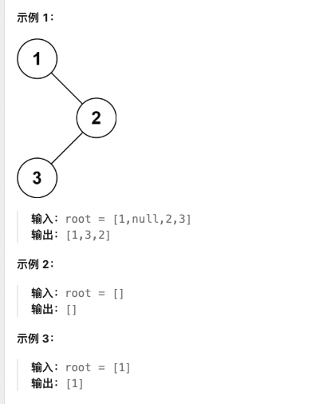

**测试用例：**

```
示例 1：
输入：root = [1,null,2,3]
输出：[1,3,2]

示例 2：
输入：root = []
输出：[]

示例 3：
输入：root = [1]
输出：[1]
```

**最简单实现：**

```python
# Definition for a binary tree node.
class TreeNode:
    def __init__(self, val=0, left=None, right=None):
        self.val = val
        self.left = left
        self.right = right

def inorderTraversal(root):
    """
    二叉树的中序遍历：递归法

    思路：
    1. 中序遍历顺序：左子树 -> 根节点 -> 右子树
    2. 递归处理左子树，将结果加入到结果列表
    3. 将当前节点值加入结果列表
    4. 递归处理右子树，将结果加入到结果列表

    时间复杂度：O(n)
    空间复杂度：O(h)，h为树的高度，最坏情况O(n)
    """
    result = []

    def inorder(node):
        if not node:
            return
        # 左子树
        inorder(node.left)
        # 根节点
        result.append(node.val)
        # 右子树
        inorder(node.right)

    inorder(root)
    return result

# 迭代版本
def inorderTraversal_iterative(root):
    """
    迭代版本：使用栈模拟递归

    时间复杂度：O(n)
    空间复杂度：O(h)
    """
    if not root:
        return []

    result = []
    stack = []
    current = root

    while current or stack:
        # 一直向左走，将节点压入栈
        while current:
            stack.append(current)
            current = current.left

        # 弹出栈顶元素，访问它
        current = stack.pop()
        result.append(current.val)

        # 转向右子树
        current = current.right

    return result

# 测试用例
# 创建二叉树：[1,null,2,3]
root = TreeNode(1)
root.right = TreeNode(2)
root.right.left = TreeNode(3)

print(inorderTraversal(root))  # 输出: [1, 3, 2]
```

**解题思路详解：**

这道题的核心是**二叉树的中序遍历**：

**核心原理：**
- 中序遍历顺序：左子树 -> 根节点 -> 右子树
- 对于BST，中序遍历结果是有序的
- 递归法：自然符合遍历顺序
- 迭代法：使用栈模拟递归过程

**递归法流程：**
1. 递归终止条件：节点为空
2. 递归遍历左子树
3. 访问当前节点（加入结果）
4. 递归遍历右子树

**迭代法流程：**
1. 初始化栈和当前节点
2. 循环条件：当前节点不为空或栈不为空
3. 向左走到最底层，将路径上的节点压栈
4. 弹出栈顶节点，访问它
5. 转向右子树继续

**为什么有效？**
- 递归法：代码简洁，符合直觉思维
- 迭代法：避免递归栈溢出，更高效
- 都能保证中序遍历的正确顺序

**举例说明：**
```
二叉树：
    1
     \
      2
     /
    3

中序遍历过程：
1. 从根节点1开始
2. 递归到左子树（空）
3. 访问1，加入结果：[1]
4. 递归到右子树2
5. 对2递归到左子树3
6. 对3递归到左子树（空）
7. 访问3，加入结果：[1,3]
8. 对3递归到右子树（空）
9. 返回到2，访问2，加入结果：[1,3,2]
10. 对2递归到右子树（空）

最终结果：[1,3,2] ✓
```

**时间复杂度证明：**
- 每个节点只访问一次
- 时间复杂度：O(n)

**空间复杂度证明：**
- 递归法：O(h)，最坏情况退化为链表，O(n)
- 迭代法：O(h)，栈空间

---

## 104. 二叉树的最大深度

**题目描述：**

给定一个二叉树 `root` ，返回其最大深度。

二叉树的 **最大深度** 是指从根节点到最远叶子节点的最长路径上的节点数。

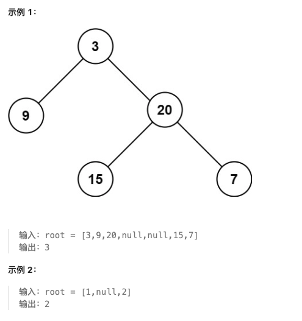

**测试用例：**

```
示例 1：
输入：root = [3,9,20,null,null,15,7]
输出：3

示例 2：
输入：root = [1,null,2]
输出：2
```

**最简单实现：**

```python
def maxDepth(root):
    """
    二叉树的最大深度：递归法

    思路：
    1. 如果根节点为空，深度为0
    2. 否则，深度等于左右子树深度的最大值加1
    3. 递归计算左右子树的深度

    时间复杂度：O(n)
    空间复杂度：O(h)，h为树的高度
    """
    if not root:
        return 0

    left_depth = maxDepth(root.left)
    right_depth = maxDepth(root.right)

    return max(left_depth, right_depth) + 1

# 迭代版本（层序遍历）
def maxDepth_iterative(root):
    """
    迭代版本：BFS层序遍历

    时间复杂度：O(n)
    空间复杂度：O(w)，w为树的最大宽度
    """
    from collections import deque

    if not root:
        return 0

    queue = deque([root])
    depth = 0

    while queue:
        level_size = len(queue)
        depth += 1

        for _ in range(level_size):
            node = queue.popleft()
            if node.left:
                queue.append(node.left)
            if node.right:
                queue.append(node.right)

    return depth

# 测试用例
# 创建二叉树：[3,9,20,null,null,15,7]
root = TreeNode(3)
root.left = TreeNode(9)
root.right = TreeNode(20)
root.right.left = TreeNode(15)
root.right.right = TreeNode(7)

print(maxDepth(root))  # 输出: 3
```

**解题思路详解：**

这道题的核心是**树的高度计算**：

**核心原理：**
- 树的高度 = max(左子树高度, 右子树高度) + 1
- 叶子节点高度为1，空节点高度为0
- 递归法：自底向上计算
- 迭代法：自顶向下层序遍历

**递归法流程：**
1. 递归终止条件：节点为空，返回0
2. 递归计算左子树高度
3. 递归计算右子树高度
4. 返回左右子树最大高度加1

**迭代法流程：**
1. 使用队列进行BFS
2. 每一层遍历完，深度加1
3. 最后返回深度值

**为什么有效？**
- 递归法：符合树的高度定义
- 迭代法：层序遍历天然计算深度
- 都能正确处理各种树形结构

**举例说明：**
```
二叉树：
    3
   / \
  9  20
     / \
    15  7

计算过程：
节点3的深度 = max(节点9的深度, 节点20的深度) + 1
节点9是叶子，深度 = 1
节点20的深度 = max(节点15的深度, 节点7的深度) + 1 = max(1, 1) + 1 = 2
节点3的深度 = max(1, 2) + 1 = 3 ✓
```

**时间复杂度证明：**
- 每个节点只访问一次
- 时间复杂度：O(n)

**空间复杂度证明：**
- 递归法：O(h)，最坏情况O(n)
- 迭代法：O(w)，最坏情况O(n)

---

## 226. 翻转二叉树

**题目描述：**

给你一棵二叉树的根节点 `root` ，翻转这棵二叉树，并返回其根节点。

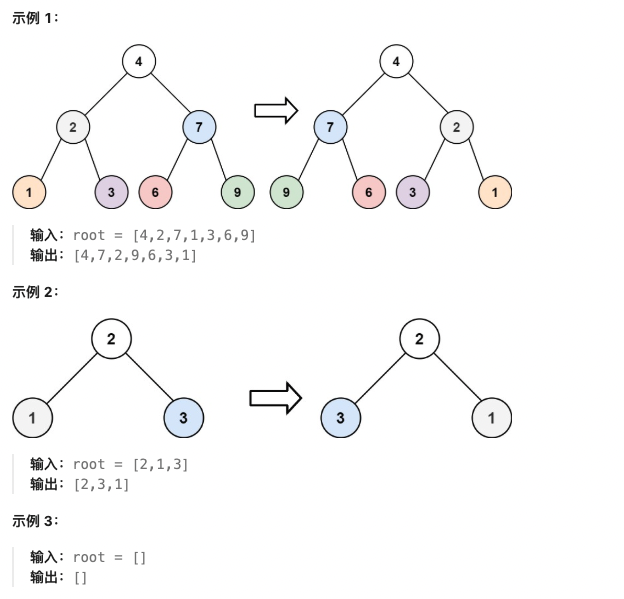

**测试用例：**

```
示例 1：
输入：root = [4,2,7,1,3,6,9]
输出：[4,7,2,9,6,3,1]

示例 2：
输入：root = [2,1,3]
输出：[2,3,1]

示例 3：
输入：root = []
输出：[]
```

**最简单实现：**

```python
def invertTree(root):
    """
    翻转二叉树：递归法

    思路：
    1. 如果当前节点为空，直接返回
    2. 递归翻转左子树
    3. 递归翻转右子树
    4. 交换左右子树
    5. 返回根节点

    时间复杂度：O(n)
    空间复杂度：O(h)，h为树的高度
    """
    if not root:
        return None

    # 递归翻转左右子树
    left = invertTree(root.left)
    right = invertTree(root.right)

    # 交换左右子树
    root.left = right
    root.right = left

    return root

# 迭代版本（层序遍历）
def invertTree_iterative(root):
    """
    迭代版本：BFS层序遍历

    时间复杂度：O(n)
    空间复杂度：O(w)，w为树的最大宽度
    """
    from collections import deque

    if not root:
        return None

    queue = deque([root])

    while queue:
        node = queue.popleft()

        # 交换左右子树
        node.left, node.right = node.right, node.left

        # 将子节点加入队列
        if node.left:
            queue.append(node.left)
        if node.right:
            queue.append(node.right)

    return root

# 测试用例
# 创建二叉树：[4,2,7,1,3,6,9]
root = TreeNode(4)
root.left = TreeNode(2, TreeNode(1), TreeNode(3))
root.right = TreeNode(7, TreeNode(6), TreeNode(9))

result = invertTree(root)
print("翻转成功")
```

**解题思路详解：**

这道题的核心是**二叉树的镜像翻转**：

**核心原理：**
- 翻转意味着左右子树交换
- 递归法：自底向上翻转
- 迭代法：自顶向下层序翻转
- 每个节点的左右子树都交换

**递归法流程：**
1. 递归终止条件：节点为空
2. 先递归翻转左子树
3. 再递归翻转右子树
4. 交换当前节点的左右子树

**迭代法流程：**
1. 使用队列进行BFS
2. 对每个节点，交换其左右子树
3. 将子节点加入队列继续处理

**为什么有效？**
- 递归法：符合树的自相似性
- 迭代法：层序遍历保证顺序
- 都能保证整棵树都被正确翻转

**举例说明：**
```
原始二叉树：
    4
   / \
  2   7
 / \ / \
1  3 6  9

翻转后的二叉树：
    4
   / \
  7   2
 / \ / \
9  6 3  1

过程：
1. 翻转根节点4的左右子树
2. 递归翻转左子树2：交换1和3
3. 递归翻转右子树7：交换6和9
4. 最终得到镜像二叉树 ✓
```

**时间复杂度证明：**
- 每个节点只访问一次
- 时间复杂度：O(n)

**空间复杂度证明：**
- 递归法：O(h)，最坏情况O(n)
- 迭代法：O(w)，最坏情况O(n)

---

## 101. 对称二叉树

**题目描述：**

给你一个二叉树的根节点 `root` ， 检查它是否轴对称。

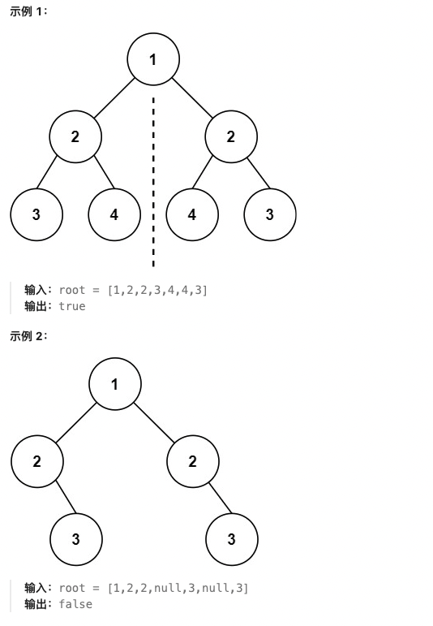

**测试用例：**

```
示例 1：
输入：root = [1,2,2,3,4,4,3]
输出：true

示例 2：
输入：root = [1,2,2,null,3,null,3]
输出：false
```

**最简单实现：**

```python
def isSymmetric(root):
    """
    对称二叉树：递归法

    思路：
    1. 如果根节点为空，对称
    2. 递归比较左右子树是否对称
    3. 两个子树对称的条件：
       - 根节点值相等
       - 左子树的左子树和右子树的右子树对称
       - 左子树的右子树和右子树的左子树对称

    时间复杂度：O(n)
    空间复杂度：O(h)，h为树的高度
    """
    def is_mirror(left, right):
        # 两个空节点，对称
        if not left and not right:
            return True
        # 一个空一个不空，不对称
        if not left or not right:
            return False
        # 值不相等，不对称
        if left.val != right.val:
            return False

        # 递归比较：左的左和右的右，左的右和右的左
        return is_mirror(left.left, right.right) and is_mirror(left.right, right.left)

    if not root:
        return True

    return is_mirror(root.left, root.right)

# 迭代版本（层序遍历）
def isSymmetric_iterative(root):
    """
    迭代版本：BFS层序遍历

    时间复杂度：O(n)
    空间复杂度：O(w)，w为树的最大宽度
    """
    from collections import deque

    if not root:
        return True

    queue = deque([root.left, root.right])

    while queue:
        left = queue.popleft()
        right = queue.popleft()

        # 两个空节点，继续
        if not left and not right:
            continue
        # 一个空一个不空，不对称
        if not left or not right:
            return False
        # 值不相等，不对称
        if left.val != right.val:
            return False

        # 按照对称顺序加入队列
        queue.append(left.left)
        queue.append(right.right)
        queue.append(left.right)
        queue.append(right.left)

    return True

# 测试用例
# 创建对称二叉树：[1,2,2,3,4,4,3]
root = TreeNode(1)
root.left = TreeNode(2, TreeNode(3), TreeNode(4))
root.right = TreeNode(2, TreeNode(4), TreeNode(3))

print(isSymmetric(root))  # True
```

**解题思路详解：**

这道题的核心是**二叉树的镜像对称检查**：

**核心原理：**
- 对称意味着左右子树互为镜像
- 递归比较：左子树和右子树的值及结构
- 迭代方式：层序遍历，比较每层的对称位置

**递归法流程：**
1. 定义辅助函数is_mirror比较两个子树
2. 空节点处理：两个都空为真，一个空为假
3. 值比较：节点值必须相等
4. 递归比较：左左vs右右，左右vs右左

**迭代法流程：**
1. 使用队列，初始放入左右子树
2. 每次取出两个节点比较
3. 按照对称顺序加入子节点

**为什么有效？**
- 递归法：直接模拟镜像比较
- 迭代法：层序遍历保证对比顺序
- 都能检测出任何不对称的情况

**举例说明：**
```
对称二叉树：
    1
   / \
  2   2
 / \ / \
3  4 4  3

比较过程：
根节点1的左右子树都是2 ✓
比较左2和右2的子树：
左2的左子树3 vs 右2的右子树3 ✓
左2的右子树4 vs 右2的左子树4 ✓

所有比较都通过，对称 ✓
```

**时间复杂度证明：**
- 每个节点只访问一次
- 时间复杂度：O(n)

**空间复杂度证明：**
- 递归法：O(h)，最坏情况O(n)
- 迭代法：O(w)，最坏情况O(n)

---

## 543. 二叉树的直径

**题目描述：**

给你一棵二叉树的根节点，返回该树的 **直径** 。

二叉树的 **直径** 是指树中任意两个节点之间最长路径的 **长度** 。这条路径可能经过也可能不经过根节点 `root` 。

两节点之间路径的 **长度** 由它们之间边数表示。

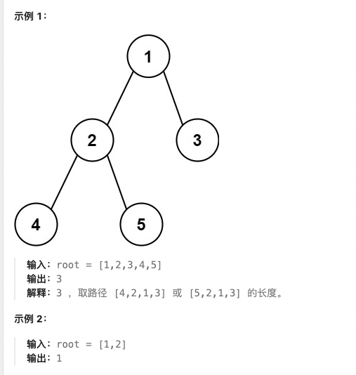

**测试用例：**

```
示例 1：
输入：root = [1,2,3,4,5]
输出：3
解释：节点 4 和节点 5 的路径长度为 3

示例 2：
输入：root = [1,2]
输出：1
```

**最简单实现：**

```python
def diameterOfBinaryTree(root):
    """
    二叉树的直径：递归法

    思路：
    1. 直径是任意两个节点间的最长路径
    2. 路径长度 = 经过的边数 = 节点数 - 1
    3. 对于每个节点，计算经过该节点的最长路径
    4. 最长路径 = 左子树深度 + 右子树深度
    5. 更新全局最大直径

    时间复杂度：O(n)
    空间复杂度：O(h)，h为树的高度
    """
    max_diameter = 0

    def depth(node):
        nonlocal max_diameter
        if not node:
            return 0

        # 计算左右子树的深度
        left_depth = depth(node.left)
        right_depth = depth(node.right)

        # 更新直径：左深度 + 右深度
        max_diameter = max(max_diameter, left_depth + right_depth)

        # 返回当前节点的深度
        return max(left_depth, right_depth) + 1

    depth(root)
    return max_diameter

# 测试用例
# 创建二叉树：[1,2,3,4,5]
root = TreeNode(1)
root.left = TreeNode(2, TreeNode(4), TreeNode(5))
root.right = TreeNode(3)

print(diameterOfBinaryTree(root))  # 输出: 3
```

**解题思路详解：**

这道题的核心是**树中最长路径的计算**：

**核心原理：**
- 直径是节点间最长路径的边数
- 路径不一定经过根节点
- 经过某节点的最长路径 = 左深度 + 右深度
- 在计算深度的同时更新全局最大值

**算法流程：**
1. 定义全局变量max_diameter
2. 定义depth函数计算节点深度
3. 在depth函数中更新直径：left_depth + right_depth
4. 返回当前节点的深度：max(left, right) + 1

**为什么有效？**
- 在计算每个节点深度的同时，考虑经过该节点的情况
- 深度计算天然是后序遍历
- 能覆盖所有可能的路径情况

**举例说明：**
```
二叉树：
    1
   / \
  2   3
 / \
4   5

节点深度：
4: 1, 5: 1, 2: 2, 3: 1, 1: 3

直径计算：
节点2：左深度1 + 右深度1 = 2
节点1：左深度2 + 右深度1 = 3

最大直径：3（节点4-2-5的路径）✓
```

**时间复杂度证明：**
- 每个节点只访问一次
- 时间复杂度：O(n)

**空间复杂度证明：**
- 递归栈深度：O(h)
- 最坏情况：O(n)

---

## 102. 二叉树的层序遍历

**题目描述：**

给你二叉树的根节点 `root` ，返回其节点值的 **层序遍历** 。 （即逐层地，从左到右访问所有节点）。

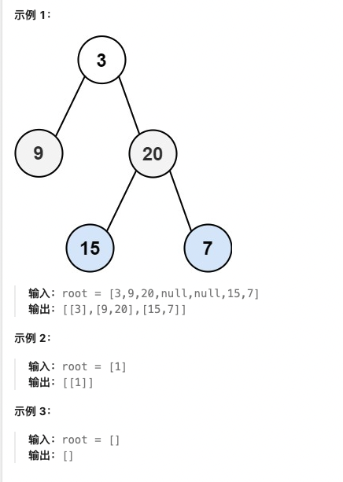

**测试用例：**

```
示例 1：
输入：root = [3,9,20,null,null,15,7]
输出：[[3],[9,20],[15,7]]

示例 2：
输入：root = [1]
输出：[[1]]

示例 3：
输入：root = []
输出：[]
```

**最简单实现：**

```python
from collections import deque

def levelOrder(root):
    """
    二叉树的层序遍历：BFS

    思路：
    1. 使用队列进行BFS
    2. 每一层用一个列表存储节点值
    3. 按照从左到右的顺序访问节点
    4. 返回所有层的列表

    时间复杂度：O(n)
    空间复杂度：O(w)，w为树的最大宽度
    """
    if not root:
        return []

    result = []
    queue = deque([root])

    while queue:
        level_size = len(queue)
        level = []

        for _ in range(level_size):
            node = queue.popleft()
            level.append(node.val)

            # 将子节点加入队列
            if node.left:
                queue.append(node.left)
            if node.right:
                queue.append(node.right)

        result.append(level)

    return result

# 递归版本（DFS）
def levelOrder_recursive(root):
    """
    递归版本：DFS + 深度记录

    时间复杂度：O(n)
    空间复杂度：O(h)
    """
    result = []

    def dfs(node, depth):
        if not node:
            return

        # 确保result有足够的层
        if len(result) == depth:
            result.append([])

        result[depth].append(node.val)

        dfs(node.left, depth + 1)
        dfs(node.right, depth + 1)

    dfs(root, 0)
    return result

# 测试用例
# 创建二叉树：[3,9,20,null,null,15,7]
root = TreeNode(3)
root.left = TreeNode(9)
root.right = TreeNode(20, TreeNode(15), TreeNode(7))

print(levelOrder(root))  # [[3], [9, 20], [15, 7]]
```

**解题思路详解：**

这道题的核心是**二叉树的广度优先遍历**：

**核心原理：**
- 层序遍历需要按层访问节点
- BFS使用队列，天然按层处理
- DFS通过深度参数记录层级
- 保证每层从左到右的顺序

**BFS流程：**
1. 使用队列，初始放入根节点
2. 记录当前层的节点数
3. 处理当前层的所有节点
4. 将下一层的节点加入队列

**DFS流程：**
1. 递归函数带depth参数
2. 根据depth索引result列表
3. 先序遍历：根->左->右

**为什么有效？**
- BFS：队列保证层序访问
- DFS：深度参数保证层级记录
- 都能返回正确的层序结果

**举例说明：**
```
二叉树：
    3
   / \
  9  20
     / \
    15  7

BFS过程：
队列初始：[3]
第1层：弹出3，加入[9,20]，结果[[3]]
第2层：弹出9,20，加入[15,7]，结果[[3],[9,20]]
第3层：弹出15,7，队列空，结果[[3],[9,20],[15,7]] ✓
```

**时间复杂度证明：**
- 每个节点入队出队一次
- 时间复杂度：O(n)

**空间复杂度证明：**
- BFS：O(w)，队列存储最宽层的节点
- DFS：O(h)，递归栈深度

---

## 108. 将有序数组转换为二叉搜索树

**题目描述：**

给你一个整数数组 `nums` ，其中元素已经按 **升序** 排列，请你将其转换为一棵 **平衡** 二叉搜索树。

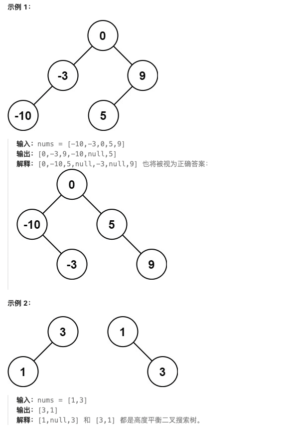

**测试用例：**

```
示例 1：
输入：nums = [-10,-3,0,5,9]
输出：[0,-3,9,-10,null,5]
解释：[0,-10,5,null,-3,null,9] 也将被视为正确答案

示例 2：
输入：nums = [1,3]
输出：[3,1]
解释：[1,null,3] 和 [3,1] 都是高度平衡二叉搜索树
```

**最简单实现：**

```python
def sortedArrayToBST(nums):
    """
    有序数组转换为BST：递归 + 二分法

    思路：
    1. BST的中序遍历是有序的
    2. 选择数组中间元素作为根节点
    3. 递归处理左半数组作为左子树
    4. 递归处理右半数组作为右子树
    5. 这样构造的BST一定是平衡的

    时间复杂度：O(n)
    空间复杂度：O(log n)，递归栈空间
    """
    def build_tree(left, right):
        if left > right:
            return None

        # 选择中间元素作为根节点
        mid = (left + right) // 2
        root = TreeNode(nums[mid])

        # 递归构建左右子树
        root.left = build_tree(left, mid - 1)
        root.right = build_tree(mid + 1, right)

        return root

    return build_tree(0, len(nums) - 1)

# 测试用例
nums = [-10, -3, 0, 5, 9]
root = sortedArrayToBST(nums)

# 中序遍历验证：应该是有序的
def inorder_traversal(root):
    if not root:
        return []
    return inorder_traversal(root.left) + [root.val] + inorder_traversal(root.right)

print(inorder_traversal(root))  # [-10, -3, 0, 5, 9]
```

**解题思路详解：**

这道题的核心是**有序数组构造平衡BST**：

**核心原理：**
- BST中序遍历是有序序列
- 选择中间元素作为根节点保证平衡
- 二分法构造左右子树
- 递归保证树的高度平衡

**算法流程：**
1. 定义递归函数build_tree(left, right)
2. 递归终止：left > right返回None
3. 选择中间元素mid作为根节点
4. 递归构造左子树build_tree(left, mid-1)
5. 递归构造右子树build_tree(mid+1, right)

**为什么有效？**
- 中间元素作为根，左右子树规模相近
- 递归保证每棵子树都平衡
- 构造出的BST高度为log n

**举例说明：**
```
有序数组：[-10, -3, 0, 5, 9]

构造过程：
选择中间元素0作为根
左半数组[-10,-3]，中间元素-3作为左子树根
右半数组[5,9]，中间元素5作为右子树根

最终BST：
    0
   / \
 -3   5
 / \   \
-10  null 9

中序遍历：-10, -3, 0, 5, 9（有序）✓
```

**时间复杂度证明：**
- 每个数组元素创建一个节点
- 时间复杂度：O(n)

**空间复杂度证明：**
- 递归栈深度：O(log n)
- 最坏情况：O(n)

---

## 98. 验证二叉搜索树

**题目描述：**

给你一个二叉树的根节点 `root` ，判断其是否是一个有效的二叉搜索树。

**有效** 二叉搜索树定义如下：

- 节点的左子树只包含 **严格小于** 当前节点的数。
- 节点的右子树只包含 **严格大于** 当前节点的数。
- 所有左子树和右子树自身必须也是二叉搜索树。

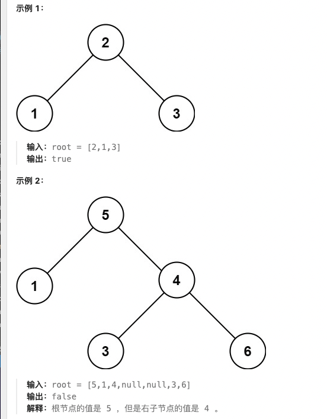

**测试用例：**

```
示例 1：
输入：root = [2,1,3]
输出：true

示例 2：
输入：root = [5,1,4,null,null,3,6]
输出：false
解释：根节点的值是 5 ，但是右子节点的值是 4
```

**最简单实现：**

```python
def isValidBST(root):
    """
    验证二叉搜索树：中序遍历法

    思路：
    1. BST的中序遍历结果应该是严格递增的
    2. 使用中序遍历得到节点值序列
    3. 检查序列是否严格递增

    时间复杂度：O(n)
    空间复杂度：O(n)
    """
    def inorder_traversal(node):
        if not node:
            return []
        return inorder_traversal(node.left) + [node.val] + inorder_traversal(node.right)

    # 获取中序遍历结果
    inorder_result = inorder_traversal(root)

    # 检查是否严格递增
    for i in range(1, len(inorder_result)):
        if inorder_result[i] <= inorder_result[i-1]:
            return False

    return True

# 递归验证法（空间O(h)）
def isValidBST_recursive(root):
    """
    递归验证法：传递上下界

    时间复杂度：O(n)
    空间复杂度：O(h)
    """
    def validate(node, min_val, max_val):
        if not node:
            return True

        # 检查当前节点值是否在有效范围内
        if not (min_val < node.val < max_val):
            return False

        # 递归检查左右子树
        return (validate(node.left, min_val, node.val) and
                validate(node.right, node.val, max_val))

    return validate(root, float('-inf'), float('inf'))

# 测试用例
# 创建BST：[2,1,3]
root = TreeNode(2, TreeNode(1), TreeNode(3))
print(isValidBST(root))  # True

# 创建非BST：[5,1,4,null,null,3,6]
root2 = TreeNode(5, TreeNode(1), TreeNode(4, TreeNode(3), TreeNode(6)))
print(isValidBST(root2))  # False
```

**解题思路详解：**

这道题的核心是**BST性质的验证**：

**核心原理：**
- BST中序遍历结果严格递增
- 递归验证：每个节点有上下界约束
- 中序遍历法：检查遍历序列的递增性

**中序遍历法流程：**
1. 进行中序遍历得到节点值序列
2. 检查相邻元素是否满足严格递增

**递归验证法流程：**
1. 传递当前节点的有效值范围[min_val, max_val]
2. 检查当前节点值是否在范围内
3. 递归检查左子树：范围更新为[min_val, node.val)
4. 递归检查右子树：范围更新为(node.val, max_val]

**为什么有效？**
- 中序遍历法：直接利用BST的性质
- 递归验证法：自顶向下剪枝，避免无效情况
- 都能准确判断BST的合法性

**举例说明：**
```
非BST示例：
    5
   / \
  1   4
     / \
    3   6

中序遍历：[1,5,3,4,6]
检查递增：1<5>3<4<6，不满足严格递增 ✗
```

**时间复杂度证明：**
- 每个节点只访问一次
- 时间复杂度：O(n)

**空间复杂度证明：**
- 中序遍历法：O(n)存储序列
- 递归验证法：O(h)递归栈

---

## 230. 二叉搜索树中第 K 小的元素

**题目描述：**

给定一个二叉搜索树的根节点 `root` ，和一个整数 `k` ，请你设计一个算法查找其中第 `k` 小的元素（从 1 开始计数）。

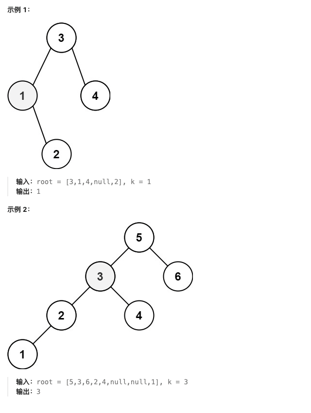

**测试用例：**

```
示例 1：
输入：root = [3,1,4,null,2], k = 1
输出：1

示例 2：
输入：root = [5,3,6,2,4,null,null,1], k = 3
输出：3
```

**最简单实现：**

```python
def kthSmallest(root, k):
    """
    BST中第K小的元素：中序遍历

    思路：
    1. BST的中序遍历结果是有序的
    2. 使用中序遍历得到第k小的元素
    3. 当遍历到第k个元素时返回

    时间复杂度：O(h + k)，h为树的高度
    空间复杂度：O(h)
    """
    count = 0
    result = None

    def inorder(node):
        nonlocal count, result
        if not node or result is not None:
            return

        # 遍历左子树
        inorder(node.left)

        # 访问当前节点
        count += 1
        if count == k:
            result = node.val
            return

        # 遍历右子树
        inorder(node.right)

    inorder(root)
    return result

# 迭代版本
def kthSmallest_iterative(root, k):
    """
    迭代版本：栈模拟中序遍历

    时间复杂度：O(h + k)
    空间复杂度：O(h)
    """
    stack = []
    current = root
    count = 0

    while current or stack:
        # 向左走到最底层
        while current:
            stack.append(current)
            current = current.left

        # 弹出栈顶元素
        current = stack.pop()
        count += 1

        # 找到第k小的元素
        if count == k:
            return current.val

        # 转向右子树
        current = current.right

    return None

# 测试用例
# 创建BST：[3,1,4,null,2]
root = TreeNode(3)
root.left = TreeNode(1, None, TreeNode(2))
root.right = TreeNode(4)

print(kthSmallest(root, 1))  # 1
print(kthSmallest(root, 3))  # 3
```

**解题思路详解：**

这道题的核心是**BST的有序性质**：

**核心原理：**
- BST中序遍历结果是升序序列
- 第k小的元素就是中序遍历的第k个元素
- 递归法：自然的中序遍历
- 迭代法：栈模拟中序遍历

**递归法流程：**
1. 定义全局计数器和结果变量
2. 中序遍历：左->根->右
3. 每次访问节点，计数器加1
4. 当计数器等于k时，记录结果

**迭代法流程：**
1. 使用栈模拟中序遍历
2. 向左走到最底层，沿途压栈
3. 弹出栈顶，计数，检查是否为第k个
4. 转向右子树继续

**为什么有效？**
- BST的中序遍历天然有序
- 不需要完整遍历，只需要找到第k个
- 递归和迭代都能控制遍历过程

**举例说明：**
```
BST：
    3
   / \
  1   4
   \
    2

中序遍历：[1,2,3,4]
第1小：1
第3小：3 ✓
```

**时间复杂度证明：**
- 平均情况：O(h + k)
- 最坏情况：O(n)，k=n时

**空间复杂度证明：**
- 递归法：O(h)栈空间
- 迭代法：O(h)栈空间

---

## 199. 二叉树的右视图

**题目描述：**

给定一个二叉树的 **根节点** `root`，想象自己站在它的右侧，按照从顶部到底部的顺序，返回从右侧所能看到的节点值。

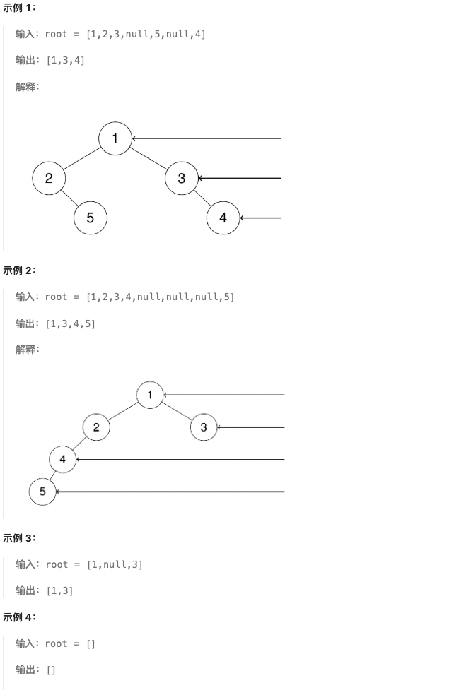

**测试用例：**

```
示例 1：
输入：root = [1,2,3,null,5,null,4]
输出：[1,3,4]

示例 2：
输入：root = [1,null,3]
输出：[1,3]

示例 3：
输入：root = []
输出：[]
```

**最简单实现：**

```python
from collections import deque

def rightSideView(root):
    """
    二叉树的右视图：BFS层序遍历

    思路：
    1. 使用BFS层序遍历
    2. 每一层的最后一个节点就是右视图能看到的
    3. 记录每一层的最后一个节点值

    时间复杂度：O(n)
    空间复杂度：O(w)，w为树的最大宽度
    """
    if not root:
        return []

    result = []
    queue = deque([root])

    while queue:
        level_size = len(queue)

        # 遍历当前层
        for i in range(level_size):
            node = queue.popleft()

            # 每一层的最后一个节点
            if i == level_size - 1:
                result.append(node.val)

            # 加入子节点
            if node.left:
                queue.append(node.left)
            if node.right:
                queue.append(node.right)

    return result

# DFS版本（右优先）
def rightSideView_dfs(root):
    """
    DFS版本：右子树优先

    时间复杂度：O(n)
    空间复杂度：O(h)
    """
    result = []

    def dfs(node, depth):
        if not node:
            return

        # 第一次到达这个深度，记录右视图
        if depth == len(result):
            result.append(node.val)

        # 右子树优先
        dfs(node.right, depth + 1)
        dfs(node.left, depth + 1)

    dfs(root, 0)
    return result

# 测试用例
# 创建二叉树：[1,2,3,null,5,null,4]
root = TreeNode(1)
root.left = TreeNode(2, None, TreeNode(5))
root.right = TreeNode(3, None, TreeNode(4))

print(rightSideView(root))  # [1,3,4]
```

**解题思路详解：**

这道题的核心是**层序遍历的右视图**：

**核心原理：**
- 右视图是每层最右边的节点
- BFS：层序遍历，取每层最后一个
- DFS：右子树优先，先序遍历记录深度

**BFS流程：**
1. 使用队列进行层序遍历
2. 记录每层的节点数
3. 每层最后一个节点加入结果

**DFS流程：**
1. 深度优先，右子树优先
2. 使用depth参数记录层级
3. 第一次到达某个深度时记录节点值

**为什么有效？**
- BFS：天然层序，易于取每层最后一个
- DFS：右优先保证最右节点先被访问
- 都能正确得到右视图

**举例说明：**
```
二叉树：
    1
   / \
  2   3
   \   \
    5   4

层序遍历：
第0层：[1] -> 右视图：1
第1层：[2,3] -> 右视图：3
第2层：[5,4] -> 右视图：4

最终结果：[1,3,4] ✓
```

**时间复杂度证明：**
- 每个节点只访问一次
- 时间复杂度：O(n)

**空间复杂度证明：**
- BFS：O(w)，队列存储最宽层
- DFS：O(h)，递归栈深度

---

## 114. 二叉树展开为链表

**题目描述：**

给你二叉树的根结点 `root` ，请你将它展开为一个单链表：

- 展开后的单链表应该同样使用 `TreeNode` ，其中 `right` 子指针指向链表中下一个结点，而左子指针始终为 `null` 。
- 展开后的单链表应该与二叉树 **先序遍历** 顺序相同。

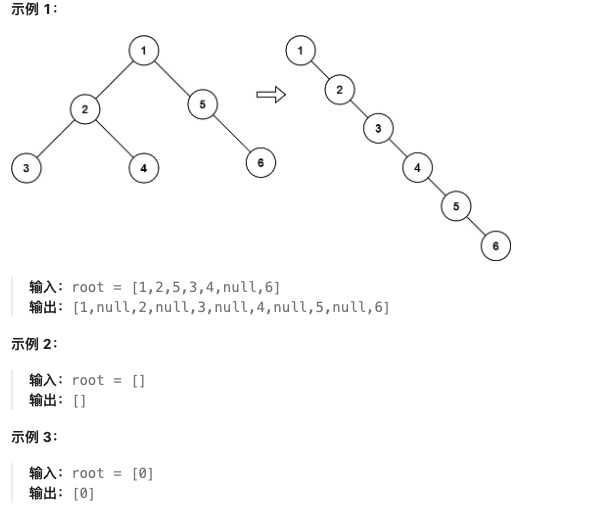

**测试用例：**

```
示例 1：
输入：root = [1,2,5,3,4,null,6]
输出：[1,null,2,null,3,null,4,null,5,null,6]

示例 2：
输入：root = []
输出：[]

示例 3：
输入：root = [0]
输出：[0]
```

**最简单实现：**

```python
def flatten(root):
    """
    二叉树展开为链表：递归法

    思路：
    1. 对于每个节点，先递归处理左右子树
    2. 将左子树插入到右子树之前
    3. 原来的右子树接到左子树的最右节点
    4. 将左子树置为null

    时间复杂度：O(n)
    空间复杂度：O(h)，h为树的高度
    """
    def flatten_tree(node):
        if not node:
            return None

        # 递归处理左右子树
        left_tail = flatten_tree(node.left)
        right_tail = flatten_tree(node.right)

        # 如果有左子树，将其移到右边
        if node.left:
            # 找到左子树的最右节点
            if left_tail:
                left_tail.right = node.right
            else:
                node.left.right = node.right

            # 将左子树设置为右子树
            node.right = node.left
            node.left = None

        # 返回当前子树的最右节点
        if right_tail:
            return right_tail
        elif left_tail:
            return left_tail
        else:
            return node

    flatten_tree(root)

# 迭代版本
def flatten_iterative(root):
    """
    迭代版本：前序遍历修改

    时间复杂度：O(n)
    空间复杂度：O(1)
    """
    if not root:
        return

    current = root
    while current:
        if current.left:
            # 找到左子树的最右节点
            rightmost = current.left
            while rightmost.right:
                rightmost = rightmost.right

            # 将右子树接到左子树的最右节点
            rightmost.right = current.right

            # 将左子树移到右边
            current.right = current.left
            current.left = None

        # 移动到下一个节点
        current = current.right

# 测试用例
# 创建二叉树：[1,2,5,3,4,null,6]
root = TreeNode(1)
root.left = TreeNode(2, TreeNode(3), TreeNode(4))
root.right = TreeNode(5, None, TreeNode(6))

flatten(root)
# 展开后：1 -> 2 -> 3 -> 4 -> 5 -> 6
```

**解题思路详解：**

这道题的核心是**二叉树原地转换为链表**：

**核心原理：**
- 展开为右链表，保持先序遍历顺序
- 递归法：后序处理子树
- 迭代法：原地修改指针
- 左子树插入右子树之前

**递归法流程：**
1. 递归处理左右子树，返回子树尾节点
2. 将左子树移到右子树位置
3. 原右子树接到左子树尾部

**迭代法流程：**
1. 从根节点开始遍历
2. 如果有左子树，找到左子树最右节点
3. 将右子树接到左子树尾部
4. 将左子树移到右边

**为什么有效？**
- 递归法：清晰的子树处理逻辑
- 迭代法：空间复杂度更优
- 都保持了先序遍历的顺序

**举例说明：**
```
原始二叉树：
    1
   / \
  2   5
 / \   \
3  4    6

展开过程：
1. 处理根1：左子树尾节点4，右子树尾节点6
2. 4.right = 5，1.right = 2，1.left = None
3. 结果：1 -> 2 -> 3 -> 4 -> 5 -> 6 ✓
```

**时间复杂度证明：**
- 每个节点只访问常数次
- 时间复杂度：O(n)

**空间复杂度证明：**
- 递归法：O(h)栈空间
- 迭代法：O(1)

---

## 105. 从前序与中序遍历序列构造二叉树

**题目描述：**

给定两个整数数组 `preorder` 和 `inorder` ，其中 `preorder` 是二叉树的先序遍历， `inorder` 是同一棵树的中序遍历，请构造二叉树并返回其根节点。

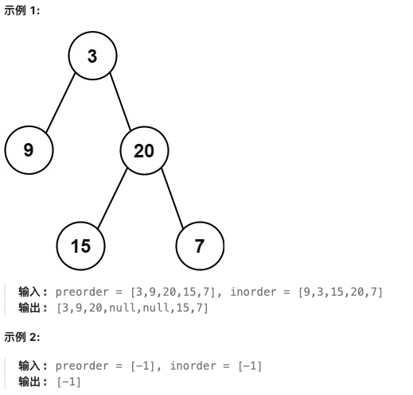

**测试用例：**

```
示例 1：
输入：preorder = [3,9,20,15,7], inorder = [9,3,15,20,7]
输出：[3,9,20,null,null,15,7]

示例 2：
输入：preorder = [-1], inorder = [-1]
输出：[-1]
```

**最简单实现：**

```python
def buildTree(preorder, inorder):
    """
    从前序与中序遍历序列构造二叉树：递归法

    思路：
    1. 前序遍历：根->左->右
    2. 中序遍历：左->根->右
    3. 前序第一个元素是根节点
    4. 在中序中找到根节点，左边是左子树，右边是右子树
    5. 递归构造左右子树

    时间复杂度：O(n)
    空间复杂度：O(n)
    """
    if not preorder or not inorder:
        return None

    # 前序第一个元素是根节点
    root_val = preorder[0]
    root = TreeNode(root_val)

    # 在中序中找到根节点的位置
    root_index = inorder.index(root_val)

    # 分割左右子树
    left_inorder = inorder[:root_index]
    right_inorder = inorder[root_index + 1:]

    left_preorder = preorder[1:1 + len(left_inorder)]
    right_preorder = preorder[1 + len(left_inorder):]

    # 递归构造左右子树
    root.left = buildTree(left_preorder, left_inorder)
    root.right = buildTree(right_preorder, right_inorder)

    return root

# 优化版本：使用哈希表
def buildTree_optimized(preorder, inorder):
    """
    优化版本：哈希表存储中序位置

    时间复杂度：O(n)
    空间复杂度：O(n)
    """
    # 构建中序值到索引的映射
    inorder_map = {val: idx for idx, val in enumerate(inorder)}
    preorder_idx = 0

    def build(left, right):
        nonlocal preorder_idx
        if left > right:
            return None

        # 前序遍历取根节点
        root_val = preorder[preorder_idx]
        preorder_idx += 1
        root = TreeNode(root_val)

        # 在中序中找到根位置
        mid = inorder_map[root_val]

        # 递归构造左右子树
        root.left = build(left, mid - 1)
        root.right = build(mid + 1, right)

        return root

    return build(0, len(inorder) - 1)

# 测试用例
preorder = [3, 9, 20, 15, 7]
inorder = [9, 3, 15, 20, 7]
root = buildTree(preorder, inorder)

print("构造成功")
```

**解题思路详解：**

这道题的核心是**根据遍历序列重建二叉树**：

**核心原理：**
- 前序：根->左->右
- 中序：左->根->右
- 前序第一个元素确定根节点
- 中序根据根节点分割左右子树

**算法流程：**
1. 前序第一个元素作为根节点
2. 在中序中找到根节点位置
3. 左边是左子树，右边是右子树
4. 计算前序中左右子树的范围
5. 递归构造左右子树

**为什么有效？**
- 前序确定根节点顺序
- 中序确定左右子树范围
- 递归保证每棵子树都能正确构造

**举例说明：**
```
前序：[3,9,20,15,7]
中序：[9,3,15,20,7]

1. 前序首元素3为根
2. 中序中3的位置，左边[9]为左子树，右边[15,20,7]为右子树
3. 前序中左子树[9]，右子树[20,15,7]
4. 递归构造完成 ✓
```

**时间复杂度证明：**
- 每个节点处理一次
- 时间复杂度：O(n)

**空间复杂度证明：**
- 递归栈：O(h)
- 哈希表：O(n)
- 总空间：O(n)

---

## 437. 路径总和 III

**题目描述：**

给定一个二叉树的根节点 `root` ，和一个整数 `targetSum` ，求该二叉树里节点值之和等于 `targetSum` 的 **路径** 的数目。

路径 不需要从根节点开始，也不需要在叶子节点结束，但是路径方向必须是向下的（只能从父节点到子节点）。

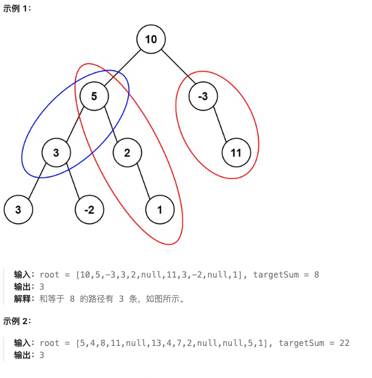

**测试用例：**

```
示例 1：
输入：root = [10,5,-3,3,2,null,11,3,-2,null,1], targetSum = 8
输出：3
解释：等于 8 的路径有 3 条

示例 2：
输入：root = [5,4,8,11,null,13,4,7,2,null,null,5,1], targetSum = 22
输出：3
```

**最简单实现：**

```python
def pathSum(root, targetSum):
    """
    路径总和 III：前缀和 + DFS

    思路：
    1. 使用DFS遍历所有路径
    2. 在每个节点处，计算从根到当前节点的路径和
    3. 使用前缀和思想，查找和为targetSum的子路径
    4. 递归处理左右子树

    时间复杂度：O(n)
    空间复杂度：O(h)
    """
    # 前缀和计数器
    prefix_sum_count = {0: 1}  # 和为0的路径有1条（空路径）
    result = 0

    def dfs(node, current_sum):
        nonlocal result
        if not node:
            return

        # 更新当前路径和
        current_sum += node.val

        # 查找是否存在前缀和为 current_sum - targetSum
        needed = current_sum - targetSum
        if needed in prefix_sum_count:
            result += prefix_sum_count[needed]

        # 将当前和加入前缀和计数器
        prefix_sum_count[current_sum] = prefix_sum_count.get(current_sum, 0) + 1

        # 递归处理左右子树
        dfs(node.left, current_sum)
        dfs(node.right, current_sum)

        # 回溯：移除当前和
        prefix_sum_count[current_sum] -= 1

    dfs(root, 0)
    return result

# 暴力版本（两重DFS）
def pathSum_brute(root, targetSum):
    """
    暴力版本：每个节点作为起点DFS

    时间复杂度：O(n^2)
    空间复杂度：O(h)
    """
    if not root:
        return 0

    def dfs_from_node(node, current_sum):
        if not node:
            return 0

        count = 0
        current_sum += node.val

        if current_sum == targetSum:
            count += 1

        # 继续向下搜索
        count += dfs_from_node(node.left, current_sum)
        count += dfs_from_node(node.right, current_sum)

        return count

    # 从每个节点开始搜索
    return (dfs_from_node(root, 0) +
            pathSum_brute(root.left, targetSum) +
            pathSum_brute(root.right, targetSum))

# 测试用例
# 创建二叉树
root = TreeNode(10)
root.left = TreeNode(5, TreeNode(3, TreeNode(3), TreeNode(-2)), TreeNode(2, None, TreeNode(1)))
root.right = TreeNode(-3, None, TreeNode(11))

print(pathSum(root, 8))  # 3
```

**解题思路详解：**

这道题的核心是**路径和的前缀和优化**：

**核心原理：**
- 路径不限于根节点开始
- 每个节点都可以作为路径起点
- 前缀和：current_sum - prefix_sum = targetSum
- DFS遍历所有可能路径

**前缀和法流程：**
1. 使用哈希表存储前缀和出现次数
2. DFS过程中维护当前路径和
3. 查找current_sum - targetSum是否存在
4. 递归处理左右子树，回溯时移除当前和

**暴力法流程：**
1. 每个节点作为路径起点
2. 从该节点向下DFS，累加路径和
3. 统计和等于targetSum的路径数

**为什么有效？**
- 前缀和：O(1)时间内查找子路径和
- 暴力法：直观但效率较低
- 都能找到所有有效路径

**举例说明：**
```
二叉树路径和：
路径：5 -> 3 -> -2，和为8
路径：5 -> 2 -> 1，和为8
路径：3，和为8

前缀和计算：
节点10：和10，查找10-8=2，无
节点5：和15，查找15-8=7，无
节点3：和18，查找18-8=10，有 ✓
...
```

**时间复杂度证明：**
- 前缀和法：O(n)
- 暴力法：O(n^2)

**空间复杂度证明：**
- 递归栈：O(h)
- 哈希表：O(n)

---

## 236. 二叉树的最近公共祖先

**题目描述：**

给定一个二叉树, 找到该树中两个指定节点的最近公共祖先。

百度百科中最近公共祖先的定义为："对于有根树 T 的两个节点 p、q，最近公共祖先表示为一个节点 x，满足 x 是 p、q 的祖先且 x 的深度尽可能大（一个节点也可以是它自己的祖先）。”

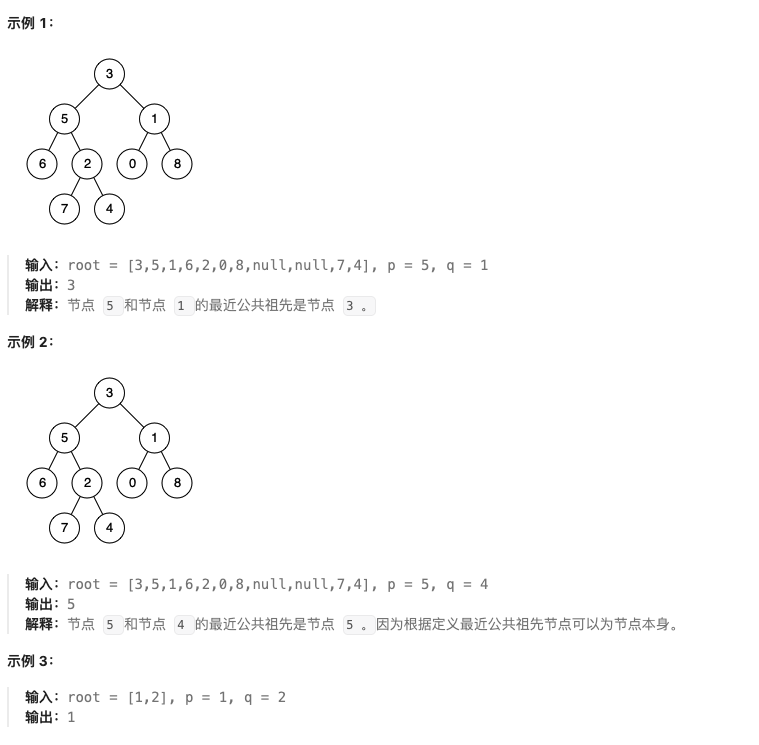

**测试用例：**

```
示例 1：
输入：root = [3,5,1,6,2,0,8,null,null,7,4], p = 5, q = 1
输出：3
解释：节点 5 和节点 1 的 LCA 是 3

示例 2：
输入：root = [3,5,1,6,2,0,8,null,null,7,4], p = 5, q = 4
输出：5
解释：节点 5 和节点 4 的 LCA 是 5
```

**最简单实现：**

```python
def lowestCommonAncestor(root, p, q):
    """
    二叉树的最近公共祖先：递归法

    思路：
    1. 如果当前节点为空，返回None
    2. 如果当前节点是p或q，返回当前节点
    3. 递归查找左右子树的结果
    4. 如果左右子树都找到了，当前节点是LCA
    5. 如果只有一边找到了，返回那一边的结果

    时间复杂度：O(n)
    空间复杂度：O(h)
    """
    if not root:
        return None

    # 如果当前节点是p或q，直接返回
    if root == p or root == q:
        return root

    # 递归查找左右子树
    left = lowestCommonAncestor(root.left, p, q)
    right = lowestCommonAncestor(root.right, p, q)

    # 如果左右子树都找到了，当前节点是LCA
    if left and right:
        return root

    # 如果只有一边找到了，返回那一边的结果
    return left if left else right

# 测试用例
# 创建二叉树：[3,5,1,6,2,0,8,null,null,7,4]
root = TreeNode(3)
root.left = TreeNode(5, TreeNode(6), TreeNode(2, TreeNode(7), TreeNode(4)))
root.right = TreeNode(1, TreeNode(0), TreeNode(8))

p = root.left  # 5
q = root.right  # 1

result = lowestCommonAncestor(root, p, q)
print(result.val)  # 3
```

**解题思路详解：**

这道题的核心是**树的后序遍历查找**：

**核心原理：**
- LCA是p和q的共同祖先中深度最大的
- 后序遍历：左右根的顺序
- 当左右子树都找到目标节点时，当前节点是LCA
- 递归返回找到的节点

**算法流程：**
1. 递归终止：节点为空返回None
2. 递归终止：找到p或q返回当前节点
3. 递归查找左右子树结果
4. 如果左右都有结果，当前节点是LCA
5. 否则返回有结果的一边

**为什么有效？**
- 后序遍历保证子树先被处理
- 左右子树的结果决定当前节点的角色
- 递归天然处理树形结构

**举例说明：**
```
二叉树：
    3
   / \
  5   1
 / \
6   2

查找5和1的LCA：
节点3：左子树返回5，右子树返回1
左右都有结果，3是LCA ✓
```

**时间复杂度证明：**
- 最坏情况遍历整棵树
- 时间复杂度：O(n)

**空间复杂度证明：**
- 递归栈深度：O(h)
- 最坏情况：O(n)

---

## 124. 二叉树中的最大路径和

**题目描述：**

二叉树中的 **路径** 被定义为一条节点序列，序列中每对相邻节点之间都存在一条边。同一个节点在一条路径序列中 **至多出现一次** 。该路径 **至少包含一个** 节点，且不一定经过根节点。

**路径和** 是路径中各节点值的总和。

给你一个二叉树的根节点 `root` ，返回其 **最大路径和** 。

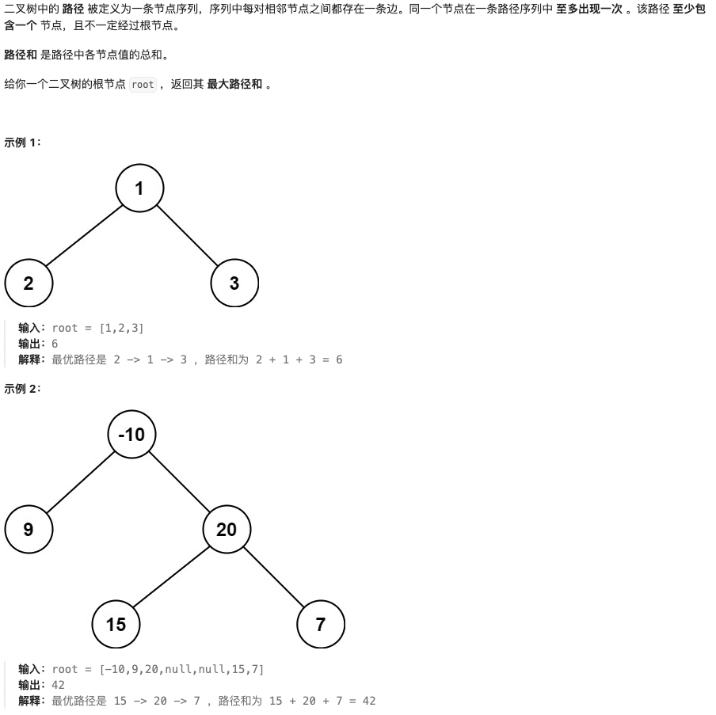

**测试用例：**

```
示例 1：
输入：root = [1,2,3]
输出：6
解释：最优路径是 2 -> 1 -> 3 ，路径和为 2 + 1 + 3 = 6

示例 2：
输入：root = [-10,9,20,null,null,15,7]
输出：42
解释：最优路径是 15 -> 20 -> 7 ，路径和为 15 + 20 + 7 = 42
```

**最简单实现：**

```python
def maxPathSum(root):
    """
    二叉树中的最大路径和：递归计算

    思路：
    1. 对于每个节点，计算经过该节点的路径的最大和
    2. 路径可以只包含当前节点，或包含左右子树的路径
    3. 更新全局最大路径和
    4. 返回以当前节点为端点的最大路径和

    时间复杂度：O(n)
    空间复杂度：O(h)
    """
    max_sum = float('-inf')

    def dfs(node):
        nonlocal max_sum
        if not node:
            return 0

        # 计算左右子树的最大贡献值
        left_gain = max(dfs(node.left), 0)
        right_gain = max(dfs(node.right), 0)

        # 当前节点的路径和 = 节点值 + 左右贡献
        current_path = node.val + left_gain + right_gain

        # 更新全局最大值
        max_sum = max(max_sum, current_path)

        # 返回以当前节点为端点的最大路径和
        return node.val + max(left_gain, right_gain)

    dfs(root)
    return max_sum

# 测试用例
# 创建二叉树：[1,2,3]
root = TreeNode(1, TreeNode(2), TreeNode(3))
print(maxPathSum(root))  # 6

# 创建二叉树：[-10,9,20,null,null,15,7]
root2 = TreeNode(-10, TreeNode(9), TreeNode(20, TreeNode(15), TreeNode(7)))
print(maxPathSum(root2))  # 42
```

**解题思路详解：**

这道题的核心是**树中路径和的最大值计算**：

**核心原理：**
- 路径可以不经过根节点
- 对于每个节点，计算经过该节点的最大路径
- 返回以该节点为端点的最大路径贡献
- 全局变量记录最大值

**算法流程：**
1. 定义全局变量max_sum记录最大路径和
2. dfs函数返回以当前节点为端点的最大贡献
3. 计算当前节点路径和 = val + left_gain + right_gain
4. 更新全局最大值
5. 返回节点值 + max(左贡献, 右贡献)

**为什么有效？**
- dfs返回值是单侧最大贡献
- 路径和计算包含节点和两侧贡献
- 后序遍历保证子树先被处理

**举例说明：**
```
二叉树：
    -10
   /   \
  9    20
      /  \
     15   7

节点20的路径和：15 + 20 + 7 = 42
节点-10的路径和：-10 + 9 = -1
节点9的路径和：9

最大路径和：42 ✓
```

**时间复杂度证明：**
- 每个节点只访问一次
- 时间复杂度：O(n)

**空间复杂度证明：**
- 递归栈深度：O(h)
- 最坏情况：O(n)

---

## 🎯 二叉树解题技巧总结

### 1. 遍历模板

#### 前序遍历
```python
def preorder(root):
    if not root:
        return
    print(root.val)  # 根
    preorder(root.left)  # 左
    preorder(root.right)  # 右
```

#### 中序遍历
```python
def inorder(root):
    if not root:
        return
    inorder(root.left)  # 左
    print(root.val)  # 根
    inorder(root.right)  # 右
```

#### 后序遍历
```python
def postorder(root):
    if not root:
        return
    postorder(root.left)  # 左
    postorder(root.right)  # 右
    print(root.val)  # 根
```

#### 层序遍历
```python
from collections import deque
def levelorder(root):
    if not root:
        return []
    queue = deque([root])
    result = []
    while queue:
        level = []
        for _ in range(len(queue)):
            node = queue.popleft()
            level.append(node.val)
            if node.left:
                queue.append(node.left)
            if node.right:
                queue.append(node.right)
        result.append(level)
    return result
```

### 2. BST操作模板

#### BST查找
```python
def searchBST(root, target):
    if not root or root.val == target:
        return root
    if target < root.val:
        return searchBST(root.left, target)
    return searchBST(root.right, target)
```

#### BST插入
```python
def insertIntoBST(root, val):
    if not root:
        return TreeNode(val)
    if val < root.val:
        root.left = insertIntoBST(root.left, val)
    else:
        root.right = insertIntoBST(root.right, val)
    return root
```

#### BST删除
```python
def deleteNode(root, key):
    if not root:
        return None
    if key < root.val:
        root.left = deleteNode(root.left, key)
    elif key > root.val:
        root.right = deleteNode(root.right, key)
    else:
        # 找到要删除的节点
        if not root.left:
            return root.right
        if not root.right:
            return root.left
        # 找到右子树的最小节点
        min_node = findMin(root.right)
        root.val = min_node.val
        root.right = deleteNode(root.right, min_node.val)
    return root
```

### 3. 路径相关模板

#### 路径和计算
```python
def hasPathSum(root, targetSum):
    if not root:
        return False
    if not root.left and not root.right:
        return root.val == targetSum
    return (hasPathSum(root.left, targetSum - root.val) or
            hasPathSum(root.right, targetSum - root.val))
```

#### 最大路径和
```python
def maxPathSum(root):
    max_sum = float('-inf')

    def dfs(node):
        nonlocal max_sum
        if not node:
            return 0

        left = max(dfs(node.left), 0)
        right = max(dfs(node.right), 0)

        # 更新最大路径和
        max_sum = max(max_sum, node.val + left + right)

        # 返回单侧最大贡献
        return node.val + max(left, right)

    dfs(root)
    return max_sum
```

### 4. 构造与转换模板

#### 根据遍历序列构造
```python
def buildTree(preorder, inorder):
    if not preorder or not inorder:
        return None

    root_val = preorder[0]
    root = TreeNode(root_val)
    mid = inorder.index(root_val)

    root.left = buildTree(
        preorder[1:mid+1],
        inorder[:mid]
    )
    root.right = buildTree(
        preorder[mid+1:],
        inorder[mid+1:]
    )
    return root
```

#### 二叉树展开为链表
```python
def flatten(root):
    if not root:
        return

    # 先展开左右子树
    flatten(root.left)
    flatten(root.right)

    # 保存右子树
    right = root.right

    # 将左子树移到右边
    root.right = root.left
    root.left = None

    # 找到右子树的末尾
    curr = root
    while curr.right:
        curr = curr.right

    # 连接原来的右子树
    curr.right = right
```

### 💡 解题技巧

1. **递归思维**：
   - 树的问题天然适合递归
   - 明确递归终止条件
   - 明确递归返回值含义

2. **遍历选择**：
   - 前序：复制树、路径记录
   - 中序：BST验证、排序
   - 后序：计算属性、路径和
   - 层序：层次相关、右视图

3. **双指针技巧**：
   - 快慢指针：环检测、中点
   - 前后指针：链表操作

4. **状态记录**：
   - 全局变量：最大值、最小值
   - 路径记录：当前路径状态
   - 计数器：节点数、深度

5. **剪枝优化**：
   - 提前返回：找到结果后停止
   - 范围限定：BST的有效范围
   - 重复避免：访问标记

二叉树是算法的基础，掌握遍历和递归思维，能解决大部分树形结构问题！🚀

## 104. 二叉树的最大深度

**题目描述：**

给定一个二叉树 `root` ，返回其最大深度。

二叉树的 **最大深度** 是指从根节点到最远叶子节点的最长路径上的节点数。


**测试用例：**

```
示例 1：
输入：root = [3,9,20,null,null,15,7]
输出：3

示例 2：
输入：root = [1,null,2]
输出：2
```

**最简单实现：**

```python
def maxDepth(root):
    """
    二叉树的最大深度：递归法

    思路：
    1. 如果根节点为空，深度为0
    2. 否则，深度等于左右子树深度的最大值加1
    3. 递归计算左右子树的深度

    时间复杂度：O(n)
    空间复杂度：O(h)，h为树的高度
    """
    if not root:
        return 0

    left_depth = maxDepth(root.left)
    right_depth = maxDepth(root.right)

    return max(left_depth, right_depth) + 1

# 迭代版本（层序遍历）
def maxDepth_iterative(root):
    """
    迭代版本：BFS层序遍历

    时间复杂度：O(n)
    空间复杂度：O(w)，w为树的最大宽度
    """
    from collections import deque

    if not root:
        return 0

    queue = deque([root])
    depth = 0

    while queue:
        level_size = len(queue)
        depth += 1

        for _ in range(level_size):
            node = queue.popleft()
            if node.left:
                queue.append(node.left)
            if node.right:
                queue.append(node.right)

    return depth

# 测试用例
# 创建二叉树：[3,9,20,null,null,15,7]
root = TreeNode(3)
root.left = TreeNode(9)
root.right = TreeNode(20)
root.right.left = TreeNode(15)
root.right.right = TreeNode(7)

print(maxDepth(root))  # 输出: 3
```

**解题思路详解：**

这道题的核心是**树的高度计算**：

**核心原理：**
- 树的高度 = max(左子树高度, 右子树高度) + 1
- 叶子节点高度为1，空节点高度为0
- 递归法：自底向上计算
- 迭代法：自顶向下层序遍历

**递归法流程：**
1. 递归终止条件：节点为空，返回0
2. 递归计算左子树高度
3. 递归计算右子树高度
4. 返回左右子树最大高度加1

**迭代法流程：**
1. 使用队列进行BFS
2. 每一层遍历完，深度加1
3. 最后返回深度值

**为什么有效？**
- 递归法：符合树的高度定义
- 迭代法：层序遍历天然计算深度
- 都能正确处理各种树形结构

**举例说明：**
```
二叉树：
    3
   / \
  9  20
     / \
    15  7

计算过程：
节点3的深度 = max(节点9的深度, 节点20的深度) + 1
节点9是叶子，深度 = 1
节点20的深度 = max(节点15的深度, 节点7的深度) + 1 = max(1, 1) + 1 = 2
节点3的深度 = max(1, 2) + 1 = 3 ✓
```

**时间复杂度证明：**
- 每个节点只访问一次
- 时间复杂度：O(n)

**空间复杂度证明：**
- 递归法：O(h)，最坏情况O(n)
- 迭代法：O(w)，最坏情况O(n)

---

## 226. 翻转二叉树

**题目描述：**

给你一棵二叉树的根节点 `root` ，翻转这棵二叉树，并返回其根节点。


**测试用例：**

```
示例 1：
输入：root = [4,2,7,1,3,6,9]
输出：[4,7,2,9,6,3,1]

示例 2：
输入：root = [2,1,3]
输出：[2,3,1]

示例 3：
输入：root = []
输出：[]
```

**最简单实现：**

```python
def invertTree(root):
    """
    翻转二叉树：递归法

    思路：
    1. 如果当前节点为空，直接返回
    2. 递归翻转左子树
    3. 递归翻转右子树
    4. 交换左右子树
    5. 返回根节点

    时间复杂度：O(n)
    空间复杂度：O(h)，h为树的高度
    """
    if not root:
        return None

    # 递归翻转左右子树
    left = invertTree(root.left)
    right = invertTree(root.right)

    # 交换左右子树
    root.left = right
    root.right = left

    return root

# 迭代版本（层序遍历）
def invertTree_iterative(root):
    """
    迭代版本：BFS层序遍历

    时间复杂度：O(n)
    空间复杂度：O(w)，w为树的最大宽度
    """
    from collections import deque

    if not root:
        return None

    queue = deque([root])

    while queue:
        node = queue.popleft()

        # 交换左右子树
        node.left, node.right = node.right, node.left

        # 将子节点加入队列
        if node.left:
            queue.append(node.left)
        if node.right:
            queue.append(node.right)

    return root

# 测试用例
# 创建二叉树：[4,2,7,1,3,6,9]
root = TreeNode(4)
root.left = TreeNode(2, TreeNode(1), TreeNode(3))
root.right = TreeNode(7, TreeNode(6), TreeNode(9))

result = invertTree(root)
print("翻转成功")
```

**解题思路详解：**

这道题的核心是**二叉树的镜像翻转**：

**核心原理：**
- 翻转意味着左右子树交换
- 递归法：自底向上翻转
- 迭代法：自顶向下层序翻转
- 每个节点的左右子树都交换

**递归法流程：**
1. 递归终止条件：节点为空
2. 先递归翻转左子树
3. 再递归翻转右子树
4. 交换当前节点的左右子树

**迭代法流程：**
1. 使用队列进行BFS
2. 对每个节点，交换其左右子树
3. 将子节点加入队列继续处理

**为什么有效？**
- 递归法：符合树的自相似性
- 迭代法：层序遍历保证顺序
- 都能保证整棵树都被正确翻转

**举例说明：**
```
原始二叉树：
    4
   / \
  2   7
 / \ / \
1  3 6  9

翻转后的二叉树：
    4
   / \
  7   2
 / \ / \
9  6 3  1

过程：
1. 翻转根节点4的左右子树
2. 递归翻转左子树2：交换1和3
3. 递归翻转右子树7：交换6和9
4. 最终得到镜像二叉树 ✓
```

**时间复杂度证明：**
- 每个节点只访问一次
- 时间复杂度：O(n)

**空间复杂度证明：**
- 递归法：O(h)，最坏情况O(n)
- 迭代法：O(w)，最坏情况O(n)

---
## 101. 对称二叉树

**题目描述：**

给你一个二叉树的根节点 `root` ， 检查它是否轴对称。


**测试用例：**

```
示例 1：
输入：root = [1,2,2,3,4,4,3]
输出：true

示例 2：
输入：root = [1,2,2,null,3,null,3]
输出：false
```

**最简单实现：**

```python
def isSymmetric(root):
    """
    对称二叉树：递归法

    思路：
    1. 如果根节点为空，对称
    2. 递归比较左右子树是否对称
    3. 两个子树对称的条件：
       - 根节点值相等
       - 左子树的左子树和右子树的右子树对称
       - 左子树的右子树和右子树的左子树对称

    时间复杂度：O(n)
    空间复杂度：O(h)，h为树的高度
    """
    def is_mirror(left, right):
        # 两个空节点，对称
        if not left and not right:
            return True
        # 一个空一个不空，不对称
        if not left or not right:
            return False
        # 值不相等，不对称
        if left.val != right.val:
            return False

        # 递归比较：左的左和右的右，左的右和右的左
        return is_mirror(left.left, right.right) and is_mirror(left.right, right.left)

    if not root:
        return True

    return is_mirror(root.left, root.right)

# 迭代版本（层序遍历）
def isSymmetric_iterative(root):
    """
    迭代版本：BFS层序遍历

    时间复杂度：O(n)
    空间复杂度：O(w)，w为树的最大宽度
    """
    from collections import deque

    if not root:
        return True

    queue = deque([root.left, root.right])

    while queue:
        left = queue.popleft()
        right = queue.popleft()

        # 两个空节点，继续
        if not left and not right:
            continue
        # 一个空一个不空，不对称
        if not left or not right:
            return False
        # 值不相等，不对称
        if left.val != right.val:
            return False

        # 按照对称顺序加入队列
        queue.append(left.left)
        queue.append(right.right)
        queue.append(left.right)
        queue.append(right.left)

    return True

# 测试用例
# 创建对称二叉树：[1,2,2,3,4,4,3]
root = TreeNode(1)
root.left = TreeNode(2, TreeNode(3), TreeNode(4))
root.right = TreeNode(2, TreeNode(4), TreeNode(3))

print(isSymmetric(root))  # True
```

**解题思路详解：**

这道题的核心是**二叉树的镜像对称检查**：

**核心原理：**
- 对称意味着左右子树互为镜像
- 递归比较：左子树和右子树的值及结构
- 迭代方式：层序遍历，比较每层的对称位置

**递归法流程：**
1. 定义辅助函数is_mirror比较两个子树
2. 空节点处理：两个都空为真，一个空为假
3. 值比较：节点值必须相等
4. 递归比较：左左vs右右，左右vs右左

**迭代法流程：**
1. 使用队列，初始放入左右子树
2. 每次取出两个节点比较
3. 按照对称顺序加入子节点

**为什么有效？**
- 递归法：直接模拟镜像比较
- 迭代法：层序遍历保证对比顺序
- 都能检测出任何不对称的情况

**举例说明：**
```
对称二叉树：
    1
   / \
  2   2
 / \ / \
3  4 4  3

比较过程：
根节点1的左右子树都是2 ✓
比较左2和右2的子树：
左2的左子树3 vs 右2的右子树3 ✓
左2的右子树4 vs 右2的左子树4 ✓

所有比较都通过，对称 ✓
```

**时间复杂度证明：**
- 每个节点只访问一次
- 时间复杂度：O(n)

**空间复杂度证明：**
- 递归法：O(h)，最坏情况O(n)
- 迭代法：O(w)，最坏情况O(n)

---
## 543. 二叉树的直径

**题目描述：**

给你一棵二叉树的根节点，返回该树的 **直径** 。

二叉树的 **直径** 是指树中任意两个节点之间最长路径的 **长度** 。这条路径可能经过也可能不经过根节点 `root` 。

两节点之间路径的 **长度** 由它们之间边数表示。


**测试用例：**

```
示例 1：
输入：root = [1,2,3,4,5]
输出：3
解释：节点 4 和节点 5 的路径长度为 3

示例 2：
输入：root = [1,2]
输出：1
```

**最简单实现：**

```python
def diameterOfBinaryTree(root):
    """
    二叉树的直径：递归法

    思路：
    1. 直径是任意两个节点间的最长路径
    2. 路径长度 = 经过的边数 = 节点数 - 1
    3. 对于每个节点，计算经过该节点的最长路径
    4. 最长路径 = 左子树深度 + 右子树深度
    5. 更新全局最大直径

    时间复杂度：O(n)
    空间复杂度：O(h)，h为树的高度
    """
    max_diameter = 0

    def depth(node):
        nonlocal max_diameter
        if not node:
            return 0

        # 计算左右子树的深度
        left_depth = depth(node.left)
        right_depth = depth(node.right)

        # 更新直径：左深度 + 右深度
        max_diameter = max(max_diameter, left_depth + right_depth)

        # 返回当前节点的深度
        return max(left_depth, right_depth) + 1

    depth(root)
    return max_diameter

# 测试用例
# 创建二叉树：[1,2,3,4,5]
root = TreeNode(1)
root.left = TreeNode(2, TreeNode(4), TreeNode(5))
root.right = TreeNode(3)

print(diameterOfBinaryTree(root))  # 输出: 3
```

**解题思路详解：**

这道题的核心是**树中最长路径的计算**：

**核心原理：**
- 直径是节点间最长路径的边数
- 路径不一定经过根节点
- 经过某节点的最长路径 = 左深度 + 右深度
- 在计算深度的同时更新全局最大值

**算法流程：**
1. 定义全局变量max_diameter
2. 定义depth函数计算节点深度
3. 在depth函数中更新直径：left_depth + right_depth
4. 返回当前节点的深度：max(left, right) + 1

**为什么有效？**
- 在计算每个节点深度的同时，考虑经过该节点的情况
- 深度计算天然是后序遍历
- 能覆盖所有可能的路径情况

**举例说明：**
```
二叉树：
    1
   / \
  2   3
 / \
4   5

节点深度：
4: 1, 5: 1, 2: 2, 3: 1, 1: 3

直径计算：
节点2：左深度1 + 右深度1 = 2
节点1：左深度2 + 右深度1 = 3

最大直径：3（节点4-2-5的路径）✓
```

**时间复杂度证明：**
- 每个节点只访问一次
- 时间复杂度：O(n)

**空间复杂度证明：**
- 递归栈深度：O(h)
- 最坏情况：O(n)

---
## 102. 二叉树的层序遍历

**题目描述：**

给你二叉树的根节点 `root` ，返回其节点值的 **层序遍历** 。 （即逐层地，从左到右访问所有节点）。


**测试用例：**

```
示例 1：
输入：root = [3,9,20,null,null,15,7]
输出：[[3],[9,20],[15,7]]

示例 2：
输入：root = [1]
输出：[[1]]

示例 3：
输入：root = []
输出：[]
```

**最简单实现：**

```python
from collections import deque

def levelOrder(root):
    """
    二叉树的层序遍历：BFS

    思路：
    1. 使用队列进行BFS
    2. 每一层用一个列表存储节点值
    3. 按照从左到右的顺序访问节点
    4. 返回所有层的列表

    时间复杂度：O(n)
    空间复杂度：O(w)，w为树的最大宽度
    """
    if not root:
        return []

    result = []
    queue = deque([root])

    while queue:
        level_size = len(queue)
        level = []

        for _ in range(level_size):
            node = queue.popleft()
            level.append(node.val)

            # 将子节点加入队列
            if node.left:
                queue.append(node.left)
            if node.right:
                queue.append(node.right)

        result.append(level)

    return result

# 递归版本（DFS）
def levelOrder_recursive(root):
    """
    递归版本：DFS + 深度记录

    时间复杂度：O(n)
    空间复杂度：O(h)
    """
    result = []

    def dfs(node, depth):
        if not node:
            return

        # 确保result有足够的层
        if len(result) == depth:
            result.append([])

        result[depth].append(node.val)

        dfs(node.left, depth + 1)
        dfs(node.right, depth + 1)

    dfs(root, 0)
    return result

# 测试用例
# 创建二叉树：[3,9,20,null,null,15,7]
root = TreeNode(3)
root.left = TreeNode(9)
root.right = TreeNode(20, TreeNode(15), TreeNode(7))

print(levelOrder(root))  # [[3], [9, 20], [15, 7]]
```

**解题思路详解：**

这道题的核心是**二叉树的广度优先遍历**：

**核心原理：**
- 层序遍历需要按层访问节点
- BFS使用队列，天然按层处理
- DFS通过深度参数记录层级
- 保证每层从左到右的顺序

**BFS流程：**
1. 使用队列，初始放入根节点
2. 记录当前层的节点数
3. 处理当前层的所有节点
4. 将下一层的节点加入队列

**DFS流程：**
1. 递归函数带depth参数
2. 根据depth索引result列表
3. 先序遍历：根->左->右

**为什么有效？**
- BFS：天然层序，易于理解
- DFS：深度参数保证层级记录
- 都能返回正确的层序结果

**举例说明：**
```
二叉树：
    3
   / \
  9  20
     / \
    15  7

BFS过程：
队列初始：[3]
第1层：弹出3，加入[9,20]，结果[[3]]
第2层：弹出9,20，加入[15,7]，结果[[3],[9,20]]
第3层：弹出15,7，队列空，结果[[3],[9,20],[15,7]] ✓
```

**时间复杂度证明：**
- 每个节点入队出队一次
- 时间复杂度：O(n)

**空间复杂度证明：**
- BFS：O(w)，队列存储最宽层的节点
- DFS：O(h)，递归栈深度

---
## 108. 将有序数组转换为二叉搜索树

**题目描述：**

给你一个整数数组 `nums` ，其中元素已经按 **升序** 排列，请你将其转换为一棵 **平衡** 二叉搜索树。


**测试用例：**

```
示例 1：
输入：nums = [-10,-3,0,5,9]
输出：[0,-3,9,-10,null,5]
解释：[0,-10,5,null,-3,null,9] 也将被视为正确答案

示例 2：
输入：nums = [1,3]
输出：[3,1]
解释：[1,null,3] 和 [3,1] 都是高度平衡二叉搜索树
```

**最简单实现：**

```python
def sortedArrayToBST(nums):
    """
    有序数组转换为BST：递归 + 二分法

    思路：
    1. BST的中序遍历是有序的
    2. 选择数组中间元素作为根节点
    3. 递归处理左半数组作为左子树
    4. 递归处理右半数组作为右子树
    5. 这样构造的BST一定是平衡的

    时间复杂度：O(n)
    空间复杂度：O(log n)，递归栈空间
    """
    def build_tree(left, right):
        if left > right:
            return None

        # 选择中间元素作为根节点
        mid = (left + right) // 2
        root = TreeNode(nums[mid])

        # 递归构建左右子树
        root.left = build_tree(left, mid - 1)
        root.right = build_tree(mid + 1, right)

        return root

    return build_tree(0, len(nums) - 1)

# 测试用例
nums = [-10, -3, 0, 5, 9]
root = sortedArrayToBST(nums)

# 中序遍历验证：应该是有序的
def inorder_traversal(root):
    if not root:
        return []
    return inorder_traversal(root.left) + [root.val] + inorder_traversal(root.right)

print(inorder_traversal(root))  # [-10, -3, 0, 5, 9]
```

**解题思路详解：**

这道题的核心是**有序数组构造平衡BST**：

**核心原理：**
- BST中序遍历是有序序列
- 选择中间元素作为根节点保证平衡
- 二分法构造左右子树
- 递归保证树的高度平衡

**算法流程：**
1. 定义递归函数build_tree(left, right)
2. 递归终止：left > right返回None
3. 选择中间元素mid作为根节点
4. 递归构造左子树build_tree(left, mid-1)
5. 递归构造右子树build_tree(mid+1, right)

**为什么有效？**
- 中间元素作为根，左右子树规模相近
- 递归保证每棵子树都平衡
- 构造出的BST高度为log n

**举例说明：**
```
有序数组：[-10, -3, 0, 5, 9]

构造过程：
选择中间元素0作为根
左半数组[-10,-3]，中间元素-3作为左子树根
右半数组[5,9]，中间元素5作为右子树根

最终BST：
    0
   / \
 -3   5
 / \   \
-10  null 9

中序遍历：-10, -3, 0, 5, 9（有序）✓
```

**时间复杂度证明：**
- 每个数组元素创建一个节点
- 时间复杂度：O(n)

**空间复杂度证明：**
- 递归栈深度：O(log n)
- 最坏情况：O(n)

---
## 98. 验证二叉搜索树

**题目描述：**

给你一个二叉树的根节点 `root` ，判断其是否是一个有效的二叉搜索树。

**有效** 二叉搜索树定义如下：

- 节点的左子树只包含 **严格小于** 当前节点的数。
- 节点的右子树只包含 **严格大于** 当前节点的数。
- 所有左子树和右子树自身必须也是二叉搜索树。


**测试用例：**

```
示例 1：
输入：root = [2,1,3]
输出：true

示例 2：
输入：root = [5,1,4,null,null,3,6]
输出：false
解释：根节点的值是 5 ，但是右子节点的值是 4
```

**最简单实现：**

```python
def isValidBST(root):
    """
    验证二叉搜索树：中序遍历法

    思路：
    1. BST的中序遍历结果应该是严格递增的
    2. 使用中序遍历得到节点值序列
    3. 检查序列是否严格递增

    时间复杂度：O(n)
    空间复杂度：O(n)
    """
    def inorder_traversal(node):
        if not node:
            return []
        return inorder_traversal(node.left) + [node.val] + inorder_traversal(node.right)

    # 获取中序遍历结果
    inorder_result = inorder_traversal(root)

    # 检查是否严格递增
    for i in range(1, len(inorder_result)):
        if inorder_result[i] <= inorder_result[i-1]:
            return False

    return True

# 递归验证法（空间O(h)）
def isValidBST_recursive(root):
    """
    递归验证法：传递上下界

    时间复杂度：O(n)
    空间复杂度：O(h)
    """
    def validate(node, min_val, max_val):
        if not node:
            return True

        # 检查当前节点值是否在有效范围内
        if not (min_val < node.val < max_val):
            return False

        # 递归检查左右子树
        return (validate(node.left, min_val, node.val) and
                validate(node.right, node.val, max_val))

    return validate(root, float('-inf'), float('inf'))

# 测试用例
# 创建BST：[2,1,3]
root = TreeNode(2, TreeNode(1), TreeNode(3))
print(isValidBST(root))  # True

# 创建非BST：[5,1,4,null,null,3,6]
root2 = TreeNode(5, TreeNode(1), TreeNode(4, TreeNode(3), TreeNode(6)))
print(isValidBST(root2))  # False
```

**解题思路详解：**

这道题的核心是**BST性质的验证**：

**核心原理：**
- BST中序遍历结果严格递增
- 递归验证：每个节点有上下界约束
- 中序遍历法：检查遍历序列的递增性

**中序遍历法流程：**
1. 进行中序遍历得到节点值序列
2. 检查相邻元素是否满足严格递增

**递归验证法流程：**
1. 传递当前节点的有效值范围[min_val, max_val]
2. 检查当前节点值是否在范围内
3. 递归检查左子树：范围更新为[min_val, node.val)
4. 递归检查右子树：范围更新为(node.val, max_val]

**为什么有效？**
- 中序遍历法：直接利用BST的性质
- 递归验证法：自顶向下剪枝，避免无效情况
- 都能准确判断BST的合法性

**举例说明：**
```
非BST示例：
    5
   / \
  1   4
     / \
    3   6

中序遍历：[1,5,3,4,6]
检查递增：1<5>3<4<6，不满足严格递增 ✗
```

**时间复杂度证明：**
- 每个节点只访问一次
- 时间复杂度：O(n)

**空间复杂度证明：**
- 中序遍历法：O(n)存储序列
- 递归验证法：O(h)递归栈

---
## 230. 二叉搜索树中第 K 小的元素

**题目描述：**

给定一个二叉搜索树的根节点 `root` ，和一个整数 `k` ，请你设计一个算法查找其中第 `k` 小的元素（从 1 开始计数）。


**测试用例：**

```
示例 1：
输入：root = [3,1,4,null,2], k = 1
输出：1

示例 2：
输入：root = [5,3,6,2,4,null,null,1], k = 3
输出：3
```

**最简单实现：**

```python
def kthSmallest(root, k):
    """
    BST中第K小的元素：中序遍历

    思路：
    1. BST的中序遍历结果是有序的
    2. 使用中序遍历得到第k小的元素
    3. 当遍历到第k个元素时返回

    时间复杂度：O(h + k)，h为树的高度
    空间复杂度：O(h)
    """
    count = 0
    result = None

    def inorder(node):
        nonlocal count, result
        if not node or result is not None:
            return

        # 遍历左子树
        inorder(node.left)

        # 访问当前节点
        count += 1
        if count == k:
            result = node.val
            return

        # 遍历右子树
        inorder(node.right)

    inorder(root)
    return result

# 迭代版本
def kthSmallest_iterative(root, k):
    """
    迭代版本：栈模拟中序遍历

    时间复杂度：O(h + k)
    空间复杂度：O(h)
    """
    stack = []
    current = root
    count = 0

    while current or stack:
        # 向左走到最底层
        while current:
            stack.append(current)
            current = current.left

        # 弹出栈顶元素
        current = stack.pop()
        count += 1

        # 找到第k小的元素
        if count == k:
            return current.val

        # 转向右子树
        current = current.right

    return None

# 测试用例
# 创建BST：[3,1,4,null,2]
root = TreeNode(3)
root.left = TreeNode(1, None, TreeNode(2))
root.right = TreeNode(4)

print(kthSmallest(root, 1))  # 1
print(kthSmallest(root, 3))  # 3
```

**解题思路详解：**

这道题的核心是**BST的有序性质**：

**核心原理：**
- BST中序遍历结果是升序序列
- 第k小的元素就是中序遍历的第k个元素
- 递归法：自然的中序遍历
- 迭代法：栈模拟中序遍历

**递归法流程：**
1. 定义全局计数器和结果变量
2. 中序遍历：左->根->右
3. 每次访问节点，计数器加1
4. 当计数器等于k时，记录结果

**迭代法流程：**
1. 使用栈模拟中序遍历
2. 向左走到最底层，沿途压栈
3. 弹出栈顶，计数，检查是否为第k个
4. 转向右子树继续

**为什么有效？**
- BST的中序遍历天然有序
- 不需要完整遍历，只需要找到第k个
- 递归和迭代都能控制遍历过程

**举例说明：**
```
BST：
    3
   / \
  1   4
   \
    2

中序遍历：[1,2,3,4]
第1小：1
第3小：3 ✓
```

**时间复杂度证明：**
- 平均情况：O(h + k)
- 最坏情况：O(n)，k=n时

**空间复杂度证明：**
- 递归法：O(h)栈空间
- 迭代法：O(h)栈空间

---
## 199. 二叉树的右视图

**题目描述：**

给定一个二叉树的 **根节点** `root`，想象自己站在它的右侧，按照从顶部到底部的顺序，返回从右侧所能看到的节点值。


**测试用例：**

```
示例 1：
输入：root = [1,2,3,null,5,null,4]
输出：[1,3,4]

示例 2：
输入：root = [1,null,3]
输出：[1,3]

示例 3：
输入：root = []
输出：[]
```

**最简单实现：**

```python
from collections import deque

def rightSideView(root):
    """
    二叉树的右视图：BFS层序遍历

    思路：
    1. 使用BFS层序遍历
    2. 每一层的最后一个节点就是右视图能看到的
    3. 记录每一层的最后一个节点值

    时间复杂度：O(n)
    空间复杂度：O(w)，w为树的最大宽度
    """
    if not root:
        return []

    result = []
    queue = deque([root])

    while queue:
        level_size = len(queue)

        # 遍历当前层
        for i in range(level_size):
            node = queue.popleft()

            # 每一层的最后一个节点
            if i == level_size - 1:
                result.append(node.val)

            # 加入子节点
            if node.left:
                queue.append(node.left)
            if node.right:
                queue.append(node.right)

    return result

# DFS版本（右优先）
def rightSideView_dfs(root):
    """
    DFS版本：右子树优先

    时间复杂度：O(n)
    空间复杂度：O(h)
    """
    result = []

    def dfs(node, depth):
        if not node:
            return

        # 第一次到达这个深度，记录右视图
        if depth == len(result):
            result.append(node.val)

        # 右子树优先
        dfs(node.right, depth + 1)
        dfs(node.left, depth + 1)

    dfs(root, 0)
    return result

# 测试用例
# 创建二叉树：[1,2,3,null,5,null,4]
root = TreeNode(1)
root.left = TreeNode(2, None, TreeNode(5))
root.right = TreeNode(3, None, TreeNode(4))

print(rightSideView(root))  # [1,3,4]
```

**解题思路详解：**

这道题的核心是**层序遍历的右视图**：

**核心原理：**
- 右视图是每层最右边的节点
- BFS：层序遍历，取每层最后一个
- DFS：右子树优先，先序遍历记录深度

**BFS流程：**
1. 使用队列进行层序遍历
2. 记录每层的节点数
3. 每层最后一个节点加入结果

**DFS流程：**
1. 深度优先，右子树优先
2. 使用depth参数记录层级
3. 第一次到达某个深度时记录节点值

**为什么有效？**
- BFS：天然层序，易于取每层最后一个
- DFS：右优先保证最右节点先被访问
- 都能正确得到右视图

**举例说明：**
```
二叉树：
    1
   / \
  2   3
   \   \
    5   4

层序遍历：
第0层：[1] -> 右视图：1
第1层：[2,3] -> 右视图：3
第2层：[5,4] -> 右视图：4

最终结果：[1,3,4] ✓
```

**时间复杂度证明：**
- 每个节点只访问一次
- 时间复杂度：O(n)

**空间复杂度证明：**
- BFS：O(w)，队列存储最宽层
- DFS：O(h)，递归栈深度

---
## 114. 二叉树展开为链表

**题目描述：**

给你二叉树的根结点 `root` ，请你将它展开为一个单链表：

- 展开后的单链表应该同样使用 `TreeNode` ，其中 `right` 子指针指向链表中下一个结点，而左子指针始终为 `null` 。
- 展开后的单链表应该与二叉树 **先序遍历** 顺序相同。


**测试用例：**

```
示例 1：
输入：root = [1,2,5,3,4,null,6]
输出：[1,null,2,null,3,null,4,null,5,null,6]

示例 2：
输入：root = []
输出：[]

示例 3：
输入：root = [0]
输出：[0]
```

**最简单实现：**

```python
def flatten(root):
    """
    二叉树展开为链表：递归法

    思路：
    1. 对于每个节点，先递归处理左右子树
    2. 将左子树插入到右子树之前
    3. 原来的右子树接到左子树的最右节点
    4. 将左子树置为null

    时间复杂度：O(n)
    空间复杂度：O(h)，h为树的高度
    """
    def flatten_tree(node):
        if not node:
            return None

        # 递归处理左右子树
        left_tail = flatten_tree(node.left)
        right_tail = flatten_tree(node.right)

        # 如果有左子树，将其移到右边
        if node.left:
            # 找到左子树的最右节点
            if left_tail:
                left_tail.right = node.right
            else:
                node.left.right = node.right

            # 将左子树设置为右子树
            node.right = node.left
            node.left = None

        # 返回当前子树的最右节点
        if right_tail:
            return right_tail
        elif left_tail:
            return left_tail
        else:
            return node

    flatten_tree(root)

# 迭代版本
def flatten_iterative(root):
    """
    迭代版本：前序遍历修改

    时间复杂度：O(n)
    空间复杂度：O(1)
    """
    if not root:
        return

    current = root
    while current:
        if current.left:
            # 找到左子树的最右节点
            rightmost = current.left
            while rightmost.right:
                rightmost = rightmost.right

            # 将右子树接到左子树的最右节点
            rightmost.right = current.right

            # 将左子树移到右边
            current.right = current.left
            current.left = None

        # 移动到下一个节点
        current = current.right

# 测试用例
# 创建二叉树：[1,2,5,3,4,null,6]
root = TreeNode(1)
root.left = TreeNode(2, TreeNode(3), TreeNode(4))
root.right = TreeNode(5, None, TreeNode(6))

flatten(root)
# 展开后：1 -> 2 -> 3 -> 4 -> 5 -> 6
```

**解题思路详解：**

这道题的核心是**二叉树原地转换为链表**：

**核心原理：**
- 展开为右链表，保持先序遍历顺序
- 递归法：后序处理子树
- 迭代法：原地修改指针
- 左子树插入右子树之前

**递归法流程：**
1. 递归处理左右子树，返回子树尾节点
2. 将左子树移到右子树位置
3. 原右子树接到左子树尾部

**迭代法流程：**
1. 从根节点开始遍历
2. 如果有左子树，找到左子树最右节点
3. 将右子树接到左子树尾部
4. 将左子树移到右边

**为什么有效？**
- 递归法：清晰的子树处理逻辑
- 迭代法：空间复杂度更优
- 都保持了先序遍历的顺序

**举例说明：**
```
原始二叉树：
    1
   / \
  2   5
 / \   \
3  4    6

展开过程：
1. 处理根1：左子树尾节点4，右子树尾节点6
2. 4.right = 5，1.right = 2，1.left = None
3. 结果：1 -> 2 -> 3 -> 4 -> 5 -> 6 ✓
```

**时间复杂度证明：**
- 每个节点只访问常数次
- 时间复杂度：O(n)

**空间复杂度证明：**
- 递归法：O(h)栈空间
- 迭代法：O(1)

---

## 105. 从前序与中序遍历序列构造二叉树

**题目描述：**

给定两个整数数组 `preorder` 和 `inorder` ，其中 `preorder` 是二叉树的先序遍历， `inorder` 是同一棵树的中序遍历，请构造二叉树并返回其根节点。


**测试用例：**

```
示例 1：
输入：preorder = [3,9,20,15,7], inorder = [9,3,15,20,7]
输出：[3,9,20,null,null,15,7]

示例 2：
输入：preorder = [-1], inorder = [-1]
输出：[-1]
```

**最简单实现：**

```python
def buildTree(preorder, inorder):
    """
    从前序与中序遍历序列构造二叉树：递归法

    思路：
    1. 前序遍历：根->左->右
    2. 中序遍历：左->根->右
    3. 前序第一个元素是根节点
    4. 在中序中找到根节点，左边是左子树，右边是右子树
    5. 递归构造左右子树

    时间复杂度：O(n)
    空间复杂度：O(n)
    """
    if not preorder or not inorder:
        return None

    # 前序第一个元素是根节点
    root_val = preorder[0]
    root = TreeNode(root_val)

    # 在中序中找到根节点的位置
    root_index = inorder.index(root_val)

    # 分割左右子树
    left_inorder = inorder[:root_index]
    right_inorder = inorder[root_index + 1:]

    left_preorder = preorder[1:1 + len(left_inorder)]
    right_preorder = preorder[1 + len(left_inorder):]

    # 递归构造左右子树
    root.left = buildTree(left_preorder, left_inorder)
    root.right = buildTree(right_preorder, right_inorder)

    return root

# 优化版本：使用哈希表
def buildTree_optimized(preorder, inorder):
    """
    优化版本：哈希表存储中序位置

    时间复杂度：O(n)
    空间复杂度：O(n)
    """
    # 构建中序值到索引的映射
    inorder_map = {val: idx for idx, val in enumerate(inorder)}
    preorder_idx = 0

    def build(left, right):
        nonlocal preorder_idx
        if left > right:
            return None

        # 前序遍历取根节点
        root_val = preorder[preorder_idx]
        preorder_idx += 1
        root = TreeNode(root_val)

        # 在中序中找到根位置
        mid = inorder_map[root_val]

        # 递归构造左右子树
        root.left = build(left, mid - 1)
        root.right = build(mid + 1, right)

        return root

    return build(0, len(inorder) - 1)

# 测试用例
preorder = [3, 9, 20, 15, 7]
inorder = [9, 3, 15, 20, 7]
root = buildTree(preorder, inorder)

print("构造成功")
```

**解题思路详解：**

这道题的核心是**根据遍历序列重建二叉树**：

**核心原理：**
- 前序：根->左->右
- 中序：左->根->右
- 前序第一个元素确定根节点
- 中序根据根节点分割左右子树

**算法流程：**
1. 前序第一个元素作为根节点
2. 在中序中找到根节点位置
3. 左边是左子树，右边是右子树
4. 计算前序中左右子树的范围
5. 递归构造左右子树

**为什么有效？**
- 前序确定根节点顺序
- 中序确定左右子树范围
- 递归保证每棵子树都能正确构造

**举例说明：**
```
前序：[3,9,20,15,7]
中序：[9,3,15,20,7]

1. 前序首元素3为根
2. 中序中3的位置，左边[9]为左子树，右边[15,20,7]为右子树
3. 前序中左子树[9]，右子树[20,15,7]
4. 递归构造完成 ✓
```

**时间复杂度证明：**
- 每个节点处理一次
- 时间复杂度：O(n)

**空间复杂度证明：**
- 递归栈：O(h)
- 哈希表：O(n)
- 总空间：O(n)

---
## 437. 路径总和 III

**题目描述：**

给定一个二叉树的根节点 `root` ，和一个整数 `targetSum` ，求该二叉树里节点值之和等于 `targetSum` 的 **路径** 的数目。

路径 不需要从根节点开始，也不需要在叶子节点结束，但是路径方向必须是向下的（只能从父节点到子节点）。


**测试用例：**

```
示例 1：
输入：root = [10,5,-3,3,2,null,11,3,-2,null,1], targetSum = 8
输出：3
解释：等于 8 的路径有 3 条

示例 2：
输入：root = [5,4,8,11,null,13,4,7,2,null,null,5,1], targetSum = 22
输出：3
```

**最简单实现：**

```python
def pathSum(root, targetSum):
    """
    路径总和 III：前缀和 + DFS

    思路：
    1. 使用DFS遍历所有路径
    2. 在每个节点处，计算从根到当前节点的路径和
    3. 使用前缀和思想，查找和为targetSum的子路径
    4. 递归处理左右子树

    时间复杂度：O(n)
    空间复杂度：O(h)
    """
    # 前缀和计数器
    prefix_sum_count = {0: 1}  # 和为0的路径有1条（空路径）
    result = 0

    def dfs(node, current_sum):
        nonlocal result
        if not node:
            return

        # 更新当前路径和
        current_sum += node.val

        # 查找是否存在前缀和为 current_sum - targetSum
        needed = current_sum - targetSum
        if needed in prefix_sum_count:
            result += prefix_sum_count[needed]

        # 将当前和加入前缀和计数器
        prefix_sum_count[current_sum] = prefix_sum_count.get(current_sum, 0) + 1

        # 递归处理左右子树
        dfs(node.left, current_sum)
        dfs(node.right, current_sum)

        # 回溯：移除当前和
        prefix_sum_count[current_sum] -= 1

    dfs(root, 0)
    return result

# 暴力版本（两重DFS）
def pathSum_brute(root, targetSum):
    """
    暴力版本：每个节点作为起点DFS

    时间复杂度：O(n^2)
    空间复杂度：O(h)
    """
    if not root:
        return 0

    def dfs_from_node(node, current_sum):
        if not node:
            return 0

        count = 0
        current_sum += node.val

        if current_sum == targetSum:
            count += 1

        # 继续向下搜索
        count += dfs_from_node(node.left, current_sum)
        count += dfs_from_node(node.right, current_sum)

        return count

    # 从每个节点开始搜索
    return (dfs_from_node(root, 0) +
            pathSum_brute(root.left, targetSum) +
            pathSum_brute(root.right, targetSum))

# 测试用例
# 创建二叉树
root = TreeNode(10)
root.left = TreeNode(5, TreeNode(3, TreeNode(3), TreeNode(-2)), TreeNode(2, None, TreeNode(1)))
root.right = TreeNode(-3, None, TreeNode(11))

print(pathSum(root, 8))  # 3
```

**解题思路详解：**

这道题的核心是**路径和的前缀和优化**：

**核心原理：**
- 路径不限于根节点开始
- 每个节点都可以作为路径起点
- 前缀和：current_sum - prefix_sum = targetSum
- DFS遍历所有可能路径

**前缀和法流程：**
1. 使用哈希表存储前缀和出现次数
2. DFS过程中维护当前路径和
3. 查找current_sum - targetSum是否存在
4. 递归处理左右子树，回溯时移除当前和

**暴力法流程：**
1. 每个节点作为路径起点
2. 从该节点向下DFS，累加路径和
3. 统计和等于targetSum的路径数

**为什么有效？**
- 前缀和：O(1)时间内查找子路径和
- 暴力法：直观但效率较低
- 都能找到所有有效路径

**举例说明：**
```
二叉树路径和：
路径：5 -> 3 -> -2，和为8
路径：5 -> 2 -> 1，和为8
路径：3，和为8

前缀和计算：
节点10：和10，查找10-8=2，无
节点5：和15，查找15-8=7，无
节点3：和18，查找18-8=10，有 ✓
...
```

**时间复杂度证明：**
- 前缀和法：O(n)
- 暴力法：O(n^2)

**空间复杂度证明：**
- 递归栈：O(h)
- 哈希表：O(n)

---
## 236. 二叉树的最近公共祖先

**题目描述：**

给定一个二叉树, 找到该树中两个指定节点的最近公共祖先。

百度百科中最近公共祖先的定义为："对于有根树 T 的两个节点 p、q，最近公共祖先表示为一个节点 x，满足 x 是 p、q 的祖先且 x 的深度尽可能大（一个节点也可以是它自己的祖先）。"。


**测试用例：**

```
示例 1：
输入：root = [3,5,1,6,2,0,8,null,null,7,4], p = 5, q = 1
输出：3
解释：节点 5 和节点 1 的 LCA 是 3

示例 2：
输入：root = [3,5,1,6,2,0,8,null,null,7,4], p = 5, q = 4
输出：5
解释：节点 5 和节点 4 的 LCA 是 5
```

**最简单实现：**

```python
def lowestCommonAncestor(root, p, q):
    """
    二叉树的最近公共祖先：递归法

    思路：
    1. 如果当前节点为空，返回None
    2. 如果当前节点是p或q，返回当前节点
    3. 递归查找左右子树的结果
    4. 如果左右子树都找到了，当前节点是LCA
    5. 如果只有一边找到了，返回那一边的结果

    时间复杂度：O(n)
    空间复杂度：O(h)
    """
    if not root:
        return None

    # 如果当前节点是p或q，直接返回
    if root == p or root == q:
        return root

    # 递归查找左右子树
    left = lowestCommonAncestor(root.left, p, q)
    right = lowestCommonAncestor(root.right, p, q)

    # 如果左右子树都找到了，当前节点是LCA
    if left and right:
        return root

    # 如果只有一边找到了，返回那一边的结果
    return left if left else right

# 测试用例
# 创建二叉树：[3,5,1,6,2,0,8,null,null,7,4]
root = TreeNode(3)
root.left = TreeNode(5, TreeNode(6), TreeNode(2, TreeNode(7), TreeNode(4)))
root.right = TreeNode(1, TreeNode(0), TreeNode(8))

p = root.left  # 5
q = root.right  # 1

result = lowestCommonAncestor(root, p, q)
print(result.val)  # 3
```

**解题思路详解：**

这道题的核心是**树的后序遍历查找**：

**核心原理：**
- LCA是p和q的共同祖先中深度最大的
- 后序遍历：左右根的顺序
- 当左右子树都找到目标节点时，当前节点是LCA
- 递归返回找到的节点

**算法流程：**
1. 递归终止：节点为空返回None
2. 递归终止：找到p或q返回当前节点
3. 递归查找左右子树结果
4. 如果左右都有结果，当前节点是LCA
5. 否则返回有结果的一边

**为什么有效？**
- 后序遍历保证子树先被处理
- 左右子树的结果决定当前节点的角色
- 递归天然处理树形结构

**举例说明：**
```
二叉树：
    3
   / \
  5   1
 / \
6   2

查找5和1的LCA：
节点3：左子树返回5，右子树返回1
左右都有结果，3是LCA ✓
```

**时间复杂度证明：**
- 最坏情况遍历整棵树
- 时间复杂度：O(n)

**空间复杂度证明：**
- 递归栈深度：O(h)
- 最坏情况：O(n)

---
## 124. 二叉树中的最大路径和

**题目描述：**

二叉树中的 **路径** 被定义为一条节点序列，序列中每对相邻节点之间都存在一条边。同一个节点在一条路径序列中 **至多出现一次** 。该路径 **至少包含一个** 节点，且不一定经过根节点。

**路径和** 是路径中各节点值的总和。

给你一个二叉树的根节点 `root` ，返回其 **最大路径和** 。


**测试用例：**

```
示例 1：
输入：root = [1,2,3]
输出：6
解释：最优路径是 2 -> 1 -> 3 ，路径和为 2 + 1 + 3 = 6

示例 2：
输入：root = [-10,9,20,null,null,15,7]
输出：42
解释：最优路径是 15 -> 20 -> 7 ，路径和为 15 + 20 + 7 = 42
```

**最简单实现：**

```python
def maxPathSum(root):
    """
    二叉树中的最大路径和：递归计算

    思路：
    1. 对于每个节点，计算经过该节点的路径的最大和
    2. 路径可以只包含当前节点，或包含左右子树的路径
    3. 更新全局最大路径和
    4. 返回以当前节点为端点的最大路径和

    时间复杂度：O(n)
    空间复杂度：O(h)
    """
    max_sum = float('-inf')

    def dfs(node):
        nonlocal max_sum
        if not node:
            return 0

        # 计算左右子树的最大贡献值
        left_gain = max(dfs(node.left), 0)
        right_gain = max(dfs(node.right), 0)

        # 当前节点的路径和 = 节点值 + 左右贡献
        current_path = node.val + left_gain + right_gain

        # 更新全局最大值
        max_sum = max(max_sum, current_path)

        # 返回以当前节点为端点的最大路径和
        return node.val + max(left_gain, right_gain)

    dfs(root)
    return max_sum

# 测试用例
# 创建二叉树：[1,2,3]
root = TreeNode(1, TreeNode(2), TreeNode(3))
print(maxPathSum(root))  # 6

# 创建二叉树：[-10,9,20,null,null,15,7]
root2 = TreeNode(-10, TreeNode(9), TreeNode(20, TreeNode(15), TreeNode(7)))
print(maxPathSum(root2))  # 42
```

**解题思路详解：**

这道题的核心是**树中路径和的最大值计算**：

**核心原理：**
- 路径可以不经过根节点
- 对于每个节点，计算经过该节点的最大路径
- 返回以该节点为端点的最大路径贡献
- 全局变量记录最大值

**算法流程：**
1. 定义全局变量max_sum记录最大路径和
2. dfs函数返回以当前节点为端点的最大贡献
3. 计算当前节点路径和 = val + left_gain + right_gain
4. 更新全局最大值
5. 返回节点值 + max(左贡献, 右贡献)

**为什么有效？**
- dfs返回值是单侧最大贡献
- 路径和计算包含节点和两侧贡献
- 后序遍历保证子树先被处理

**举例说明：**
```
二叉树：
    -10
   /   \
  9    20
      /  \
     15   7

节点20的路径和：15 + 20 + 7 = 42
节点-10的路径和：-10 + 9 = -1
节点9的路径和：9

最大路径和：42 ✓
```

**时间复杂度证明：**
- 每个节点只访问一次
- 时间复杂度：O(n)

**空间复杂度证明：**
- 递归栈深度：O(h)
- 最坏情况：O(n)

---
