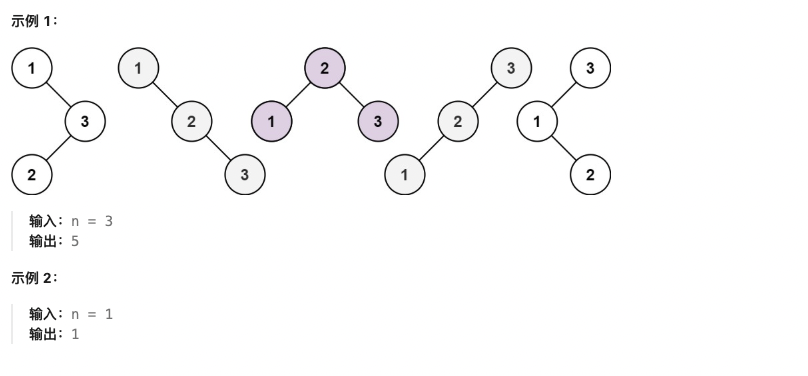

# 动态规划专题

## 🔍 动态规划基础知识

### 📖 定义

**动态规划**（Dynamic Programming，简称DP）是一种通过把原问题分解为相对简单的子问题的方式求解复杂问题的方法。动态规划常常适用于有重叠子问题和最优子结构性质的问题。

### ⚡ 核心特征

1. **最优子结构**：问题的最优解包含子问题的最优解
2. **重叠子问题**：递归过程中会重复计算相同的子问题
3. **无后效性**：当前状态只依赖于之前的状态，不依赖于未来

### 🎯 解题步骤

1. **定义状态**：确定 dp 数组的含义
2. **状态转移**：找出状态之间的关系
3. **初始化**：确定边界条件
4. **计算顺序**：确保计算当前状态时，依赖的状态已经计算过
5. **返回结果**：根据题目要求返回对应的值

### 🐍 Python中的DP实现技巧

#### 1. 一维DP数组
```python
# 基础模板
dp = [0] * (n + 1)
dp[0] = 初始值
for i in range(1, n + 1):
    dp[i] = 状态转移方程
return dp[n]
```

#### 2. 二维DP数组
```python
# 二维DP模板
dp = [[0] * (m + 1) for _ in range(n + 1)]
# 初始化边界
for i in range(n + 1):
    for j in range(m + 1):
        if 边界条件:
            dp[i][j] = 初始值
        else:
            dp[i][j] = 状态转移方程
```

#### 3. 空间优化
```python
# 滚动数组优化
prev = [0] * (m + 1)
curr = [0] * (m + 1)
for i in range(1, n + 1):
    for j in range(1, m + 1):
        curr[j] = 状态转移方程
    prev, curr = curr, prev
```

---

## 📋 题目目录

| 题号 | 题目名称 | 难度 | 核心技巧 |
|------|----------|------|----------|
| 5 | 最长回文子串 | 中等 | 区间DP/中心扩展 |
| 32 | 最长有效括号 | 困难 | 字符串DP |
| 53 | 最大子数组和 | 中等 | Kadane算法 |
| 62 | 不同路径 | 中等 | 路径DP |
| 64 | 最小路径和 | 中等 | 路径DP |
| 70 | 爬楼梯 | 简单 | 斐波那契DP |
| 96 | 不同的二叉搜索树 | 中等 | 卡塔兰数 |
| 118 | 杨辉三角 | 简单 | 基础DP |
| 139 | 单词拆分 | 中等 | 字符串DP |
| 152 | 乘积最大子数组 | 中等 | 状态DP |
| 198 | 打家劫舍 | 中等 | 线性DP |
| 213 | 打家劫舍 II | 中等 | 环形DP |
| 279 | 完全平方数 | 中等 | 完全背包 |
| 300 | 最长递增子序列 | 中等 | 序列DP |
| 322 | 零钱兑换 | 中等 | 完全背包 |
| 337 | 打家劫舍 III | 中等 | 树形DP |
| 338 | 比特位计数 | 简单 | 位运算DP |
| 343 | 整数拆分 | 中等 | 数学DP |
| 416 | 分割等和子集 | 中等 | 0-1背包 |
| 72 | 编辑距离 | 中等 | 字符串匹配DP |
| 1143 | 最长公共子序列 | 中等 | 字符串匹配DP |

---

## 🎯 基础动态规划

### 70. 爬楼梯 ⭐

**题目描述：**

假设你正在爬楼梯。需要 n 阶你才能到达楼顶。每次你可以爬 1 或 2 个台阶。你有多少种不同的方法可以爬到楼顶呢？

**测试用例：**

```
示例 1：
输入：n = 2
输出：2
解释：有两种方法可以爬到楼顶。
1. 1 阶 + 1 阶
2. 2 阶

示例 2：
输入：n = 3
输出：3
解释：有三种方法可以爬到楼顶。
1. 1 阶 + 1 阶 + 1 阶
2. 1 阶 + 2 阶
3. 2 阶 + 1 阶
```

**最简单实现：**

```python
def climbStairs(n):
    """
    使用动态规划解决爬楼梯问题

    思路：
    1. 到达第i阶的方法数 = 到达第(i-1)阶的方法数 + 到达第(i-2)阶的方法数
    2. 这是因为可以从第(i-1)阶爬1步，或从第(i-2)阶爬2步到达第i阶
    3. 状态转移方程：dp[i] = dp[i-1] + dp[i-2]

    时间复杂度：O(n)
    空间复杂度：O(n)
    """
    if n <= 2:
        return n

    # dp[i] 表示到达第i阶的方法数
    dp = [0] * (n + 1)
    dp[1] = 1  # 到达第1阶只有1种方法
    dp[2] = 2  # 到达第2阶有2种方法

    for i in range(3, n + 1):
        dp[i] = dp[i - 1] + dp[i - 2]

    return dp[n]

# 空间优化版本
def climbStairsOptimal(n):
    """
    空间优化：只需要保存前两个状态

    时间复杂度：O(n)
    空间复杂度：O(1)
    """
    if n <= 2:
        return n

    prev2 = 1  # dp[i-2]
    prev1 = 2  # dp[i-1]

    for i in range(3, n + 1):
        current = prev1 + prev2
        prev2 = prev1
        prev1 = current

    return prev1

# 测试用例
print(climbStairs(2))  # 输出: 2
print(climbStairs(3))  # 输出: 3
print(climbStairs(5))  # 输出: 8
```

---

### 118. 杨辉三角 ⭐

**题目描述：**

给定一个非负整数 numRows，生成「杨辉三角」的前 numRows 行。

在杨辉三角中，每个数是它左上方和右上方的数的和。

**测试用例：**

```
示例 1：
输入：numRows = 5
输出：[[1],[1,1],[1,2,1],[1,3,3,1],[1,4,6,4,1]]

示例 2：
输入：numRows = 1
输出：[[1]]
```

**最简单实现：**

```python
def generate(numRows):
    """
    生成杨辉三角

    思路：
    1. 每行的第一个和最后一个元素都是1
    2. 中间的元素等于上一行对应位置和前一个位置的和
    3. 状态转移方程：dp[i][j] = dp[i-1][j-1] + dp[i-1][j]

    时间复杂度：O(numRows²)
    空间复杂度：O(numRows²)
    """
    if numRows == 0:
        return []

    triangle = []

    for i in range(numRows):
        # 创建当前行，初始化为1
        row = [1] * (i + 1)

        # 填充中间的元素
        for j in range(1, i):
            row[j] = triangle[i - 1][j - 1] + triangle[i - 1][j]

        triangle.append(row)

    return triangle

# 更简洁的实现
def generateSimple(numRows):
    """
    更简洁的杨辉三角生成
    """
    triangle = [[1]]

    for i in range(1, numRows):
        # 在前一行的基础上生成新行
        prev_row = triangle[-1]
        new_row = [1]  # 第一个元素是1

        # 中间元素是上一行相邻两元素之和
        for j in range(1, i):
            new_row.append(prev_row[j - 1] + prev_row[j])

        new_row.append(1)  # 最后一个元素是1
        triangle.append(new_row)

    return triangle

# 测试用例
print(generate(5))  # 输出: [[1],[1,1],[1,2,1],[1,3,3,1],[1,4,6,4,1]]
print(generate(1))  # 输出: [[1]]
```

---

## 📝 字符串动态规划

### 5. 最长回文子串 ⭐⭐

**题目描述：**

给你一个字符串 s，找到 s 中最长的回文子串。

**测试用例：**

```
示例 1：
输入：s = "babad"
输出："bab"
解释："aba" 同样是符合题意的答案。

示例 2：
输入：s = "cbbd"
输出："bb"
```

**最简单实现：**

```python
def longestPalindrome(s):
    """
    使用动态规划找最长回文子串

    思路：
    1. dp[i][j] 表示 s[i:j+1] 是否为回文
    2. 状态转移：dp[i][j] = (s[i] == s[j]) and dp[i+1][j-1]
    3. 边界条件：单个字符和两个相同字符都是回文

    时间复杂度：O(n²)
    空间复杂度：O(n²)
    """
    if not s:
        return ""

    n = len(s)
    # dp[i][j] 表示 s[i:j+1] 是否为回文
    dp = [[False] * n for _ in range(n)]

    start = 0  # 最长回文子串的起始位置
    max_len = 1  # 最长回文子串的长度

    # 单个字符都是回文
    for i in range(n):
        dp[i][i] = True

    # 检查长度为2的子串
    for i in range(n - 1):
        if s[i] == s[i + 1]:
            dp[i][i + 1] = True
            start = i
            max_len = 2

    # 检查长度大于2的子串
    for length in range(3, n + 1):  # 子串长度
        for i in range(n - length + 1):  # 起始位置
            j = i + length - 1  # 结束位置

            # 如果首尾字符相同且中间是回文
            if s[i] == s[j] and dp[i + 1][j - 1]:
                dp[i][j] = True
                start = i
                max_len = length

    return s[start:start + max_len]

# 中心扩展法（更优雅的解法）
def longestPalindromeExpand(s):
    """
    中心扩展法找最长回文子串

    思路：
    1. 以每个字符为中心向两边扩展
    2. 考虑奇数长度和偶数长度的回文

    时间复杂度：O(n²)
    空间复杂度：O(1)
    """
    if not s:
        return ""

    def expand_around_center(left, right):
        """以left和right为中心向两边扩展"""
        while left >= 0 and right < len(s) and s[left] == s[right]:
            left -= 1
            right += 1
        return right - left - 1  # 返回回文长度

    start = 0
    max_len = 0

    for i in range(len(s)):
        # 奇数长度回文（以i为中心）
        len1 = expand_around_center(i, i)
        # 偶数长度回文（以i和i+1为中心）
        len2 = expand_around_center(i, i + 1)

        # 取较大的长度
        current_len = max(len1, len2)

        if current_len > max_len:
            max_len = current_len
            start = i - (current_len - 1) // 2

    return s[start:start + max_len]

# 测试用例
print(longestPalindrome("babad"))  # 输出: "bab" 或 "aba"
print(longestPalindrome("cbbd"))   # 输出: "bb"
```

---

### 32. 最长有效括号 ⭐⭐⭐

**题目描述：**

给你一个只包含 '(' 和 ')' 的字符串，找出最长有效（格式正确且连续）括号子串的长度。

**测试用例：**

```
示例 1：
输入：s = "(()"
输出：2
解释：最长有效括号子串是 "()"

示例 2：
输入：s = ")()())"
输出：4
解释：最长有效括号子串是 "()()"

示例 3：
输入：s = ""
输出：0
```

**最简单实现：**

```python
def longestValidParentheses(s):
    """
    使用动态规划找最长有效括号

    思路：
    1. dp[i] 表示以 s[i] 结尾的最长有效括号长度
    2. 只有 ')' 才可能形成有效括号
    3. 状态转移：
       - 如果 s[i] == ')'：
         - 如果 s[i-1] == '('：dp[i] = dp[i-2] + 2
         - 如果 s[i-1] == ')' 且 dp[i-1] > 0：
           找到与当前 ')' 匹配的 '(' 的位置，检查是否能形成有效括号

    时间复杂度：O(n)
    空间复杂度：O(n)
    """
    if not s:
        return 0

    n = len(s)
    dp = [0] * n  # dp[i] 表示以 s[i] 结尾的最长有效括号长度
    max_len = 0

    for i in range(1, n):
        if s[i] == ')':
            if s[i - 1] == '(':
                # 情况1: ...()
                dp[i] = (dp[i - 2] if i >= 2 else 0) + 2
            elif dp[i - 1] > 0:
                # 情况2: ...))，需要找到匹配的 '('
                match_index = i - dp[i - 1] - 1
                if match_index >= 0 and s[match_index] == '(':
                    dp[i] = dp[i - 1] + 2 + (dp[match_index - 1] if match_index > 0 else 0)

            max_len = max(max_len, dp[i])

    return max_len

# 使用栈的解法
def longestValidParenthesesStack(s):
    """
    使用栈找最长有效括号

    思路：
    1. 栈中存储字符的索引
    2. 栈底始终保持最后一个没有被匹配的 ')' 的索引
    3. 遇到 '(' 就入栈，遇到 ')' 就出栈
    4. 出栈后如果栈为空，说明当前 ')' 没有匹配，将其索引入栈
    5. 否则，当前有效括号长度为 i - stack[-1]

    时间复杂度：O(n)
    空间复杂度：O(n)
    """
    stack = [-1]  # 栈底保持最后一个没有匹配的 ')' 的索引
    max_len = 0

    for i, char in enumerate(s):
        if char == '(':
            stack.append(i)
        else:  # char == ')'
            stack.pop()
            if not stack:
                # 当前 ')' 没有匹配，将其索引作为新的栈底
                stack.append(i)
            else:
                # 计算当前有效括号长度
                max_len = max(max_len, i - stack[-1])

    return max_len

# 测试用例
print(longestValidParentheses("(()"))     # 输出: 2
print(longestValidParentheses(")()())"))  # 输出: 4
print(longestValidParentheses(""))        # 输出: 0
```

---

### 139. 单词拆分 ⭐⭐

**题目描述：**

给你一个字符串 s 和一个字符串列表 wordDict 作为字典。如果可以利用字典中出现的一个或多个单词拼接出 s 则返回 true。

**约束条件：**
- 不要求字典中出现的单词全部都使用，并且字典中的单词可以重复使用

**测试用例：**

```
示例 1：
输入: s = "leetcode", wordDict = ["leet", "code"]
输出: true
解释: 返回 true 因为 "leetcode" 可以由 "leet" 和 "code" 拼接成。

示例 2：
输入: s = "applepenapple", wordDict = ["apple", "pen"]
输出: true
解释: 返回 true 因为 "applepenapple" 可以由 "apple" "pen" "apple" 拼接成。

示例 3：
输入: s = "catsandog", wordDict = ["cats", "dog", "sand", "and", "cat"]
输出: false
```

**最简单实现：**

```python
def wordBreak(s, wordDict):
    """
    使用动态规划判断单词拆分

    思路：
    1. dp[i] 表示 s[0:i] 是否可以被拆分
    2. 状态转移：dp[i] = any(dp[j] and s[j:i] in wordDict) for j in range(i)
    3. 边界条件：dp[0] = True（空字符串可以被拆分）

    时间复杂度：O(n² + m)，n是字符串长度，m是字典大小
    空间复杂度：O(n + m)
    """
    if not s:
        return True

    n = len(s)
    word_set = set(wordDict)  # 转换为set提高查找效率

    # dp[i] 表示 s[0:i] 是否可以被拆分
    dp = [False] * (n + 1)
    dp[0] = True  # 空字符串可以被拆分

    for i in range(1, n + 1):
        for j in range(i):
            # 如果 s[0:j] 可以被拆分且 s[j:i] 在字典中
            if dp[j] and s[j:i] in word_set:
                dp[i] = True
                break  # 找到一种拆分方式即可

    return dp[n]

# 优化版本：从后往前检查
def wordBreakOptimized(s, wordDict):
    """
    优化版本：从后往前检查，可能提前结束
    """
    if not s:
        return True

    n = len(s)
    word_set = set(wordDict)
    max_word_len = max(len(word) for word in wordDict) if wordDict else 0

    dp = [False] * (n + 1)
    dp[0] = True

    for i in range(1, n + 1):
        # 只检查可能的单词长度，避免不必要的计算
        for j in range(max(0, i - max_word_len), i):
            if dp[j] and s[j:i] in word_set:
                dp[i] = True
                break

    return dp[n]

# 测试用例
print(wordBreak("leetcode", ["leet", "code"]))  # 输出: True
print(wordBreak("applepenapple", ["apple", "pen"]))  # 输出: True
print(wordBreak("catsandog", ["cats", "dog", "sand", "and", "cat"]))  # 输出: False
```

---

## 📊 数组动态规划

### 53. 最大子数组和 ⭐⭐

**题目描述：**

给你一个整数数组 nums，请你找出一个具有最大和的连续子数组（子数组最少包含一个元素），返回其最大和。

**测试用例：**

```
示例 1：
输入：nums = [-2,1,-3,4,-1,2,1,-5,4]
输出：6
解释：连续子数组 [4,-1,2,1] 的和最大，为 6

示例 2：
输入：nums = [1]
输出：1

示例 3：
输入：nums = [5,4,-1,7,8]
输出：23
```

**最简单实现：**

```python
def maxSubArray(nums):
    """
    使用Kadane算法找最大子数组和

    思路：
    1. dp[i] 表示以 nums[i] 结尾的最大子数组和
    2. 状态转移：dp[i] = max(nums[i], dp[i-1] + nums[i])
    3. 如果前面的和是负数，不如重新开始

    时间复杂度：O(n)
    空间复杂度：O(1)
    """
    if not nums:
        return 0

    max_sum = nums[0]  # 全局最大和
    current_sum = nums[0]  # 当前子数组和

    for i in range(1, len(nums)):
        # 要么继续之前的子数组，要么重新开始
        current_sum = max(nums[i], current_sum + nums[i])
        max_sum = max(max_sum, current_sum)

    return max_sum

# 更直观的DP版本
def maxSubArrayDP(nums):
    """
    标准动态规划版本
    """
    if not nums:
        return 0

    n = len(nums)
    dp = [0] * n  # dp[i] 表示以 nums[i] 结尾的最大子数组和
    dp[0] = nums[0]
    max_sum = dp[0]

    for i in range(1, n):
        dp[i] = max(nums[i], dp[i - 1] + nums[i])
        max_sum = max(max_sum, dp[i])

    return max_sum

# 测试用例
print(maxSubArray([-2, 1, -3, 4, -1, 2, 1, -5, 4]))  # 输出: 6
print(maxSubArray([1]))  # 输出: 1
print(maxSubArray([5, 4, -1, 7, 8]))  # 输出: 23
```

---

### 152. 乘积最大子数组 ⭐⭐

**题目描述：**

给你一个整数数组 nums，请你找出数组中乘积最大的非空连续子数组（该子数组中至少包含一个数字），并返回该子数组所对应的乘积。

**测试用例：**

```
示例 1:
输入: nums = [2,3,-2,4]
输出: 6
解释: 子数组 [2,3] 有最大乘积 6。

示例 2:
输入: nums = [-2,0,-1]
输出: 0
解释: 结果不能为 2, 因为 [-2,-1] 不是子数组。
```

**最简单实现：**

```python
def maxProduct(nums):
    """
    使用动态规划找乘积最大子数组

    思路：
    1. 由于存在负数，需要同时维护最大值和最小值
    2. 负数 * 最小值 = 最大值，负数 * 最大值 = 最小值
    3. max_dp[i] 表示以 nums[i] 结尾的最大乘积
    4. min_dp[i] 表示以 nums[i] 结尾的最小乘积

    时间复杂度：O(n)
    空间复杂度：O(1)
    """
    if not nums:
        return 0

    # 初始化
    max_product = nums[0]  # 全局最大乘积
    current_max = nums[0]  # 当前最大乘积
    current_min = nums[0]  # 当前最小乘积

    for i in range(1, len(nums)):
        num = nums[i]

        # 如果当前数是负数，交换最大值和最小值
        if num < 0:
            current_max, current_min = current_min, current_max

        # 更新当前最大值和最小值
        current_max = max(num, current_max * num)
        current_min = min(num, current_min * num)

        # 更新全局最大值
        max_product = max(max_product, current_max)

    return max_product

# 更清晰的版本
def maxProductClear(nums):
    """
    更清晰的实现，不交换变量
    """
    if not nums:
        return 0

    max_product = nums[0]
    current_max = nums[0]
    current_min = nums[0]

    for i in range(1, len(nums)):
        num = nums[i]

        # 计算三个候选值
        candidates = [num, current_max * num, current_min * num]

        # 更新最大值和最小值
        current_max = max(candidates)
        current_min = min(candidates)

        # 更新全局最大值
        max_product = max(max_product, current_max)

    return max_product

# 测试用例
print(maxProduct([2, 3, -2, 4]))  # 输出: 6
print(maxProduct([-2, 0, -1]))    # 输出: 0
print(maxProduct([-2, 3, -4]))    # 输出: 24
```

---

### 300. 最长递增子序列 (LIS) ⭐⭐⭐

**题目描述：**

给你一个整数数组 nums，找到其中最长严格递增子序列的长度。

子序列是由数组派生而来的序列，删除（或不删除）数组中的元素而不改变其余元素的顺序。例如，[3,6,2,7] 是数组 [0,3,1,6,2,2,7] 的子序列。

**测试用例：**

```
示例 1：
输入：nums = [10,9,2,5,3,7,101,18]
输出：4
解释：最长递增子序列是 [2,3,7,101]，因此长度为 4

示例 2：
输入：nums = [0,1,0,3,2,3]
输出：4

示例 3：
输入：nums = [7,7,7,7,7,7,7]
输出：1
```

**最简单实现：**

```python
def lengthOfLIS(nums):
    """
    使用动态规划找最长递增子序列长度

    思路：
    1. dp[i] 表示以 nums[i] 结尾的最长递增子序列长度
    2. 状态转移：dp[i] = max(dp[j] + 1) for all j < i where nums[j] < nums[i]
    3. 初始化：dp[i] = 1（每个元素自己构成长度为1的序列）

    时间复杂度：O(n²)
    空间复杂度：O(n)
    """
    if not nums:
        return 0

    n = len(nums)
    dp = [1] * n  # dp[i] 表示以 nums[i] 结尾的最长递增子序列长度

    for i in range(1, n):
        for j in range(i):
            if nums[j] < nums[i]:
                dp[i] = max(dp[i], dp[j] + 1)

    return max(dp)

# 二分查找优化版本 O(n log n)
def lengthOfLISOptimal(nums):
    """
    使用二分查找优化的版本

    思路：
    1. 维护一个数组 tails，tails[i] 表示长度为 i+1 的递增子序列的最小尾部元素
    2. 对于每个数字，用二分查找找到它在 tails 中的位置
    3. 如果位置在末尾，说明可以扩展序列；否则替换对应位置的元素

    时间复杂度：O(n log n)
    空间复杂度：O(n)
    """
    if not nums:
        return 0

    tails = []  # tails[i] 表示长度为 i+1 的递增子序列的最小尾部元素

    for num in nums:
        # 二分查找插入位置
        left, right = 0, len(tails)
        while left < right:
            mid = (left + right) // 2
            if tails[mid] < num:
                left = mid + 1
            else:
                right = mid

        # 如果插入位置在末尾，扩展序列
        if left == len(tails):
            tails.append(num)
        else:
            # 否则替换对应位置的元素
            tails[left] = num

    return len(tails)

# 使用 bisect 模块的简洁版本
def lengthOfLISBisect(nums):
    """
    使用 Python 的 bisect 模块
    """
    import bisect

    if not nums:
        return 0

    tails = []

    for num in nums:
        pos = bisect.bisect_left(tails, num)
        if pos == len(tails):
            tails.append(num)
        else:
            tails[pos] = num

    return len(tails)

# 测试用例
print(lengthOfLIS([10, 9, 2, 5, 3, 7, 101, 18]))  # 输出: 4
print(lengthOfLIS([0, 1, 0, 3, 2, 3]))  # 输出: 4
print(lengthOfLIS([7, 7, 7, 7, 7, 7, 7]))  # 输出: 1
```

---

## 🛤️ 路径问题

### 62. 不同路径 ⭐⭐

**题目描述：**

一个机器人位于一个 m x n 网格的左上角（起始点在下图中标记为 "Start"）。

机器人每次只能向下或者向右移动一步。机器人试图达到网格的右下角（在下图中标记为 "Finish"）。

问总共有多少条不同的路径？


**测试用例：**

```
示例 1：
输入：m = 3, n = 7
输出：28

示例 2：
输入：m = 3, n = 2
输出：3
解释：
从左上角开始，总共有 3 条路径可以到达右下角。
1. 向右 -> 向下 -> 向下
2. 向下 -> 向下 -> 向右
3. 向下 -> 向右 -> 向下
```

**最简单实现：**

```python
def uniquePaths(m, n):
    """
    使用动态规划计算不同路径数

    思路：
    1. dp[i][j] 表示到达位置 (i,j) 的不同路径数
    2. 状态转移：dp[i][j] = dp[i-1][j] + dp[i][j-1]
    3. 边界条件：第一行和第一列都只有一条路径

    时间复杂度：O(m*n)
    空间复杂度：O(m*n)
    """
    # 创建 dp 数组
    dp = [[1] * n for _ in range(m)]

    # 填充 dp 数组
    for i in range(1, m):
        for j in range(1, n):
            dp[i][j] = dp[i-1][j] + dp[i][j-1]

    return dp[m-1][n-1]

# 空间优化版本
def uniquePathsOptimal(m, n):
    """
    空间优化：只需要保存一行的数据

    时间复杂度：O(m*n)
    空间复杂度：O(n)
    """
    dp = [1] * n  # 只需要一行

    for i in range(1, m):
        for j in range(1, n):
            dp[j] = dp[j] + dp[j-1]  # dp[j] 是上方，dp[j-1] 是左方

    return dp[n-1]

# 数学解法（组合数学）
def uniquePathsMath(m, n):
    """
    数学解法：从 (m+n-2) 步中选择 (m-1) 步向下

    时间复杂度：O(min(m,n))
    空间复杂度：O(1)
    """
    import math
    return math.comb(m + n - 2, m - 1)

# 测试用例
print(uniquePaths(3, 7))  # 输出: 28
print(uniquePaths(3, 2))  # 输出: 3
```

---

### 64. 最小路径和 ⭐⭐

**题目描述：**

给定一个包含非负整数的 m x n 网格 grid，请找出一条从左上角到右下角的路径，使得路径上的数字总和为最小。

**说明：**每次只能向下或者向右移动一步。


**测试用例：**

```
示例 1：
输入：grid = [[1,3,1],[1,5,1],[4,2,1]]
输出：7
解释：因为路径 1→3→1→1→1 的总和最小。

示例 2：
输入：grid = [[1,2,3],[4,5,6]]
输出：12
```

**最简单实现：**

```python
def minPathSum(grid):
    """
    使用动态规划找最小路径和

    思路：
    1. dp[i][j] 表示到达位置 (i,j) 的最小路径和
    2. 状态转移：dp[i][j] = grid[i][j] + min(dp[i-1][j], dp[i][j-1])
    3. 边界条件：第一行只能从左边来，第一列只能从上面来

    时间复杂度：O(m*n)
    空间复杂度：O(m*n)
    """
    if not grid or not grid[0]:
        return 0

    m, n = len(grid), len(grid[0])

    # 创建 dp 数组
    dp = [[0] * n for _ in range(m)]

    # 初始化起点
    dp[0][0] = grid[0][0]

    # 初始化第一行
    for j in range(1, n):
        dp[0][j] = dp[0][j-1] + grid[0][j]

    # 初始化第一列
    for i in range(1, m):
        dp[i][0] = dp[i-1][0] + grid[i][0]

    # 填充其余位置
    for i in range(1, m):
        for j in range(1, n):
            dp[i][j] = grid[i][j] + min(dp[i-1][j], dp[i][j-1])

    return dp[m-1][n-1]

# 原地修改版本（节省空间）
def minPathSumInPlace(grid):
    """
    原地修改 grid 数组，节省空间

    时间复杂度：O(m*n)
    空间复杂度：O(1)
    """
    if not grid or not grid[0]:
        return 0

    m, n = len(grid), len(grid[0])

    # 初始化第一行
    for j in range(1, n):
        grid[0][j] += grid[0][j-1]

    # 初始化第一列
    for i in range(1, m):
        grid[i][0] += grid[i-1][0]

    # 填充其余位置
    for i in range(1, m):
        for j in range(1, n):
            grid[i][j] += min(grid[i-1][j], grid[i][j-1])

    return grid[m-1][n-1]

# 空间优化版本
def minPathSumOptimal(grid):
    """
    空间优化：只需要保存一行的数据

    时间复杂度：O(m*n)
    空间复杂度：O(n)
    """
    if not grid or not grid[0]:
        return 0

    m, n = len(grid), len(grid[0])
    dp = [float('inf')] * n
    dp[0] = 0

    for i in range(m):
        dp[0] += grid[i][0]  # 第一列
        for j in range(1, n):
            dp[j] = grid[i][j] + min(dp[j], dp[j-1])

    return dp[n-1]

# 测试用例
grid1 = [[1,3,1],[1,5,1],[4,2,1]]
print(minPathSum(grid1))  # 输出: 7

grid2 = [[1,2,3],[4,5,6]]
print(minPathSum(grid2))  # 输出: 12
```

---

## 🎒 背包问题

### 322. 零钱兑换 ⭐⭐⭐

**题目描述：**

给你一个整数数组 coins，表示不同面额的硬币；以及一个整数 amount，表示总金额。

计算并返回可以凑成总金额所需的最少的硬币个数。如果没有任何一种硬币组合能组成总金额，返回 -1。

你可以认为每种硬币的数量是无限的。

**测试用例：**

```
示例 1：
输入：coins = [1, 2, 5], amount = 11
输出：3
解释：11 = 5 + 5 + 1

示例 2：
输入：coins = [2], amount = 3
输出：-1

示例 3：
输入：coins = [1], amount = 0
输出：0
```

**最简单实现：**

```python
def coinChange(coins, amount):
    """
    使用动态规划解决零钱兑换问题（完全背包）

    思路：
    1. dp[i] 表示凑成金额 i 所需的最少硬币个数
    2. 状态转移：dp[i] = min(dp[i], dp[i-coin] + 1) for coin in coins
    3. 初始化：dp[0] = 0，其余为无穷大

    时间复杂度：O(amount * len(coins))
    空间复杂度：O(amount)
    """
    if amount == 0:
        return 0

    # dp[i] 表示凑成金额 i 所需的最少硬币个数
    dp = [float('inf')] * (amount + 1)
    dp[0] = 0  # 凑成金额 0 需要 0 个硬币

    # 遍历所有金额
    for i in range(1, amount + 1):
        # 尝试每种硬币
        for coin in coins:
            if coin <= i:  # 硬币面额不能超过当前金额
                dp[i] = min(dp[i], dp[i - coin] + 1)

    return dp[amount] if dp[amount] != float('inf') else -1

# BFS解法（另一种思路）
def coinChangeBFS(coins, amount):
    """
    使用BFS解决零钱兑换问题

    思路：
    1. 从金额0开始，每次加上一个硬币面额
    2. 第一次到达目标金额时，就是最少硬币数

    时间复杂度：O(amount * len(coins))
    空间复杂度：O(amount)
    """
    if amount == 0:
        return 0

    from collections import deque

    queue = deque([0])  # 队列存储当前金额
    visited = {0}  # 记录已访问的金额
    steps = 0  # 硬币数量

    while queue:
        steps += 1
        for _ in range(len(queue)):
            current_amount = queue.popleft()

            for coin in coins:
                next_amount = current_amount + coin

                if next_amount == amount:
                    return steps

                if next_amount < amount and next_amount not in visited:
                    visited.add(next_amount)
                    queue.append(next_amount)

    return -1

# 测试用例
print(coinChange([1, 2, 5], 11))  # 输出: 3
print(coinChange([2], 3))         # 输出: -1
print(coinChange([1], 0))         # 输出: 0
```

---

### 416. 分割等和子集 ⭐⭐

**题目描述：**

给你一个只包含正整数的非空数组 nums。请你判断是否可以将这个数组分割成两个子集，使得两个子集的元素和相等。

**测试用例：**

```
示例 1：
输入：nums = [1,5,11,5]
输出：true
解释：数组可以分割成 [1, 5, 5] 和 [11]

示例 2：
输入：nums = [1,2,3,5]
输出：false
解释：数组不能分割成两个元素和相等的子集
```

**最简单实现：**

```python
def canPartition(nums):
    """
    使用动态规划解决分割等和子集问题（0-1背包变形）

    思路：
    1. 问题转化为：是否能从数组中选择一些数字，使其和等于 total_sum // 2
    2. 这是一个0-1背包问题，每个数字只能选择一次
    3. dp[i] 表示是否能凑成和为 i

    时间复杂度：O(n * sum)
    空间复杂度：O(sum)
    """
    total_sum = sum(nums)

    # 如果总和是奇数，无法分割成两个相等的子集
    if total_sum % 2 != 0:
        return False

    target = total_sum // 2

    # dp[i] 表示是否能凑成和为 i
    dp = [False] * (target + 1)
    dp[0] = True  # 和为 0 总是可以达到（不选任何数字）

    for num in nums:
        # 从后往前遍历，避免重复使用同一个数字
        for j in range(target, num - 1, -1):
            dp[j] = dp[j] or dp[j - num]

    return dp[target]

# 使用集合的解法
def canPartitionSet(nums):
    """
    使用集合记录所有可能的和
    """
    total_sum = sum(nums)

    if total_sum % 2 != 0:
        return False

    target = total_sum // 2
    possible_sums = {0}  # 所有可能的和

    for num in nums:
        # 创建新的可能和集合
        new_sums = set()
        for s in possible_sums:
            new_sum = s + num
            if new_sum == target:
                return True
            if new_sum < target:
                new_sums.add(new_sum)

        possible_sums.update(new_sums)

    return target in possible_sums

# 二维DP版本（更直观）
def canPartition2D(nums):
    """
    二维DP版本，更容易理解

    dp[i][j] 表示前 i 个数字是否能凑成和为 j
    """
    total_sum = sum(nums)

    if total_sum % 2 != 0:
        return False

    target = total_sum // 2
    n = len(nums)

    # dp[i][j] 表示前 i 个数字是否能凑成和为 j
    dp = [[False] * (target + 1) for _ in range(n + 1)]

    # 初始化：和为 0 总是可以达到
    for i in range(n + 1):
        dp[i][0] = True

    for i in range(1, n + 1):
        for j in range(1, target + 1):
            # 不选择第 i 个数字
            dp[i][j] = dp[i - 1][j]

            # 选择第 i 个数字（如果可能）
            if j >= nums[i - 1]:
                dp[i][j] = dp[i][j] or dp[i - 1][j - nums[i - 1]]

    return dp[n][target]

# 测试用例
print(canPartition([1, 5, 11, 5]))  # 输出: True
print(canPartition([1, 2, 3, 5]))   # 输出: False
```

---

### 279. 完全平方数 ⭐⭐

**题目描述：**

给你一个整数 n，返回和为 n 的完全平方数的最少数量。

完全平方数是一个整数，其值等于另一个整数的平方；换句话说，其值等于一个整数自乘的积。例如，1、4、9 和 16 都是完全平方数，而 3 和 11 不是。

**测试用例：**

```
示例 1：
输入：n = 12
输出：3
解释：12 = 4 + 4 + 4

示例 2：
输入：n = 13
输出：2
解释：13 = 4 + 9
```

**最简单实现：**

```python
def numSquares(n):
    """
    使用动态规划解决完全平方数问题（完全背包变形）

    思路：
    1. dp[i] 表示和为 i 的完全平方数的最少数量
    2. 状态转移：dp[i] = min(dp[i], dp[i - j*j] + 1) for all j where j*j <= i
    3. 初始化：dp[0] = 0

    时间复杂度：O(n * sqrt(n))
    空间复杂度：O(n)
    """
    if n <= 0:
        return 0

    # dp[i] 表示和为 i 的完全平方数的最少数量
    dp = [float('inf')] * (n + 1)
    dp[0] = 0

    # 预计算所有可能的完全平方数
    squares = []
    i = 1
    while i * i <= n:
        squares.append(i * i)
        i += 1

    # 填充 dp 数组
    for i in range(1, n + 1):
        for square in squares:
            if square > i:
                break
            dp[i] = min(dp[i], dp[i - square] + 1)

    return dp[n]

# BFS解法
def numSquaresBFS(n):
    """
    使用BFS解决完全平方数问题

    思路：
    1. 从0开始，每次加上一个完全平方数
    2. 第一次到达n时，就是最少数量

    时间复杂度：O(n * sqrt(n))
    空间复杂度：O(n)
    """
    if n <= 0:
        return 0

    from collections import deque

    # 预计算完全平方数
    squares = []
    i = 1
    while i * i <= n:
        squares.append(i * i)
        i += 1

    queue = deque([0])
    visited = {0}
    level = 0

    while queue:
        level += 1
        for _ in range(len(queue)):
            current = queue.popleft()

            for square in squares:
                next_val = current + square

                if next_val == n:
                    return level

                if next_val < n and next_val not in visited:
                    visited.add(next_val)
                    queue.append(next_val)

    return -1

# 测试用例
print(numSquares(12))  # 输出: 3
print(numSquares(13))  # 输出: 2
```

---

## 🌳 树形动态规划

### 198. 打家劫舍 ⭐⭐

**题目描述：**

你是一个专业的小偷，计划偷窃沿街的房屋。每间房内都藏有一定的现金，影响你偷窃的唯一制约因素就是相邻的房屋装有相互连通的防盗系统，如果两间相邻的房屋在同一晚上被小偷闯入，系统会自动报警。

给定一个代表每个房屋存放金额的非负整数数组，计算你不触动警报装置的情况下，一夜之内能够偷窃到的最高金额。

**测试用例：**

```
示例 1：
输入：[1,2,3,1]
输出：4
解释：偷窃 1 号房屋 (金额 = 1) ，然后偷窃 3 号房屋 (金额 = 3)。
     偷窃到的最高金额 = 1 + 3 = 4

示例 2：
输入：[2,7,9,3,1]
输出：12
解释：偷窃 1 号房屋 (金额 = 2), 偷窃 3 号房屋 (金额 = 9)，接着偷窃 5 号房屋 (金额 = 1)。
     偷窃到的最高金额 = 2 + 9 + 1 = 12
```

**最简单实现：**

```python
def rob(nums):
    """
    使用动态规划解决打家劫舍问题

    思路：
    1. dp[i] 表示偷窃前 i 个房屋能获得的最高金额
    2. 状态转移：dp[i] = max(dp[i-1], dp[i-2] + nums[i])
    3. 对于每个房屋，可以选择偷或不偷

    时间复杂度：O(n)
    空间复杂度：O(n)
    """
    if not nums:
        return 0
    if len(nums) == 1:
        return nums[0]

    n = len(nums)
    dp = [0] * n
    dp[0] = nums[0]
    dp[1] = max(nums[0], nums[1])

    for i in range(2, n):
        dp[i] = max(dp[i-1], dp[i-2] + nums[i])

    return dp[n-1]

# 空间优化版本
def robOptimal(nums):
    """
    空间优化：只需要保存前两个状态

    时间复杂度：O(n)
    空间复杂度：O(1)
    """
    if not nums:
        return 0
    if len(nums) == 1:
        return nums[0]

    prev2 = nums[0]  # dp[i-2]
    prev1 = max(nums[0], nums[1])  # dp[i-1]

    for i in range(2, len(nums)):
        current = max(prev1, prev2 + nums[i])
        prev2 = prev1
        prev1 = current

    return prev1

# 测试用例
print(rob([1, 2, 3, 1]))  # 输出: 4
print(rob([2, 7, 9, 3, 1]))  # 输出: 12
```

---

### 337. 打家劫舍 III ⭐⭐⭐

**题目描述：**

小偷又发现了一个新的可行窃的地区。这个地区只有一个入口，我们称之为 root。

除了 root 之外，每栋房子有且只有一个"父"房子与之相连。一番侦察之后，聪明的小偷意识到"这个地方的所有房屋的排列类似于一棵二叉树"。如果两个直接相连的房子在同一天晚上被打劫，房屋将自动报警。

给定二叉树的 root。返回在不触动警报的情况下，小偷能够盗取的最高金额。

**测试用例：**

```
示例 1:
输入: root = [3,2,3,null,3,null,1]
输出: 7
解释: 小偷一晚能够盗取的最高金额 3 + 3 + 1 = 7

示例 2:
输入: root = [3,4,5,1,3,null,1]
输出: 9
解释: 小偷一晚能够盗取的最高金额 4 + 5 = 9
```

**最简单实现：**

```python
# 二叉树节点定义
class TreeNode:
    def __init__(self, val=0, left=None, right=None):
        self.val = val
        self.left = left
        self.right = right

def rob(root):
    """
    使用树形动态规划解决打家劫舍III

    思路：
    1. 对于每个节点，有两种状态：偷或不偷
    2. 如果偷当前节点，就不能偷子节点
    3. 如果不偷当前节点，子节点可偷可不偷
    4. 返回两种状态的最大值

    时间复杂度：O(n)
    空间复杂度：O(h)，h是树的高度
    """
    def dfs(node):
        """
        返回 (不偷当前节点的最大金额, 偷当前节点的最大金额)
        """
        if not node:
            return (0, 0)

        # 递归计算左右子树
        left_not_rob, left_rob = dfs(node.left)
        right_not_rob, right_rob = dfs(node.right)

        # 不偷当前节点：子节点可偷可不偷，取最大值
        not_rob = max(left_not_rob, left_rob) + max(right_not_rob, right_rob)

        # 偷当前节点：子节点都不能偷
        rob_current = node.val + left_not_rob + right_not_rob

        return (not_rob, rob_current)

    not_rob, rob_current = dfs(root)
    return max(not_rob, rob_current)

# 使用记忆化搜索的版本
def robMemo(root):
    """
    使用记忆化搜索优化
    """
    memo = {}

    def dfs(node):
        if not node:
            return 0

        if node in memo:
            return memo[node]

        # 偷当前节点
        rob_current = node.val
        if node.left:
            rob_current += dfs(node.left.left) + dfs(node.left.right)
        if node.right:
            rob_current += dfs(node.right.left) + dfs(node.right.right)

        # 不偷当前节点
        not_rob = dfs(node.left) + dfs(node.right)

        memo[node] = max(rob_current, not_rob)
        return memo[node]

    return dfs(root)

# 测试用例
# 构建测试树 [3,2,3,null,3,null,1]
root1 = TreeNode(3)
root1.left = TreeNode(2)
root1.right = TreeNode(3)
root1.left.right = TreeNode(3)
root1.right.right = TreeNode(1)

print(rob(root1))  # 输出: 7
```

---

### 96. 不同的二叉搜索树 ⭐⭐

**题目描述：**

给你一个整数 n，求恰由 n 个节点组成且节点值从 1 到 n 互不相同的二叉搜索树有多少种？返回满足题意的二叉搜索树的种数。



**测试用例：**

```
示例 1：
输入：n = 3
输出：5
解释：给定 n = 3, 一共有 5 种不同结构的二叉搜索树

示例 2：
输入：n = 1
输出：1
```

**最简单实现：**

```python
def numTrees(n):
    """
    使用动态规划计算不同的二叉搜索树数量（卡塔兰数）

    思路：
    1. dp[i] 表示 i 个节点能构成的不同二叉搜索树数量
    2. 对于 n 个节点，可以选择任意一个作为根节点
    3. 如果选择 i 作为根节点，左子树有 i-1 个节点，右子树有 n-i 个节点
    4. 状态转移：dp[n] = Σ(dp[i-1] * dp[n-i]) for i in range(1, n+1)

    时间复杂度：O(n²)
    空间复杂度：O(n)
    """
    if n <= 1:
        return 1

    # dp[i] 表示 i 个节点能构成的不同二叉搜索树数量
    dp = [0] * (n + 1)
    dp[0] = 1  # 空树
    dp[1] = 1  # 单节点树

    for nodes in range(2, n + 1):
        for root in range(1, nodes + 1):
            left_trees = dp[root - 1]  # 左子树的数量
            right_trees = dp[nodes - root]  # 右子树的数量
            dp[nodes] += left_trees * right_trees

    return dp[n]

# 数学公式版本（卡塔兰数）
def numTreesMath(n):
    """
    使用卡塔兰数公式：C(n) = C(2n, n) / (n + 1)

    时间复杂度：O(n)
    空间复杂度：O(1)
    """
    if n <= 1:
        return 1

    # 计算 C(2n, n)
    result = 1
    for i in range(n):
        result = result * (n + 1 + i) // (i + 1)

    return result // (n + 1)

# 测试用例
print(numTrees(3))  # 输出: 5
print(numTrees(1))  # 输出: 1
print(numTrees(4))  # 输出: 14
```

---

## 🔢 位运算动态规划

### 338. 比特位计数 ⭐⭐

**题目描述：**

给你一个整数 n，对于 0 <= i <= n 中的每个 i，计算其二进制表示中 1 的个数，返回一个长度为 n + 1 的数组 ans 作为答案。

**测试用例：**

```
示例 1：
输入：n = 2
输出：[0,1,1]
解释：
0 --> 0
1 --> 1
2 --> 10

示例 2：
输入：n = 5
输出：[0,1,1,2,1,2]
解释：
0 --> 0
1 --> 1
2 --> 10
3 --> 11
4 --> 100
5 --> 101
```

**最简单实现：**

```python
def countBits(n):
    """
    使用动态规划计算比特位计数

    思路：
    1. dp[i] 表示数字 i 的二进制表示中 1 的个数
    2. 观察规律：dp[i] = dp[i >> 1] + (i & 1)
    3. i >> 1 是 i 除以 2，i & 1 是 i 的最低位

    时间复杂度：O(n)
    空间复杂度：O(1)，不计算返回数组
    """
    dp = [0] * (n + 1)

    for i in range(1, n + 1):
        # i >> 1 是 i 的高位部分，i & 1 是最低位
        dp[i] = dp[i >> 1] + (i & 1)

    return dp

# 另一种思路：最高有效位
def countBitsHighestBit(n):
    """
    使用最高有效位的思路

    思路：
    1. 对于数字 i，找到不超过 i 的最大的 2 的幂 highestBit
    2. dp[i] = dp[i - highestBit] + 1
    """
    dp = [0] * (n + 1)
    highest_bit = 0

    for i in range(1, n + 1):
        # 如果 i 是 2 的幂，更新 highest_bit
        if (i & (i - 1)) == 0:
            highest_bit = i

        dp[i] = dp[i - highest_bit] + 1

    return dp

# 最直观的方法（用于对比）
def countBitsNaive(n):
    """
    直观方法：对每个数字计算其二进制中 1 的个数

    时间复杂度：O(n * log n)
    空间复杂度：O(1)
    """
    def count_ones(num):
        count = 0
        while num:
            count += num & 1
            num >>= 1
        return count

    return [count_ones(i) for i in range(n + 1)]

# 测试用例
print(countBits(2))  # 输出: [0, 1, 1]
print(countBits(5))  # 输出: [0, 1, 1, 2, 1, 2]
```

---

### 343. 整数拆分 ⭐⭐

**题目描述：**

给定一个正整数 n，将其拆分为至少两个正整数的和，并使这些整数的乘积最大化。返回你可以获得的最大乘积。

**测试用例：**

```
示例 1：
输入: n = 2
输出: 1
解释: 2 = 1 + 1, 1 × 1 = 1

示例 2：
输入: n = 10
输出: 36
解释: 10 = 3 + 3 + 4, 3 × 3 × 4 = 36
```

**最简单实现：**

```python
def integerBreak(n):
    """
    使用动态规划解决整数拆分问题

    思路：
    1. dp[i] 表示数字 i 拆分后能得到的最大乘积
    2. 对于数字 i，可以拆分为 j 和 (i-j)
    3. (i-j) 可以继续拆分，也可以不拆分
    4. 状态转移：dp[i] = max(dp[i], max(j, dp[j]) * max(i-j, dp[i-j]))

    时间复杂度：O(n²)
    空间复杂度：O(n)
    """
    if n <= 3:
        return n - 1

    dp = [0] * (n + 1)
    dp[1] = 1
    dp[2] = 2
    dp[3] = 3

    for i in range(4, n + 1):
        for j in range(1, i // 2 + 1):
            dp[i] = max(dp[i], dp[j] * dp[i - j])

    return dp[n]

# 数学解法（贪心）
def integerBreakMath(n):
    """
    数学解法：尽可能多地拆分成 3

    思路：
    1. 当 n >= 5 时，3(n-3) >= n，所以应该拆分
    2. 当 n = 4 时，拆分成 2+2 比 1+3 更优
    3. 因此策略是尽可能多地使用 3，余数处理：
       - 余数为 0：全部是 3
       - 余数为 1：最后一个 3 改为两个 2
       - 余数为 2：加一个 2

    时间复杂度：O(1)
    空间复杂度：O(1)
    """
    if n <= 3:
        return n - 1

    if n % 3 == 0:
        return 3 ** (n // 3)
    elif n % 3 == 1:
        return 3 ** (n // 3 - 1) * 4
    else:  # n % 3 == 2
        return 3 ** (n // 3) * 2

# 测试用例
print(integerBreak(2))   # 输出: 1
print(integerBreak(10))  # 输出: 36
print(integerBreak(8))   # 输出: 18
```

### 1143. 最长公共子序列 ⭐⭐⭐

**题目描述：**

给定两个字符串 text1 和 text2，返回这两个字符串的最长 **公共子序列** 的长度。如果不存在 **公共子序列** ，返回 0 。

一个字符串的 **子序列** 是指这样一个新的字符串：它是由原字符串在不改变字符的相对顺序的情况下删除某些字符（也可以不删除任何字符）后组成的新字符串。

例如，"ace" 是 "abcde" 的子序列，但 "aec" 不是 "abcde" 的子序列。
两个字符串的 **公共子序列** 是这两个字符串所共同拥有的子序列。

**测试用例：**

```
示例 1：
输入：text1 = "abcde", text2 = "ace"
输出：3
解释：最长公共子序列是 "ace" ，它的长度为 3 。

示例 2：
输入：text1 = "abc", text2 = "abc"
输出：3
解释：最长公共子序列是 "abc" ，它的长度为 3 。

示例 3：
输入：text1 = "abc", text2 = "def"
输出：0
解释：两个字符串没有公共子序列，返回 0 。
```

**最简单实现：**

```python
def longestCommonSubsequence(text1, text2):
    """
    使用动态规划找最长公共子序列

    思路：
    1. dp[i][j] 表示 text1[0:i] 和 text2[0:j] 的最长公共子序列长度
    2. 如果 text1[i-1] == text2[j-1]，dp[i][j] = dp[i-1][j-1] + 1
    3. 否则，dp[i][j] = max(dp[i-1][j], dp[i][j-1])
    4. 边界条件：dp[0][j] = 0, dp[i][0] = 0

    时间复杂度：O(m*n)
    空间复杂度：O(m*n)
    """
    m, n = len(text1), len(text2)

    # dp[i][j] 表示 text1[0:i] 和 text2[0:j] 的 LCS 长度
    dp = [[0] * (n + 1) for _ in range(m + 1)]

    # 填充 dp 表
    for i in range(1, m + 1):
        for j in range(1, n + 1):
            if text1[i - 1] == text2[j - 1]:
                # 字符匹配，长度 +1
                dp[i][j] = dp[i - 1][j - 1] + 1
            else:
                # 字符不匹配，取两个可能情况的最大值
                dp[i][j] = max(dp[i - 1][j], dp[i][j - 1])

    return dp[m][n]

# 空间优化版本
def longestCommonSubsequenceOptimal(text1, text2):
    """
    空间优化：只保存两行数据

    时间复杂度：O(m*n)
    空间复杂度：O(min(m,n))
    """
    if len(text1) < len(text2):
        text1, text2 = text2, text1  # 确保 text1 更长

    m, n = len(text1), len(text2)
    prev = [0] * (n + 1)
    curr = [0] * (n + 1)

    for i in range(1, m + 1):
        for j in range(1, n + 1):
            if text1[i - 1] == text2[j - 1]:
                curr[j] = prev[j - 1] + 1
            else:
                curr[j] = max(prev[j], curr[j - 1])

        prev, curr = curr, prev

    return prev[n]

# 测试用例
print(longestCommonSubsequence("abcde", "ace"))  # 输出: 3
print(longestCommonSubsequence("abc", "abc"))    # 输出: 3
print(longestCommonSubsequence("abc", "def"))    # 输出: 0
```

**解题思路详解：**

这道题的核心是使用**二维动态规划**：

**核心原理：**
- LCS 是两个字符串中最长的公共子序列
- 子序列要求保持相对顺序，不要求连续

**状态定义：**
- `dp[i][j]` 表示 `text1[0:i]` 和 `text2[0:j]` 的最长公共子序列长度

**状态转移：**
- 如果 `text1[i-1] == text2[j-1]`：
  - `dp[i][j] = dp[i-1][j-1] + 1`
- 否则：
  - `dp[i][j] = max(dp[i-1][j], dp[i][j-1])`

**初始化：**
- `dp[0][j] = 0`（空串与任何串的 LCS 长度为 0）
- `dp[i][0] = 0`

**举例说明：**
```
text1 = "abc", text2 = "ac"

   a c
a [1,1]
b [1,1]
c [1,2]

最终结果：2（"ac"）
```

**时间复杂度证明：**
- 双重循环遍历所有字符对：O(m*n)
- 每个状态计算：O(1)
- 总复杂度：O(m*n)

---

### 72. 编辑距离 ⭐⭐⭐

**题目描述：**

给你两个单词 word1 和 word2，请返回将 word1 转换成 word2 所使用的最少操作数。

你可以对一个单词进行如下三种操作：
- 插入一个字符
- 删除一个字符
- 替换一个字符

**测试用例：**

```
示例 1：
输入：word1 = "horse", word2 = "ros"
输出：3
解释：
horse -> rorse (将 'h' 替换为 'r')
rorse -> rose (删除 'r')
rose -> ros (删除 'e')

示例 2：
输入：word1 = "intention", word2 = "execution"
输出：5
解释：
intention -> inention (删除 't')
inention -> enention (将 'i' 替换为 'e')
enention -> exention (将 'n' 替换为 'x')
exention -> exection (将 'n' 替换为 'c')
exection -> execution (插入 'u')
```

**最简单实现：**

```python
def minDistance(word1, word2):
    """
    使用动态规划计算编辑距离

    思路：
    1. dp[i][j] 表示 word1[0:i] 转换为 word2[0:j] 的最小操作数
    2. 状态转移：
       - 如果 word1[i-1] == word2[j-1]：dp[i][j] = dp[i-1][j-1]
       - 否则：dp[i][j] = min(dp[i-1][j], dp[i][j-1], dp[i-1][j-1]) + 1
         分别对应：删除、插入、替换操作
    3. 边界条件：
       - dp[0][j] = j（插入 j 次）
       - dp[i][0] = i（删除 i 次）

    时间复杂度：O(m*n)
    空间复杂度：O(m*n)
    """
    m, n = len(word1), len(word2)

    # dp[i][j] 表示 word1[0:i] 转换为 word2[0:j] 的最小操作数
    dp = [[0] * (n + 1) for _ in range(m + 1)]

    # 初始化边界
    for i in range(m + 1):
        dp[i][0] = i  # 删除 i 个字符
    for j in range(n + 1):
        dp[0][j] = j  # 插入 j 个字符

    # 填充 dp 表
    for i in range(1, m + 1):
        for j in range(1, n + 1):
            if word1[i - 1] == word2[j - 1]:
                # 字符相同，不需要操作
                dp[i][j] = dp[i - 1][j - 1]
            else:
                # 三个操作中的最小值 + 1
                dp[i][j] = min(
                    dp[i - 1][j],      # 删除 word1[i-1]
                    dp[i][j - 1],      # 插入 word2[j-1]
                    dp[i - 1][j - 1]   # 替换 word1[i-1] 为 word2[j-1]
                ) + 1

    return dp[m][n]

# 空间优化版本
def minDistanceOptimal(word1, word2):
    """
    空间优化：只保存两行数据

    时间复杂度：O(m*n)
    空间复杂度：O(min(m,n))
    """
    if len(word1) < len(word2):
        word1, word2 = word2, word1  # 确保 word1 更长

    m, n = len(word1), len(word2)
    prev = list(range(n + 1))  # dp[0][j]
    curr = [0] * (n + 1)

    for i in range(1, m + 1):
        curr[0] = i  # dp[i][0] = i
        for j in range(1, n + 1):
            if word1[i - 1] == word2[j - 1]:
                curr[j] = prev[j - 1]
            else:
                curr[j] = min(prev[j], curr[j - 1], prev[j - 1]) + 1

        prev, curr = curr, prev

    return prev[n]

# 测试用例
print(minDistance("horse", "ros"))          # 输出: 3
print(minDistance("intention", "execution")) # 输出: 5
```

**解题思路详解：**

这道题的核心是使用**二维动态规划**：

**核心原理：**
- 编辑距离是两个字符串之间的最小编辑操作数
- 三种操作：插入、删除、替换

**状态定义：**
- `dp[i][j]` 表示 `word1[0:i]` 转换为 `word2[0:j]` 的最小操作数

**状态转移：**
- 如果 `word1[i-1] == word2[j-1]`：
  - `dp[i][j] = dp[i-1][j-1]`（不需要操作）
- 否则：
  - 删除：`dp[i-1][j] + 1`（删除 word1[i-1]）
  - 插入：`dp[i][j-1] + 1`（插入 word2[j-1]）
  - 替换：`dp[i-1][j-1] + 1`（替换 word1[i-1] 为 word2[j-1]）
  - `dp[i][j] = min(删除, 插入, 替换)`

**初始化：**
- `dp[i][0] = i`（需要删除 i 个字符）
- `dp[0][j] = j`（需要插入 j 个字符）

**举例说明：**
```
word1 = "ho", word2 = "ro"

     r o
  [0,1,2]
h [1,1,2]
o [2,2,1]

最终结果：1（替换 'h' 为 'r'）
```

**时间复杂度证明：**
- 双重循环遍历所有字符对：O(m*n)
- 每个状态计算：O(1)
- 总复杂度：O(m*n)
---

## � 解题思路与模板

### 🎯 动态规划解题的通用思路

1. **确定DP问题的特征**
   - 最优子结构：问题的最优解包含子问题的最优解
   - 重叠子问题：递归过程中会重复计算相同的子问题
   - 无后效性：当前状态只依赖于之前的状态

2. **DP解题五步法**
   - **定义状态**：确定 dp 数组的含义
   - **状态转移**：找出状态之间的关系
   - **初始化**：确定边界条件
   - **计算顺序**：确保依赖的状态已计算
   - **返回结果**：根据题目要求返回对应值

3. **常见解题模式**
   - **自底向上**：从小规模问题开始，逐步构建大规模问题的解
   - **自顶向下**：记忆化搜索，避免重复计算
   - **状态压缩**：优化空间复杂度

### 🔧 常用代码模板

#### 模板1：一维线性DP
```python
def linear_dp(nums):
    n = len(nums)
    dp = [0] * n  # 或者根据题意初始化

    # 初始化边界条件
    dp[0] = nums[0]  # 根据题意调整

    for i in range(1, n):
        dp[i] = max(dp[i-1], nums[i])  # 状态转移方程

    return dp[n-1]  # 或者 max(dp)
```

#### 模板2：二维路径DP
```python
def path_dp(grid):
    m, n = len(grid), len(grid[0])
    dp = [[0] * n for _ in range(m)]

    # 初始化第一行和第一列
    dp[0][0] = grid[0][0]
    for i in range(1, m):
        dp[i][0] = dp[i-1][0] + grid[i][0]
    for j in range(1, n):
        dp[0][j] = dp[0][j-1] + grid[0][j]

    # 填充DP表
    for i in range(1, m):
        for j in range(1, n):
            dp[i][j] = min(dp[i-1][j], dp[i][j-1]) + grid[i][j]

    return dp[m-1][n-1]
```

#### 模板3：背包DP
```python
def knapsack_dp(items, capacity):
    n = len(items)
    dp = [0] * (capacity + 1)

    for weight, value in items:
        # 0-1背包：从后往前
        for w in range(capacity, weight - 1, -1):
            dp[w] = max(dp[w], dp[w - weight] + value)

        # 完全背包：从前往后
        # for w in range(weight, capacity + 1):
        #     dp[w] = max(dp[w], dp[w - weight] + value)

    return dp[capacity]
```

#### 模板4：区间DP
```python
def interval_dp(s):
    n = len(s)
    dp = [[False] * n for _ in range(n)]

    # 单个字符
    for i in range(n):
        dp[i][i] = True

    # 长度为2的子串
    for i in range(n - 1):
        dp[i][i + 1] = (s[i] == s[i + 1])

    # 长度大于2的子串
    for length in range(3, n + 1):
        for i in range(n - length + 1):
            j = i + length - 1
            dp[i][j] = (s[i] == s[j]) and dp[i + 1][j - 1]

    return dp
```

#### 模板5：树形DP
```python
def tree_dp(root):
    def dfs(node):
        if not node:
            return (0, 0)  # (不选, 选择)

        left_not_select, left_select = dfs(node.left)
        right_not_select, right_select = dfs(node.right)

        # 不选择当前节点
        not_select = max(left_not_select, left_select) + max(right_not_select, right_select)

        # 选择当前节点
        select = node.val + left_not_select + right_not_select

        return (not_select, select)

    not_select, select = dfs(root)
    return max(not_select, select)
```

### 💡 解题技巧

1. **状态设计技巧**
   - 状态要能表示子问题的解
   - 状态转移要有明确的递推关系
   - 考虑是否需要多维状态

2. **优化技巧**
   - **空间优化**：滚动数组、状态压缩
   - **时间优化**：单调队列、线段树优化
   - **剪枝优化**：提前终止无效计算

3. **调试技巧**
   - 先写出递归解法，再改为DP
   - 画出状态转移图
   - 用小规模数据验证

### � 常见陷阱

1. **状态定义不清**：dp数组的含义要明确
2. **边界条件错误**：注意数组越界和初始化
3. **状态转移错误**：确保转移方程正确
4. **计算顺序错误**：确保依赖的状态已计算
5. **空间优化错误**：注意滚动数组的更新顺序

## 🎯 刷题建议

### 📚 学习顺序
1. **基础题目**：70(爬楼梯) → 198(打家劫舍) → 53(最大子数组和)
2. **进阶题目**：5(最长回文子串) → 300(最长递增子序列) → 322(零钱兑换)
3. **困难题目**：32(最长有效括号) → 76(最小覆盖子串)

### 🔄 练习方法
- **第一遍**：理解题意，尝试递归解法
- **第二遍**：识别重叠子问题，改为DP
- **第三遍**：优化空间复杂度
- **第四遍**：总结模板，举一反三

### 📊 掌握标准
- 能够快速识别DP适用场景
- 熟练掌握各种DP类型的模板
- 能够进行空间和时间优化
- 理解状态转移的本质
- 注意边界条件和特殊情况

### 🎓 进阶学习
- **状态机DP**：股票买卖系列问题
- **数位DP**：数字计数问题
- **概率DP**：期望和概率计算
- **博弈DP**：游戏理论问题
- **插头DP**：复杂的状态压缩问题

---

> 💡 **总结**:
> 动态规划是算法中的重要思想，掌握好DP不仅能解决很多实际问题，还能培养分解问题和抽象思维的能力。
> 关键是要理解"状态"和"转移"的本质，多练习不同类型的题目，逐步建立起完整的DP知识体系。
