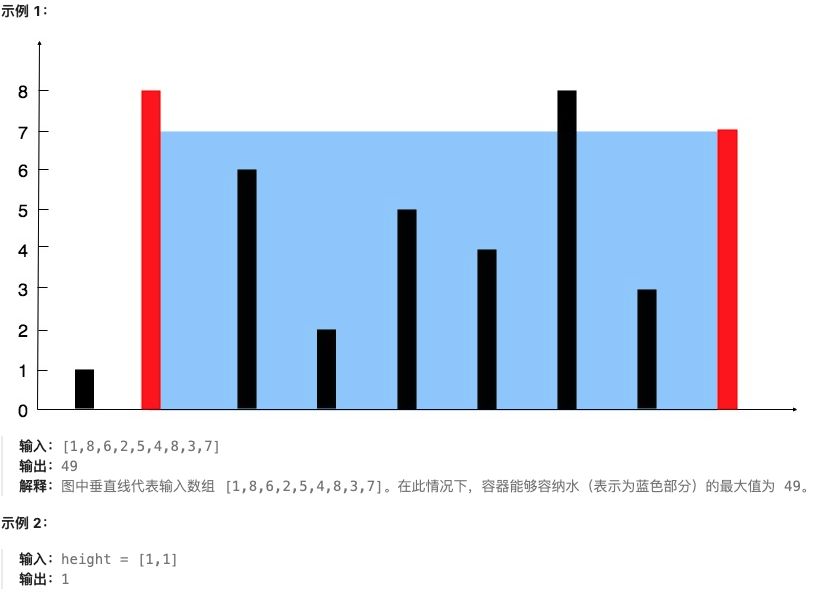
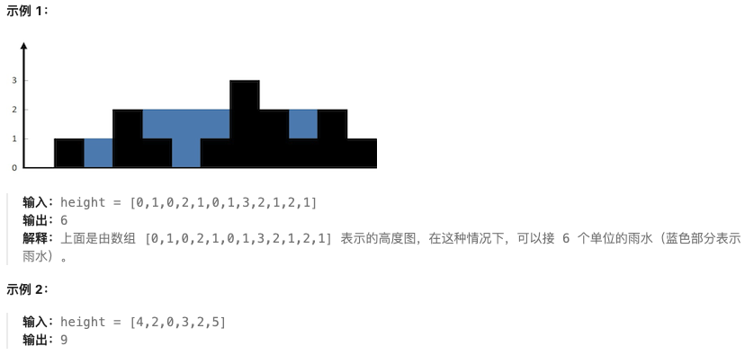

# 双指针专题

## 🔍 双指针基础知识

### 📖 定义

**双指针**（Two Pointers）是一种在数组、链表等线性数据结构中，使用两个指针（索引）来解决问题的方法。通过同时移动两个指针，可以高效地解决搜索、排序、合并等问题。

### ⚡ 双指针的类型

#### 1. 对撞指针（Two Pointers from Both Ends）
```python
# 从两端向中间移动
left, right = 0, len(nums) - 1
while left < right:
    # 处理逻辑
    if condition:
        left += 1
    else:
        right -= 1
```

#### 2. 快慢指针（Fast and Slow Pointers）
```python
# 快指针每次走两步，慢指针每次走一步
slow = fast = 0
while fast < len(nums):
    # 处理逻辑
    slow += 1
    fast += 2
```

#### 3. 同向双指针（Two Pointers in Same Direction）
```python
# 两个指针同向移动，通常用于滑动窗口
left = 0
for right in range(len(nums)):
    # 扩展窗口
    while condition_not_satisfied:
        # 收缩窗口
        left += 1
    # 更新结果
```

### 🎯 解题步骤

1. **确定指针类型**：根据问题特征选择合适的双指针类型
2. **初始化指针**：设置指针的初始位置
3. **移动条件**：确定指针移动的条件和时机
4. **边界处理**：处理指针越界和特殊情况
5. **结果更新**：在适当的时候更新结果

### 🐍 双指针应用场景

- **数组去重**：快慢指针去除重复元素
- **查找元素**：对撞指针在有序数组中查找
- **滑动窗口**：同向双指针解决子数组问题
- **链表操作**：快慢指针处理链表环、倒数第k个节点等
- **字符串匹配**：对撞指针处理回文串等

---

## 📋 题目目录

| 题号 | 题目名称 | 难度 | 核心技巧 |
|------|----------|------|----------|
| 283 | 移动零 | 简单 | 快慢指针 |
| 11 | 盛最多水的容器 | 中等 | 对撞指针 |
| 15 | 三数之和 | 中等 | 排序+对撞指针 |
| 42 | 接雨水 | 困难 | 对撞指针 |

---

## 283. 移动零

**题目描述：**

给定一个数组 nums，编写一个函数将所有 0 移动到数组的末尾，同时保持非零元素的相对顺序。

**测试用例：**

```
示例 1：
输入: nums = [0,1,0,3,12]
输出: [1,3,12,0,0]

示例 2：
输入: nums = [0]
输出: [0]
```

**最简单实现：**

```python
def moveZeroes(nums):
    """
    使用快慢指针将所有0移动到数组末尾
    
    思路：
    1. 使用slow指针记录非零元素应该放置的位置
    2. 使用fast指针遍历整个数组
    3. 当fast遇到非零元素时，与slow位置交换
    4. 最后slow后面的位置自然都是0
    
    时间复杂度：O(n)
    空间复杂度：O(1)
    """
    if not nums:
        return
    
    slow = 0  # 慢指针：记录非零元素应该放置的位置
    
    # 快指针遍历数组
    for fast in range(len(nums)):
        if nums[fast] != 0:
            # 发现非零元素，与slow位置交换
            nums[slow], nums[fast] = nums[fast], nums[slow]
            slow += 1  # 慢指针前进
    
    # slow后面的位置自然都是0，无需额外处理

# 测试用例
nums1 = [0,1,0,3,12]
moveZeroes(nums1)
print(nums1)  # 输出: [1,3,12,0,0]

nums2 = [0]
moveZeroes(nums2)
print(nums2)  # 输出: [0]

nums3 = [1,0,1]
moveZeroes(nums3)
print(nums3)  # 输出: [1,1,0]
```

**解题思路详解：**

这道题的核心是使用**快慢指针**来解决：

1. **slow指针**：记录下一个非零元素应该放置的位置
2. **fast指针**：遍历整个数组，寻找非零元素

**算法流程：**
- 初始化slow = 0
- fast从0到len(nums)-1遍历：
  - 如果nums[fast] != 0，将nums[fast]与nums[slow]交换，slow += 1
  - 如果nums[fast] == 0，fast继续前进，slow保持不动
- 最终slow后面的位置都是0

**举例说明：**
```
初始状态：nums = [0,1,0,3,12], slow = 0, fast = 0

fast=0: nums[0]=0，跳过
fast=1: nums[1]=1 ≠ 0，交换nums[0]和nums[1] -> [1,0,0,3,12], slow=1
fast=2: nums[2]=0，跳过
fast=3: nums[3]=3 ≠ 0，交换nums[1]和nums[3] -> [1,3,0,0,12], slow=2
fast=4: nums[4]=12 ≠ 0，交换nums[2]和nums[4] -> [1,3,12,0,0], slow=3

完成！
```

---

## 11. 盛最多水的容器

**题目描述：**

给定一个长度为 n 的整数数组 height 。有 n 条垂线，第 i 条线的两个端点是 (i, 0) 和 (i, height[i]) 。

找出其中的两条线，使得它们与 x 轴共同构成的容器可以容纳最多的水。

返回容器可以储存的最大水量。

说明：你不能倾斜容器。



**测试用例：**

```
示例 1：
输入：height = [1,8,6,2,5,4,8,3,7]
输出：49
解释：图中垂直线代表输入数组 [1,8,6,2,5,4,8,3,7]。在此情况下，容器能够容纳水（表示为蓝色部分）的最大值为 49。

示例 2：
输入：height = [1,1]
输出：1
```

**最简单实现：**

```python
def maxArea(height):
    """
    使用对撞指针求解盛最多水的容器问题
    
    思路：
    1. 初始化左右指针分别指向数组两端
    2. 计算当前容器的面积：面积 = min(height[left], height[right]) * (right - left)
    3. 更新最大面积
    4. 移动较短的那根线，因为移动较长的线不会增加面积
    
    时间复杂度：O(n)
    空间复杂度：O(1)
    """
    if not height or len(height) < 2:
        return 0
    
    left, right = 0, len(height) - 1
    max_area = 0
    
    while left < right:
        # 计算当前面积：短板效应，面积由较短的线决定
        current_area = min(height[left], height[right]) * (right - left)
        max_area = max(max_area, current_area)
        
        # 移动较短的那根线
        if height[left] < height[right]:
            left += 1
        else:
            right -= 1
    
    return max_area

# 测试用例
print(maxArea([1,8,6,2,5,4,8,3,7]))  # 输出: 49
print(maxArea([1,1]))                 # 输出: 1
print(maxArea([4,3,2,1,4]))          # 输出: 16
```

**解题思路详解：**

这道题的核心是使用**对撞指针**来解决：

**核心原理：面积计算公式**
- 面积 = min(左边高度, 右边高度) × (右边索引 - 左边索引)
- 水的容量受限于较短的那根线（短板效应）

**为什么使用对撞指针：**
1. **暴力解法**：枚举所有线对，时间复杂度O(n²)，效率太低
2. **对撞指针**：从两端开始，每次移动较短的线，时间复杂度O(n)

**算法流程：**
- 初始化left=0, right=len(height)-1
- while left < right:
  - 计算当前面积 = min(height[left], height[right]) * (right - left)
  - 更新最大面积
  - 如果height[left] < height[right]，移动left++
  - 否则移动right--

**为什么移动较短的线：**
- 移动较长的线不会增加面积，因为面积受限于较短的线
- 移动较短的线可能找到更高的线，从而增加面积

**举例说明：**
```
height = [1,8,6,2,5,4,8,3,7]

初始：left=0(1), right=8(7), area=min(1,7)*(8-0)=1*8=8
由于height[0]=1 < height[8]=7，移动left到1

left=1(8), right=8(7), area=min(8,7)*(8-1)=7*7=49 ← 最大面积
由于height[1]=8 > height[8]=7，移动right到7

left=1(8), right=7(3), area=min(8,3)*(7-1)=3*6=18
由于height[1]=8 > height[7]=3，移动right到6

...以此类推...
```

**时间复杂度证明：**
- 每个元素最多被访问两次（作为left或right）
- 总时间复杂度O(n)

---

## 15. 三数之和

**题目描述：**

给你一个整数数组 nums ，判断是否存在三元组 [nums[i], nums[j], nums[k]] 满足 i != j、i != k 且 j != k ，同时还满足 nums[i] + nums[j] + nums[k] == 0 。请你返回所有和为 0 且不重复的三元组。

注意：答案中不可以包含重复的三元组。

**测试用例：**

```
示例 1：
输入：nums = [-1,0,1,2,-1,-4]
输出：[[-1,-1,2],[-1,0,1]]
解释：
nums[0] + nums[1] + nums[2] = (-1) + 0 + 1 = 0 。
nums[1] + nums[2] + nums[4] = 0 + 1 + (-1) = 0 。
nums[0] + nums[3] + nums[4] = (-1) + 2 + (-1) = 0 。
不同的三元组是 [-1,0,1] 和 [-1,-1,2] 。
注意，输出的顺序和三元组的顺序并不重要。

示例 2：
输入：nums = [0,1,1]
输出：[]
解释：唯一可能的三元组和不为 0 。

示例 3：
输入：nums = [0,0,0]
输出：[[0,0,0]]
解释：唯一可能的三元组和为 0 。
```

**最简单实现：**

```python
def threeSum(nums):
    """
    使用排序+双指针求解三数之和问题
    
    思路：
    1. 先对数组排序
    2. 固定第一个数，转换为两数之和问题
    3. 使用双指针在剩余数组中找两数之和为-target
    4. 跳过重复元素避免重复结果
    
    时间复杂度：O(n²)
    空间复杂度：O(1)（不考虑排序的空间）
    """
    if not nums or len(nums) < 3:
        return []
    
    nums.sort()  # 排序是关键
    result = []
    n = len(nums)
    
    for i in range(n - 2):
        # 跳过重复的第一个数
        if i > 0 and nums[i] == nums[i - 1]:
            continue
        
        # 对撞指针：left从i+1开始，right从末尾开始
        left, right = i + 1, n - 1
        target = -nums[i]  # 两数之和的目标值
        
        while left < right:
            current_sum = nums[left] + nums[right]
            
            if current_sum == target:
                result.append([nums[i], nums[left], nums[right]])
                
                # 跳过重复的left元素
                while left < right and nums[left] == nums[left + 1]:
                    left += 1
                # 跳过重复的right元素
                while left < right and nums[right] == nums[right - 1]:
                    right -= 1
                
                # 移动指针继续寻找
                left += 1
                right -= 1
                
            elif current_sum < target:
                left += 1  # 需要更大的和
            else:
                right -= 1  # 需要更小的和
    
    return result

# 测试用例
print(threeSum([-1,0,1,2,-1,-4]))  # 输出: [[-1,-1,2],[-1,0,1]]
print(threeSum([0,1,1]))           # 输出: []
print(threeSum([0,0,0]))           # 输出: [[0,0,0]]
```

**解题思路详解：**

这道题的核心是**排序 + 对撞指针**：

**为什么需要排序？**
1. **便于去重**：排序后相同的元素会相邻，便于跳过重复元素
2. **有序性**：利用有序数组的双指针特性

**算法流程：**
1. **排序数组**：nums.sort()
2. **固定第一个数**：for i in range(n-2)
3. **双指针查找**：left=i+1, right=n-1
4. **计算目标值**：target = -nums[i]
5. **移动指针**：
   - current_sum == target：找到解，记录并跳过重复元素
   - current_sum < target：left++（需要更大的和）
   - current_sum > target：right--（需要更小的和）

**去重策略：**
- **第一个数去重**：i > 0 and nums[i] == nums[i-1]，跳过
- **第二个数去重**：找到解后，left移动时跳过重复元素
- **第三个数去重**：找到解后，right移动时跳过重复元素

**举例说明：**
```
nums = [-1,0,1,2,-1,-4] 排序后：[-4,-1,-1,0,1,2]

i=0: nums[0]=-4, target=4
left=1(-1), right=5(2), sum=-1+2=1 < 4, left++ 到2(-1)
left=2(-1), right=5(2), sum=-1+2=1 < 4, left++ 到3(0)
left=3(0), right=5(2), sum=0+2=2 < 4, left++ 到4(1)
left=4(1), right=5(2), sum=1+2=3 < 4, left++ 到5，结束

i=1: nums[1]=-1, target=1
left=2(-1), right=5(2), sum=-1+2=1 == 1，找到解[-1,-1,2]
跳过重复left：left=2到3(0)
right=5到4(1)

left=3(0), right=4(1), sum=0+1=1 == 1，找到解[-1,0,1]
结束

i=2: nums[2]=-1，重复，跳过
...以此类推...
```

**时间复杂度分析：**
- 排序：O(n log n)
- 双指针遍历：O(n²)
- 总体：O(n²)

---

## 42. 接雨水

**题目描述：**

给定 n 个非负整数表示每个宽度为 1 的柱子的高度图，计算按此排列的柱子，下雨之后能接多少雨水。



**测试用例：**

```
示例 1：
输入：height = [0,1,0,2,1,0,1,3,2,1,2,1]
输出：6
解释：上面是由数组 [0,1,0,2,1,0,1,3,2,1,2,1] 表示的高度图，在这种情况下，可以接 6 个单位的雨水（蓝色部分表示雨水）。

示例 2：
输入：height = [4,2,0,3,2,5]
输出：9
```

**最简单实现：**

```python
def trap(height):
    """
    使用对撞指针求解接雨水问题
    
    思路：
    1. 使用左右指针从两端向中间移动
    2. 维护左右两边的最大高度
    3. 当前位置能接的雨水 = min(左边最大高度, 右边最大高度) - 当前高度
    4. 移动较低一侧的指针，因为水的容量受限于较低的一侧
    
    时间复杂度：O(n)
    空间复杂度：O(1)
    """
    if not height or len(height) < 3:
        return 0
    
    left, right = 0, len(height) - 1
    left_max, right_max = 0, 0
    water = 0
    
    while left < right:
        # 更新左右最大高度
        left_max = max(left_max, height[left])
        right_max = max(right_max, height[right])
        
        # 移动较低一侧的指针
        if left_max < right_max:
            # 左边较低，以左边最大高度为准
            water += left_max - height[left]
            left += 1
        else:
            # 右边较低，以右边最大高度为准
            water += right_max - height[right]
            right -= 1
    
    return water

# 测试用例
print(trap([0,1,0,2,1,0,1,3,2,1,2,1]))  # 输出: 6
print(trap([4,2,0,3,2,5]))              # 输出: 9
print(trap([0,1,0,2,1,0,1,3,2,1,2,1])) # 输出: 6
```

**解题思路详解：**

这道题的核心是使用**对撞指针**来解决：

**核心原理：每个位置能接的雨水**
- 位置i能接的雨水 = min(左边最大高度, 右边最大高度) - height[i]
- 但这个值不能为负数

**为什么使用对撞指针：**
1. **暴力解法**：对每个位置都要找到左右最大高度，时间复杂度O(n²)
2. **对撞指针**：一边遍历，一边维护左右最大高度，时间复杂度O(n)

**算法流程：**
1. 初始化left=0, right=len-1
2. 初始化left_max=0, right_max=0, water=0
3. while left < right:
   - 更新left_max = max(left_max, height[left])
   - 更新right_max = max(right_max, height[right])
   - 如果left_max < right_max：
     - 左边较低，当前位置雨水 = left_max - height[left]
     - left++
   - 否则：
     - 右边较低，当前位置雨水 = right_max - height[right]
     - right--

**为什么移动较低的一侧：**
- 水的容量总是受限于较低的一侧
- 移动较低的一侧可以确保我们总是以较低的边界来计算雨水

**举例说明：**
```
height = [0,1,0,2,1,0,1,3,2,1,2,1]

初始：left=0(0), right=11(1), left_max=0, right_max=0

left=0: left_max=max(0,0)=0
right=11: right_max=max(0,1)=1
由于left_max=0 < right_max=1，water += 0-0=0，left++ 到1

left=1(1), right=11(1), left_max=max(0,1)=1, right_max=1
由于left_max=1 == right_max=1，移动right，water += 1-1=0，right-- 到10

left=1(1), right=10(2), left_max=1, right_max=max(1,2)=2
由于left_max=1 < right_max=2，water += 1-1=0，left++ 到2

...以此类推，最终water=6
```

**时间复杂度证明：**
- 每个位置只被访问一次
- 左右指针各移动n/2次
- 总时间复杂度O(n)

---

## 🎯 双指针解题模板总结

### 1. 快慢指针模板
```python
def fast_slow_pointer(nums):
    slow = fast = 0
    while fast < len(nums):
        # 处理逻辑
        slow += 1
        fast += 2  # 快指针步长可以调整
    return result
```

### 2. 对撞指针模板
```python
def collision_pointer(nums):
    left, right = 0, len(nums) - 1
    while left < right:
        if condition:
            left += 1
        else:
            right -= 1
        # 处理逻辑
    return result
```

### 3. 滑动窗口模板
```python
def sliding_window(nums, target):
    left = 0
    for right in range(len(nums)):
        # 扩展窗口
        while condition_not_satisfied:
            # 收缩窗口
            left += 1
        # 更新结果
    return result
```

双指针技巧是解决数组和字符串问题的强大工具，掌握这三种基本类型可以解决大部分相关问题。