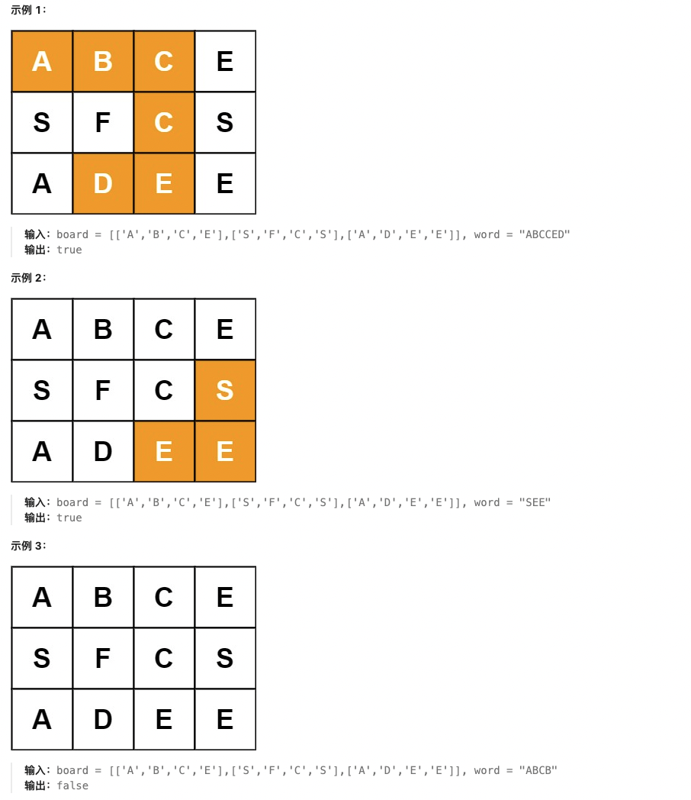
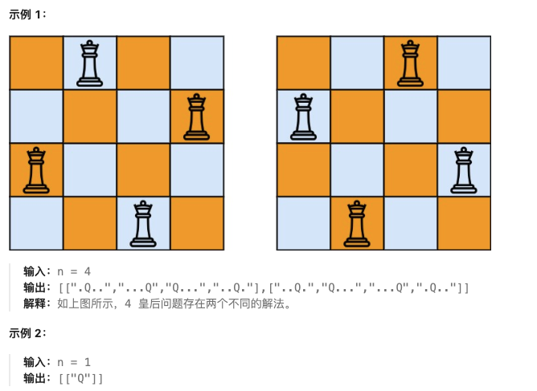

# 回溯专题

## 🔍 回溯基础知识

### 📖 定义

**回溯算法**（Backtracking）是一种通过探索所有可能的候选解来找出所有的解的算法。如果候选解被确认不是一个解（或者至少不是最后一个解），回溯算法会通过在上一步进行一些修改，抛弃该解，即"回溯"并且再次尝试。

### ⚡ 核心概念

1. **决策树**：回溯的过程可以抽象为一棵决策树
2. **路径记录**：用数组或字符串记录当前路径
3. **选择列表**：当前步骤可以做的选择
4. **结束条件**：到达决策树底层，无法再做选择的条件

### 🎯 回溯算法框架

```python
def backtrack(路径, 选择列表):
    if 满足结束条件:
        result.append(路径)
        return

    for 选择 in 选择列表:
        if 选择符合条件:
            做选择：路径.add(选择)
            backtrack(路径, 选择列表)
            撤销选择：路径.remove(选择)
```

### 🐍 回溯算法应用场景

- **排列问题**：全排列、下一个排列
- **组合问题**：组合总和、子集
- **搜索问题**：单词搜索、N皇后
- **字符串处理**：分割回文串、电话号码字母组合
- **其他**：括号生成、解数独

---

## 📋 题目目录

| 题号 | 题目名称 | 难度 | 核心技巧 |
|------|----------|------|----------|
| 46 | 全排列 | 中等 | 回溯排列 |
| 78 | 子集 | 中等 | 回溯组合 |
| 17 | 电话号码的字母组合 | 中等 | 回溯字符串 |
| 39 | 组合总和 | 中等 | 回溯组合（可重复） |
| 22 | 括号生成 | 中等 | 回溯括号匹配 |
| 79 | 单词搜索 | 中等 | 回溯二维网格 |
| 131 | 分割回文串 | 中等 | 回溯+回文判断 |
| 51 | N皇后 | 困难 | 回溯+位运算 |

---

## 46. 全排列

**题目描述：**

给定一个不含重复数字的数组 `nums` ，返回其 **所有可能的全排列** 。你可以 **按任意顺序** 返回答案。

**测试用例：**

```
示例 1：
输入：nums = [1,2,3]
输出：[[1,2,3],[1,3,2],[2,1,3],[2,3,1],[3,1,2],[3,2,1]]

示例 2：
输入：nums = [0,1]
输出：[[0,1],[1,0]]

示例 3：
输入：nums = [1]
输出：[[1]]
```

**最简单实现：**

```python
def permute(nums):
    """
    全排列：回溯算法

    思路：
    1. 使用回溯算法，枚举所有可能的排列
    2. 维护一个路径数组path，记录当前排列
    3. 使用used数组标记元素是否已被使用
    4. 当path长度等于nums长度时，找到一个排列

    时间复杂度：O(n!)
    空间复杂度：O(n)
    """
    def backtrack(path, used):
        # 结束条件：找到一个完整的排列
        if len(path) == len(nums):
            result.append(path[:])  # 复制path
            return

        for i in range(len(nums)):
            if not used[i]:
                # 做选择
                used[i] = True
                path.append(nums[i])

                # 递归
                backtrack(path, used)

                # 撤销选择
                path.pop()
                used[i] = False

    result = []
    used = [False] * len(nums)
    backtrack([], used)
    return result

# 测试用例
print(permute([1,2,3]))  # [[1,2,3],[1,3,2],[2,1,3],[2,3,1],[3,1,2],[3,2,1]]
print(permute([0,1]))    # [[0,1],[1,0]]
print(permute([1]))      # [[1]]
```

**解题思路详解：**

这道题的核心是**排列问题的回溯算法**：

**核心原理：**
- 排列问题需要考虑元素的顺序，每个元素都要选择一次
- 使用used数组避免重复选择同一个元素
- 路径path记录当前已选择的元素

**回溯算法流程：**
1. 初始化result数组存储所有排列
2. 初始化used数组标记元素使用状态
3. 调用backtrack函数开始回溯

**backtrack函数逻辑：**
1. 结束条件：path长度等于nums长度
2. 遍历所有元素，寻找未使用的元素
3. 做选择：标记used，添加到path
4. 递归调用backtrack
5. 撤销选择：从path弹出，取消used标记

**为什么有效？**
- used数组确保每个元素只使用一次
- path记录当前路径状态
- 递归树穷举所有可能的排列

**举例说明：**
```
nums = [1,2,3]

决策树：
                 []
         /       |       \
       [1]       [2]       [3]
      /  \      /  \      /  \
   [1,2] [1,3] [2,1] [2,3] [3,1] [3,2]
     |     |     |     |     |     |
   [1,2,3] [1,3,2] [2,1,3] [2,3,1] [3,1,2] [3,2,1]

最终结果：所有6种排列 ✓
```

**时间复杂度证明：**
- 排列总数：n!
- 每个排列需要O(n)时间构建
- 总复杂度：O(n! * n) = O(n!)

---

## 78. 子集

**题目描述：**

给你一个整数数组 `nums` ，数组中的元素 **互不相同** 。返回该数组所有可能的子集（幂集）。

解集 **不能** 包含重复的子集。你可以按 **任意顺序** 返回解集。

**测试用例：**

```
示例 1：
输入：nums = [1,2,3]
输出：[[],[1],[2],[1,2],[3],[1,3],[2,3],[1,2,3]]

示例 2：
输入：nums = [0]
输出：[[],[0]]
```

**最简单实现：**

```python
def subsets(nums):
    """
    子集：回溯算法

    思路：
    1. 使用回溯算法，枚举所有可能的子集
    2. 对于每个元素，都有选择和不选择两种情况
    3. 路径path记录当前子集
    4. 递归遍历所有元素

    时间复杂度：O(2^n)
    空间复杂度：O(n)
    """
    def backtrack(start, path):
        # 每个状态都是一个有效的子集
        result.append(path[:])

        for i in range(start, len(nums)):
            # 做选择
            path.append(nums[i])

            # 递归（注意start+1，避免重复）
            backtrack(i + 1, path)

            # 撤销选择
            path.pop()

    result = []
    backtrack(0, [])
    return result

# 迭代版本
def subsets_iterative(nums):
    """
    迭代版本：位运算

    思路：
    1. 总共有2^n个子集
    2. 使用位运算枚举所有子集
    3. 第i位为1表示选择nums[i]

    时间复杂度：O(2^n * n)
    空间复杂度：O(1)
    """
    n = len(nums)
    result = []

    for mask in range(1 << n):  # 0到2^n-1
        subset = []
        for i in range(n):
            if mask & (1 << i):  # 检查第i位是否为1
                subset.append(nums[i])
        result.append(subset)

    return result

# 测试用例
print(subsets([1,2,3]))  # [[],[1],[1,2],[1,2,3],[1,3],[2],[2,3],[3]]
print(subsets([0]))      # [[],[0]]
```

**解题思路详解：**

这道题的核心是**组合问题的回溯算法**：

**核心原理：**
- 子集问题不需要考虑顺序，只需要选择哪些元素
- 每个元素都有"选"和"不选"两种选择
- 使用start参数避免重复选择前面的元素

**回溯算法流程：**
1. 初始化result数组存储所有子集
2. 调用backtrack(0, [])开始回溯

**backtrack函数逻辑：**
1. 首先将当前path加入result（每个状态都是有效子集）
2. 从start开始遍历剩余元素
3. 做选择：添加到path
4. 递归调用backtrack(i+1, path)
5. 撤销选择：从path弹出

**为什么有效？**
- start参数确保元素按顺序选择，避免重复
- 每个递归状态都代表一个有效子集
- 递归树覆盖所有可能的子集组合

**举例说明：**
```
nums = [1,2,3]

决策树：
                 []
         /              \
       [1]              []
      /    \          /     \
   [1,2]   [1]     [2]      []
   /  \   /  \    /  \    /  \
[1,2,3][1,2][1,3][1][2,3][2][3][]

最终结果：所有8种子集 ✓
```

**时间复杂度证明：**
- 子集总数：2^n
- 每个子集需要O(n)时间构建
- 总复杂度：O(2^n * n)

**空间复杂度证明：**
- 递归栈深度：O(n)
- path数组：O(n)
- 结果存储：O(2^n * n)

---

## 17. 电话号码的字母组合

**题目描述：**

给定一个仅包含数字 `2-9` 的字符串，返回所有它能表示的字母组合。答案可以按 **任意顺序** 返回。

给出数字到字母的映射如下（与电话按键相同）。注意 1 不对应任何字母。

**测试用例：**

```
示例 1：
输入：digits = "23"
输出：["ad","ae","af","bd","be","bf","cd","ce","cf"]

示例 2：
输入：digits = ""
输出：[]

示例 3：
输入：digits = "2"
输出：["a","b","c"]
```

**最简单实现：**

```python
def letterCombinations(digits):
    """
    电话号码的字母组合：回溯算法

    思路：
    1. 建立数字到字母的映射表
    2. 使用回溯算法，逐位处理数字
    3. 路径path记录当前组合的字母
    4. 当处理完所有数字时，得到一个组合

    时间复杂度：O(3^m * 4^n)，m是3字母数字，n是4字母数字
    空间复杂度：O(m + n)
    """
    if not digits:
        return []

    # 数字到字母的映射
    phone_map = {
        '2': 'abc', '3': 'def', '4': 'ghi', '5': 'jkl',
        '6': 'mno', '7': 'pqrs', '8': 'tuv', '9': 'wxyz'
    }

    def backtrack(index, path):
        # 结束条件：处理完所有数字
        if index == len(digits):
            result.append(''.join(path))
            return

        # 获取当前数字对应的字母
        letters = phone_map[digits[index]]

        for letter in letters:
            # 做选择
            path.append(letter)

            # 递归处理下一个数字
            backtrack(index + 1, path)

            # 撤销选择
            path.pop()

    result = []
    backtrack(0, [])
    return result

# 测试用例
print(letterCombinations("23"))  # ["ad","ae","af","bd","be","bf","cd","ce","cf"]
print(letterCombinations(""))    # []
print(letterCombinations("2"))   # ["a","b","c"]
```

**解题思路详解：**

这道题的核心是**字符串组合的回溯算法**：

**核心原理：**
- 每个数字对应多个字母
- 需要组合出所有可能的字母序列
- 递归处理每个数字，尝试所有可能的字母

**回溯算法流程：**
1. 建立数字到字母的映射表
2. 初始化result数组存储结果
3. 调用backtrack(0, [])开始回溯

**backtrack函数逻辑：**
1. 结束条件：index等于digits长度
2. 获取当前数字对应的所有字母
3. 对每个字母做选择，递归处理下一个数字
4. 撤销选择，继续尝试其他字母

**为什么有效？**
- index参数控制处理到哪个数字
- path记录当前组合的字母序列
- 递归树穷举所有可能的字母组合

**举例说明：**
```
digits = "23"

数字映射：
2 -> "abc"
3 -> "def"

决策树：
                 ""
         /       |       \
       "a"      "b"      "c"
      / | \    / | \    / | \
   "ad""ae""af""bd""be""bf""cd""ce""cf"

最终结果：9种组合 ✓
```

**时间复杂度证明：**
- 数字2,3,4,5,6,8对应3个字母
- 数字7,9对应4个字母
- 复杂度：O(3^m * 4^n)，m和n分别是对应字母数的数字个数

**空间复杂度证明：**
- 递归栈深度：O(len(digits))
- path数组：O(len(digits))
- 结果存储：O(组合总数)

---

## 39. 组合总和

**题目描述：**

给你一个 **无重复元素** 的整数数组 `candidates` 和一个目标整数 `target` ，找出 `candidates` 中可以使数字和为目标数 `target` 的 **所有** **不同组合** ，并以列表形式返回。你可以按 **任意顺序** 返回这些组合。

`candidates` 中的 **同一个** 数字可以 **无限制重复被选取** 。如果至少一个数字的被选数量不同，则两种组合是不同的。

对于给定的输入，保证和为 `target` 的不同组合数少于 150 个。

**测试用例：**

```
示例 1：
输入：candidates = [2,3,6,7], target = 7
输出：[[2,2,3],[7]]
解释：
2 和 3 可以形成一组候选，2 + 2 + 3 = 7 。注意 2 可以使用多次。
7 也是一个候选， 7 = 7 。
仅有这两种组合。

示例 2：
输入: candidates = [2,3,5], target = 8
输出: [[2,2,2,2],[2,3,3],[3,5]]

示例 3：
输入: candidates = [2], target = 1
输出: []
```

**最简单实现：**

```python
def combinationSum(candidates, target):
    """
    组合总和：回溯算法（元素可重复使用）

    思路：
    1. 排序candidates数组（可选，用于优化）
    2. 使用回溯算法，寻找所有和为target的组合
    3. start参数避免重复使用前面的元素
    4. 剪枝：当当前和超过target时停止

    时间复杂度：O(2^target)，最坏情况
    空间复杂度：O(target)
    """
    def backtrack(start, path, current_sum):
        # 结束条件：找到和为target的组合
        if current_sum == target:
            result.append(path[:])
            return

        # 剪枝：超过target，直接返回
        if current_sum > target:
            return

        for i in range(start, len(candidates)):
            # 做选择
            path.append(candidates[i])
            current_sum += candidates[i]

            # 递归（可以重复使用当前元素）
            backtrack(i, path, current_sum)

            # 撤销选择
            path.pop()
            current_sum -= candidates[i]

    result = []
    candidates.sort()  # 排序便于剪枝
    backtrack(0, [], 0)
    return result

# 测试用例
print(combinationSum([2,3,6,7], 7))  # [[2,2,3],[7]]
print(combinationSum([2,3,5], 8))    # [[2,2,2,2],[2,3,3],[3,5]]
print(combinationSum([2], 1))        # []
```

**解题思路详解：**

这道题的核心是**组合问题的回溯算法（元素可重复）**：

**核心原理：**
- 每个元素可以被无限次使用
- 组合问题不需要考虑顺序
- 需要找到所有和为target的不同组合

**回溯算法流程：**
1. 排序candidates数组（便于后续剪枝）
2. 初始化result数组存储结果
3. 调用backtrack(0, [], 0)开始回溯

**backtrack函数逻辑：**
1. 结束条件：current_sum == target
2. 剪枝条件：current_sum > target
3. 从start开始遍历元素（允许重复使用）
4. 做选择：添加到path，更新current_sum
5. 递归调用backtrack(i, path, current_sum)
6. 撤销选择：从path弹出，恢复current_sum

**为什么有效？**
- start参数从i开始，允许重复使用当前元素
- current_sum实时跟踪当前和，避免重复计算
- 剪枝优化：超过target时提前停止

**举例说明：**
```
candidates = [2,3,6,7], target = 7

决策树（部分）：
                 []
         /       |       \
       [2]      [3]      [6]...
      / | \    / | \    /
   [2,2] [2,3] [2,6] [3,2] [3,3] [3,6]
    /     |      |
[2,2,2] [2,2,3] [2,3,2]...

有效组合：[2,2,3]和[7] ✓
```

**时间复杂度证明：**
- 最坏情况下接近O(2^target)
- 实际复杂度取决于candidates和target的具体值
- 题目保证组合数少于150个

**空间复杂度证明：**
- 递归栈深度：O(target/min(candidates))
- path数组：O(target/min(candidates))
- 结果存储：O(组合总数)

---

## 22. 括号生成

**题目描述：**

数字 `n` 代表生成括号的对数，请你设计一个函数，用于能够生成所有可能的并且 **有效的** 括号组合。

**测试用例：**

```
示例 1：
输入：n = 3
输出：["((()))","(()())","(())()","()(())","()()()"]

示例 2：
输入：n = 1
输出：["()"]
```

**最简单实现：**

```python
def generateParenthesis(n):
    """
    括号生成：回溯算法

    思路：
    1. 使用回溯算法，生成所有可能的括号序列
    2. 使用left和right计数当前使用的左右括号数
    3. 左括号数不能超过n，右括号数不能超过左括号数
    4. 当左右括号都为n时，得到有效序列

    时间复杂度：O(4^n / √n)
    空间复杂度：O(n)
    """
    def backtrack(path, left, right):
        # 结束条件：左右括号都使用了n个
        if left == n and right == n:
            result.append(''.join(path))
            return

        # 添加左括号：左括号数 < n
        if left < n:
            path.append('(')
            backtrack(path, left + 1, right)
            path.pop()

        # 添加右括号：右括号数 < 左括号数
        if right < left:
            path.append(')')
            backtrack(path, left, right + 1)
            path.pop()

    result = []
    backtrack([], 0, 0)
    return result

# 测试用例
print(generateParenthesis(3))  # ["((()))","(()())","(())()","()(())","()()()"]
print(generateParenthesis(1))  # ["()"]
```

**解题思路详解：**

这道题的核心是**括号匹配的回溯算法**：

**核心原理：**
- 括号必须成对出现，左右括号数量相等
- 在任何位置，右括号数量不能超过左括号数量
- 使用计数器跟踪左右括号的使用情况

**回溯算法流程：**
1. 初始化result数组存储结果
2. 调用backtrack([], 0, 0)开始回溯

**backtrack函数逻辑：**
1. 结束条件：left == n and right == n
2. 添加左括号：条件是left < n
3. 添加右括号：条件是right < left
4. 递归调用，撤销选择

**为什么有效？**
- left计数器：控制左括号总数不超过n
- right < left：确保右括号不超过左括号
- 递归树只生成有效的括号序列

**举例说明：**
```
n = 2

决策树：
                 ""
         /              \
       "("              (无效)
      /    \
    "(("   "()"
   /      /    \
"(()"  "()("  "()()"
  |      |      |
"(())"  "(()"  "()()"

有效结果：["(())","()()"] ✓
```

**时间复杂度证明：**
- 卡塔兰数：第n个卡塔兰数是第2n个卡塔兰数的1/(n+1)倍
- 括号生成数：第n个卡塔兰数
- 复杂度：O(4^n / √n)

**空间复杂度证明：**
- 递归栈深度：O(n)
- path数组：O(n)
- 结果存储：O(卡塔兰数 * n)

---

## 79. 单词搜索

**题目描述：**

给定一个 `m x n` 二维字符网格 `board` 和一个字符串单词 `word` 。如果 `word` 存在于网格中，返回 `true` ；否则，返回 `false` 。

单词必须按照字母顺序，通过相邻的单元格内的字母构成，其中"相邻"单元格是那些水平相邻或垂直相邻的单元格。同一个单元格内的字母不允许被重复使用。



**测试用例：**

```
示例 1：
输入：board = [["A","B","C","E"],["S","F","C","S"],["A","D","E","E"]], word = "ABCCED"
输出：true

示例 2：
输入：board = [["A","B","C","E"],["S","F","C","S"],["A","D","E","E"]], word = "SEE"
输出：true

示例 3：
输入：board = [["A","B","C","E"],["S","F","C","S"],["A","D","E","E"]], word = "ABCB"
输出：false
```

**最简单实现：**

```python
def exist(board, word):
    """
    单词搜索：回溯算法

    思路：
    1. 遍历网格，找到word第一个字母的位置
    2. 从该位置开始DFS/BFS搜索word剩余字母
    3. 使用visited数组标记已访问位置
    4. 搜索相邻四个方向的单元格

    时间复杂度：O(m*n*4^L)，L是word长度
    空间复杂度：O(m*n)
    """
    if not board or not board[0]:
        return False

    m, n = len(board), len(board[0])

    def dfs(i, j, index):
        # 结束条件：找到完整单词
        if index == len(word):
            return True

        # 边界检查和字符匹配
        if i < 0 or i >= m or j < 0 or j >= n or board[i][j] != word[index]:
            return False

        # 标记已访问
        temp = board[i][j]
        board[i][j] = '#'  # 临时标记

        # 搜索四个方向
        found = (dfs(i-1, j, index+1) or  # 上
                 dfs(i+1, j, index+1) or  # 下
                 dfs(i, j-1, index+1) or  # 左
                 dfs(i, j+1, index+1))    # 右

        # 恢复原状
        board[i][j] = temp

        return found

    # 遍历所有起始位置
    for i in range(m):
        for j in range(n):
            if board[i][j] == word[0] and dfs(i, j, 0):
                return True

    return False

# 测试用例
board1 = [["A","B","C","E"],["S","F","C","S"],["A","D","E","E"]]
print(exist(board1, "ABCCED"))  # True
print(exist(board1, "SEE"))     # True
print(exist(board1, "ABCB"))    # False
```

**解题思路详解：**

这道题的核心是**二维网格的回溯搜索**：

**核心原理：**
- 在二维网格中搜索字符串路径
- 每个位置只能使用一次
- 路径必须连续相邻（上下左右）

**回溯算法流程：**
1. 遍历网格找到word首字母位置
2. 从该位置开始DFS搜索
3. 使用临时标记避免重复访问

**dfs函数逻辑：**
1. 结束条件：index == len(word)
2. 边界和字符匹配检查
3. 临时标记当前位置为已访问
4. 递归搜索四个方向
5. 恢复原位置标记

**为什么有效？**
- 临时标记确保每个位置只使用一次
- 递归回溯尝试所有可能的路径
- 找到一条完整路径即可返回true

**举例说明：**
```
board = [["A","B","C","E"],
         ["S","F","C","S"],
         ["A","D","E","E"]]

word = "ABCCED"

搜索路径：
A(0,0) -> B(0,1) -> C(0,2) -> C(1,2) -> E(2,3) -> D(2,2)

完整路径存在 ✓
```

**时间复杂度证明：**
- 最坏情况：每个位置都是word首字母
- 每个位置DFS深度为word长度
- 每个位置有4个方向选择
- 复杂度：O(m*n*4^L)

**空间复杂度证明：**
- 递归栈深度：O(L)，L是word长度
- 临时标记使用原board空间
- 总空间：O(m*n)

---

## 131. 分割回文串

**题目描述：**

给你一个字符串 `s`，请你将 `s` 分割成一些 **子串**，使每个子串都是 **回文串** 。返回 `s` 所有可能的分割方案。

**测试用例：**

```
示例 1：
输入：s = "aab"
输出：[["a","a","b"],["aa","b"]]

示例 2：
输入：s = "a"
输出：[["a"]]
```

**最简单实现：**

```python
def partition(s):
    """
    分割回文串：回溯算法 + 回文判断

    思路：
    1. 使用回溯算法，尝试所有可能的分割位置
    2. 对于每个子串，检查是否为回文串
    3. 路径path记录当前分割的子串列表
    4. 当分割完整个字符串时，得到一个方案

    时间复杂度：O(2^n * n)
    空间复杂度：O(n)
    """
    def is_palindrome(sub):
        """检查子串是否为回文"""
        return sub == sub[::-1]

    def backtrack(start, path):
        # 结束条件：分割完整个字符串
        if start == len(s):
            result.append(path[:])
            return

        for end in range(start + 1, len(s) + 1):
            # 检查子串[start:end]是否为回文
            substring = s[start:end]
            if is_palindrome(substring):
                # 做选择
                path.append(substring)

                # 递归处理剩余部分
                backtrack(end, path)

                # 撤销选择
                path.pop()

    result = []
    backtrack(0, [])
    return result

# 优化版本：预处理回文矩阵
def partition_optimized(s):
    """
    优化版本：预处理所有子串的回文状态

    时间复杂度：O(n^2)
    空间复杂度：O(n^2)
    """
    n = len(s)

    # 预处理：dp[i][j]表示s[i:j+1]是否为回文
    dp = [[False] * n for _ in range(n)]
    for i in range(n):
        dp[i][i] = True  # 单个字符是回文

    for length in range(2, n + 1):  # 子串长度
        for i in range(n - length + 1):
            j = i + length - 1
            if s[i] == s[j]:
                if length == 2:
                    dp[i][j] = True
                else:
                    dp[i][j] = dp[i+1][j-1]

    def backtrack(start, path):
        if start == n:
            result.append(path[:])
            return

        for end in range(start, n):
            if dp[start][end]:  # 快速检查是否为回文
                path.append(s[start:end+1])
                backtrack(end + 1, path)
                path.pop()

    result = []
    backtrack(0, [])
    return result

# 测试用例
print(partition("aab"))  # [["a","a","b"],["aa","b"]]
print(partition("a"))    # [["a"]]
```

**解题思路详解：**

这道题的核心是**回溯算法 + 回文判断**：

**核心原理：**
- 将字符串分割成多个子串
- 每个子串都必须是回文串
- 穷举所有可能的分割方案

**回溯算法流程：**
1. 初始化result数组存储所有方案
2. 调用backtrack(0, [])开始回溯

**backtrack函数逻辑：**
1. 结束条件：start == len(s)
2. 尝试所有可能的结束位置end
3. 检查子串s[start:end]是否为回文
4. 如果是回文，做选择，递归处理剩余部分
5. 撤销选择，继续尝试其他分割

**为什么有效？**
- 回文检查确保每个分割都是有效的
- start参数控制当前处理的位置
- 递归树覆盖所有可能的分割方案

**举例说明：**
```
s = "aab"

可能的分割：
"a|a|b" -> ["a","a","b"] ✓
"a|ab" -> ["a","ab"] ✗ (ab不是回文)
"aa|b" -> ["aa","b"] ✓

最终结果：[["a","a","b"],["aa","b"]] ✓
```

**时间复杂度证明：**
- 回文检查：每个子串O(n)时间
- 总分割方案：O(2^n)
- 复杂度：O(2^n * n)

**空间复杂度证明：**
- 递归栈深度：O(n)
- path数组：O(n)
- 结果存储：O(2^n * n)

---

## 51. N皇后

**题目描述：**

按照国际象棋的规则，皇后可以攻击与之处在同一行或同一列或同一斜线上的棋子。

**n 皇后问题** 研究的是如何将 n 个皇后放置在 n×n 的棋盘上，并且使皇后彼此之间不能相互攻击。

给你一个整数 `n` ，返回所有不同的 **n 皇后问题** 的解决方案。

每一种解法包含一个不同的 **n 皇后问题** 的棋子放置方案，该方案中 'Q' 和 '.' 分别代表了皇后和空位。



**测试用例：**

```
示例 1：
输入：n = 4
输出：[[".Q..","...Q","Q...","..Q."],["..Q.","Q...","...Q",".Q.."]]

解释：如上图所示，4 皇后问题存在两个不同的解法。

示例 2：
输入：n = 1
输出：[["Q"]]
```

**最简单实现：**

```python
def solveNQueens(n):
    """
    N皇后：回溯算法

    思路：
    1. 使用回溯算法，逐行放置皇后
    2. 使用三个数组标记列和对角线的占用情况
    3. 检查当前位置是否安全（不同行、列、对角线）
    4. 当放置完n个皇后时，找到一个解

    时间复杂度：O(n!)
    空间复杂度：O(n)
    """
    def is_safe(row, col):
        """检查当前位置是否安全"""
        # 检查列
        if col in columns:
            return False

        # 检查主对角线（row - col）
        if row - col in diagonals1:
            return False

        # 检查副对角线（row + col）
        if row + col in diagonals2:
            return False

        return True

    def backtrack(row):
        # 结束条件：放置完所有皇后
        if row == n:
            # 转换为棋盘格式
            board = []
            for i in range(n):
                row_str = ['.'] * n
                row_str[queens[i]] = 'Q'
                board.append(''.join(row_str))
            result.append(board)
            return

        for col in range(n):
            if is_safe(row, col):
                # 做选择
                queens[row] = col
                columns.add(col)
                diagonals1.add(row - col)
                diagonals2.add(row + col)

                # 递归下一行
                backtrack(row + 1)

                # 撤销选择
                columns.remove(col)
                diagonals1.remove(row - col)
                diagonals2.remove(row + col)

    # 初始化
    result = []
    queens = [-1] * n  # queens[i]表示第i行皇后在哪一列
    columns = set()    # 已占用的列
    diagonals1 = set() # 已占用的主对角线（row - col）
    diagonals2 = set() # 已占用的副对角线（row + col）

    backtrack(0)
    return result

# 位运算优化版本
def solveNQueens_bitwise(n):
    """
    位运算优化版本：使用位运算加速检查

    时间复杂度：O(n!)
    空间复杂度：O(n)
    """
    def backtrack(row, columns, diagonals1, diagonals2):
        if row == n:
            # 转换为棋盘格式
            board = []
            for i in range(n):
                row_str = ['.'] * n
                col = queens[i]
                row_str[col] = 'Q'
                board.append(''.join(row_str))
            result.append(board)
            return

        # 计算可用的列：不在已占用列和对角线的列
        available = ((1 << n) - 1) & ~(columns | diagonals1 | diagonals2)

        while available:
            # 找到最低位的1
            col = available & -available

            # 计算列索引
            col_index = 0
            temp = col
            while temp > 1:
                temp >>= 1
                col_index += 1

            queens[row] = col_index

            # 递归下一行，更新状态
            backtrack(row + 1,
                     columns | col,
                     (diagonals1 | col) << 1,
                     (diagonals2 | col) >> 1)

            # 清除最低位的1
            available &= available - 1

    result = []
    queens = [-1] * n
    backtrack(0, 0, 0, 0)
    return result

# 测试用例
print(len(solveNQueens(4)))  # 2
print(solveNQueens(1))       # [["Q"]]
```

**解题思路详解：**

这道题的核心是**约束满足问题的回溯算法**：

**核心原理：**
- 皇后不能在同一行、列或对角线
- 逐行放置皇后，每行只能放一个
- 使用标记数组或位运算跟踪约束

**回溯算法流程：**
1. 初始化标记数组（列、主对角线、副对角线）
2. 调用backtrack(0)开始逐行放置
3. 记录queens数组表示每行皇后的列位置

**backtrack函数逻辑：**
1. 结束条件：row == n，找到一个完整解
2. 遍历当前行的所有列
3. 检查当前位置是否安全
4. 做选择：更新标记数组，递归下一行
5. 撤销选择：恢复标记数组

**为什么有效？**
- 逐行放置确保不同行
- 列标记确保不同列
- 对角线标记确保不同对角线
- 回溯尝试所有可能的放置方案

**举例说明：**
```
n = 4

一个解：
行0：列1 -> Q . . .
行1：列3 -> . . . Q
行2：列0 -> Q . . .
行3：列2 -> . . Q .

检查约束：无同一行、列、对角线 ✓
```

**时间复杂度证明：**
- 最坏情况：检查所有可能的皇后放置
- 排列数：n!
- 每个位置需要检查约束
- 复杂度：O(n!)

**空间复杂度证明：**
- 递归栈深度：O(n)
- 标记集合：O(n)
- queens数组：O(n)

---

## 🎯 回溯算法解题技巧总结

### 1. 回溯算法通用模板

```python
def backtrack(路径, 选择列表):
    # 结束条件
    if 满足结束条件:
        result.append(路径[:])  # 注意复制
        return

    for 选择 in 选择列表:
        if 选择符合条件:  # 剪枝条件
            # 做选择
            路径.add(选择)

            # 递归
            backtrack(路径, 新的选择列表)

            # 撤销选择
            路径.remove(选择)
```

### 2. 排列问题模板（46.全排列）

```python
def permute(nums):
    def backtrack(path, used):
        if len(path) == len(nums):
            result.append(path[:])
            return

        for i in range(len(nums)):
            if not used[i]:
                used[i] = True
                path.append(nums[i])
                backtrack(path, used)
                path.pop()
                used[i] = False

    result = []
    backtrack([], [False] * len(nums))
    return result
```

### 3. 组合问题模板（78.子集）

```python
def subsets(nums):
    def backtrack(start, path):
        result.append(path[:])

        for i in range(start, len(nums)):
            path.append(nums[i])
            backtrack(i + 1, path)
            path.pop()

    result = []
    backtrack(0, [])
    return result
```

### 4. 组合总和模板（39.组合总和）

```python
def combinationSum(candidates, target):
    def backtrack(start, path, current_sum):
        if current_sum == target:
            result.append(path[:])
            return
        if current_sum > target:
            return

        for i in range(start, len(candidates)):
            path.append(candidates[i])
            backtrack(i, path, current_sum + candidates[i])
            path.pop()

    result = []
    backtrack(0, [], 0)
    return result
```

### 5. N皇后模板（51.N皇后）

```python
def solveNQueens(n):
    def backtrack(row):
        if row == n:
            # 记录解
            return

        for col in range(n):
            if is_safe(row, col):
                # 做选择：放置皇后，更新约束
                place_queen(row, col)
                backtrack(row + 1)
                # 撤销选择：移除皇后，恢复约束
                remove_queen(row, col)

    backtrack(0)
```

### 💡 解题技巧

1. **问题分类**：
   - **排列问题**：强调元素顺序，使用used数组
   - **组合问题**：不考虑顺序，使用start参数
   - **搜索问题**：二维网格，标记访问状态

2. **剪枝优化**：
   - **提前终止**：当前和超过target
   - **排序剪枝**：排序后跳过重复元素
   - **可行性剪枝**：皇后问题中的约束检查

3. **状态记录**：
   - **路径记录**：用数组或字符串记录当前路径
   - **访问标记**：used数组、visited矩阵
   - **计数器**：括号生成中的左右括号计数

4. **复杂度分析**：
   - **排列问题**：O(n!)
   - **组合问题**：O(2^n)
   - **搜索问题**：O(分支因子^深度)

5. **常见错误**：
   - **忘记复制路径**：result.append(path[:])
   - **忘记撤销选择**：递归后必须恢复状态
   - **重复使用元素**：排列问题中忘记used标记

回溯算法是解决组合、排列、搜索问题的有力工具，掌握回溯思维和模板，能解决很多看似复杂的问题！🚀