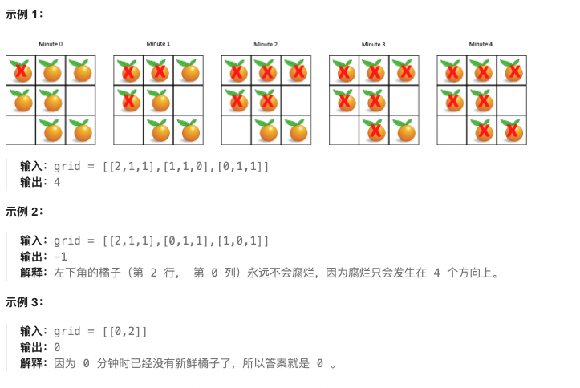

# 图论专题

## 🔍 图论基础知识

### 📖 定义

**图**（Graph）是由顶点（vertex）和边（edge）组成的集合。图论是研究图的性质和应用的数学分支。在算法中，图常用于表示实体之间的关系和连接。

### ⚡ 核心概念

1. **顶点（Vertex/Node）**：图的基本元素
2. **边（Edge）**：连接两个顶点的线段
3. **有向图/无向图**：边是否有方向
4. **权重图**：边是否有权重
5. **连通图**：任意两点都连通

### 🎯 图的表示方法

#### 1. 邻接矩阵
```python
# 二维数组表示边，适合稠密图
graph = [
    [0, 1, 1],  # 节点0连接到1和2
    [1, 0, 0],  # 节点1连接到0
    [1, 0, 0]   # 节点2连接到0
]
```

#### 2. 邻接表
```python
# 数组+链表，适合稀疏图
graph = [
    [1, 2],      # 节点0的邻居：1, 2
    [0],         # 节点1的邻居：0
    [0]          # 节点2的邻居：0
]
```

### 🐍 图的遍历算法

#### 1. 深度优先搜索（DFS）
```python
def dfs(graph, node, visited):
    visited.add(node)
    print(node)  # 访问节点

    for neighbor in graph[node]:
        if neighbor not in visited:
            dfs(graph, neighbor, visited)
```

#### 2. 广度优先搜索（BFS）
```python
from collections import deque

def bfs(graph, start):
    visited = set()
    queue = deque([start])
    visited.add(start)

    while queue:
        node = queue.popleft()
        print(node)  # 访问节点

        for neighbor in graph[node]:
            if neighbor not in visited:
                visited.add(neighbor)
                queue.append(neighbor)
```

### 📏 图论应用场景

- **连通性问题**：岛屿数量、朋友圈
- **最短路径**：迷宫、导航
- **拓扑排序**：课程安排、依赖关系
- **最小生成树**：网络设计
- **字符串处理**：Trie树、前缀匹配

---

## 📋 题目目录

| 题号 | 题目名称 | 难度 | 核心技巧 |
|------|----------|------|----------|
| 200 | 岛屿数量 | 中等 | DFS/BFS遍历 |
| 994 | 腐烂的橘子 | 中等 | 多源BFS |
| 207 | 课程表 | 中等 | 拓扑排序 |
| 208 | 实现 Trie | 中等 | Trie树 |

---

## 200. 岛屿数量

**题目描述：**

给你一个由 '1'（陆地）和 '0'（水）组成的的二维网格，请你计算网格中岛屿的数量。

岛屿总是被水包围，并且每座岛屿只能由水平方向和/或竖直方向上相邻的陆地连接形成。

此外，你可以假设该网格的四条边均被水包围。

**测试用例：**

```
示例 1：
输入：grid = [
  ['1','1','1','1','0'],
  ['1','1','0','1','0'],
  ['1','1','0','0','0'],
  ['0','0','0','0','0']
]
输出：1

示例 2：
输入：grid = [
  ['1','1','0','0','0'],
  ['1','1','0','0','0'],
  ['0','0','1','0','0'],
  ['0','0','0','1','1']
]
输出：3
```

**最简单实现：**

```python
def numIslands(grid):
    """
    岛屿数量：DFS遍历

    思路：
    1. 遍历网格，遇到'1'时开始DFS/BFS
    2. 将相连的所有'1'标记为已访问（改为'0'）
    3. 每次DFS/BFS算作一个岛屿
    4. 统计岛屿数量

    时间复杂度：O(m*n)
    空间复杂度：O(m*n)，最坏情况递归栈深度
    """
    if not grid or not grid[0]:
        return 0

    m, n = len(grid), len(grid[0])
    count = 0

    def dfs(i, j):
        # 边界检查和水域检查
        if i < 0 or i >= m or j < 0 or j >= n or grid[i][j] == '0':
            return

        # 标记为已访问
        grid[i][j] = '0'

        # 访问四个方向
        dfs(i-1, j)  # 上
        dfs(i+1, j)  # 下
        dfs(i, j-1)  # 左
        dfs(i, j+1)  # 右

    # 遍历网格
    for i in range(m):
        for j in range(n):
            if grid[i][j] == '1':
                count += 1
                dfs(i, j)  # 淹没整个岛屿

    return count

# BFS版本
def numIslandsBFS(grid):
    """
    BFS版本：使用队列遍历

    时间复杂度：O(m*n)
    空间复杂度：O(min(m,n))
    """
    from collections import deque

    if not grid or not grid[0]:
        return 0

    m, n = len(grid), len(grid[0])
    count = 0

    for i in range(m):
        for j in range(n):
            if grid[i][j] == '1':
                count += 1
                queue = deque([(i, j)])
                grid[i][j] = '0'  # 标记已访问

                while queue:
                    x, y = queue.popleft()

                    # 检查四个方向
                    for dx, dy in [(-1, 0), (1, 0), (0, -1), (0, 1)]:
                        nx, ny = x + dx, y + dy
                        if 0 <= nx < m and 0 <= ny < n and grid[nx][ny] == '1':
                            grid[nx][ny] = '0'
                            queue.append((nx, ny))

    return count

# 测试用例
grid1 = [
  ['1','1','1','1','0'],
  ['1','1','0','1','0'],
  ['1','1','0','0','0'],
  ['0','0','0','0','0']
]
print(numIslands(grid1))  # 输出: 1

grid2 = [
  ['1','1','0','0','0'],
  ['1','1','0','0','0'],
  ['0','0','1','0','0'],
  ['0','0','0','1','1']
]
print(numIslands(grid2))  # 输出: 3
```

**解题思路详解：**

这道题的核心是**图的遍历**问题：

**核心原理：**
- 将网格看作无向图，每个'1'是节点，相邻的'1'有边
- 每次DFS/BFS遍历一个连通分量，就是一个岛屿
- 统计连通分量的数量

**DFS方法流程：**
1. 遍历网格，遇到'1'时开始DFS
2. DFS将所有相连的'1'标记为'0'
3. 每次DFS算作一个岛屿
4. 返回岛屿数量

**BFS方法流程：**
1. 使用队列进行层次遍历
2. 将起始'1'入队并标记
3. 扩展到所有相邻的'1'
4. 每次BFS算作一个岛屿

**为什么有效？**
- DFS递归遍历所有相连的陆地
- 每次遍历都会"淹没"一个岛屿
- 避免重复计数

**举例说明：**
```
grid = [
  ['1','1','0','0','0'],
  ['1','1','0','0','0'],
  ['0','0','1','0','0'],
  ['0','0','0','1','1']
]

第一次找到(0,0)，DFS淹没：
  ['0','0','0','0','0'],
  ['0','0','0','0','0'],
  ['0','0','1','0','0'],
  ['0','0','0','1','1']

第二次找到(2,2)，DFS淹没：
  ['0','0','0','0','0'],
  ['0','0','0','0','0'],
  ['0','0','0','0','0'],
  ['0','0','0','1','1']

第三次找到(3,3)，DFS淹没：
  ['0','0','0','0','0'],
  ['0','0','0','0','0'],
  ['0','0','0','0','0'],
  ['0','0','0','0','0']

总共3个岛屿 ✓
```

**时间复杂度证明：**
- 每个格子最多访问一次：O(m*n)
- DFS/BFS的开销：O(m*n)
- 总复杂度：O(m*n)

---

## 994. 腐烂的橘子

**题目描述：**

在给定的 m x n 网格 grid 中，每个单元格可以有以下三个值之一：

- 值 0 代表空单元格；
- 值 1 代表新鲜橘子；
- 值 2 代表腐烂的橘子。

每分钟，腐烂的橘子 **周围 4 个方向上相邻** 的新鲜橘子都会腐烂。

返回 直到单元格中没有新鲜橘子为止所必须经过的最小分钟数。如果不可能，返回 -1。



**测试用例：**

```
示例 1：
输入：grid = [[2,1,1],[1,1,0],[0,1,1]]
输出：4

示例 2：
输入：grid = [[2,1,1],[0,1,1],[1,0,1]]
输出：-1

示例 3：
输入：grid = [[0,2]]
输出：0
```

**最简单实现：**

```python
from collections import deque

def orangesRotting(grid):
    """
    腐烂的橘子：多源BFS

    思路：
    1. 将所有腐烂橘子入队，作为多源BFS起点
    2. 统计新鲜橘子的数量
    3. BFS每分钟腐烂相邻的新鲜橘子
    4. 如果还有新鲜橘子，返回-1

    时间复杂度：O(m*n)
    空间复杂度：O(m*n)
    """
    if not grid or not grid[0]:
        return 0

    m, n = len(grid), len(grid[0])
    queue = deque()
    fresh_count = 0

    # 初始化队列和新鲜橘子计数
    for i in range(m):
        for j in range(n):
            if grid[i][j] == 2:
                queue.append((i, j))  # 腐烂橘子入队
            elif grid[i][j] == 1:
                fresh_count += 1  # 新鲜橘子计数

    if fresh_count == 0:
        return 0  # 没有新鲜橘子

    minutes = 0
    directions = [(-1, 0), (1, 0), (0, -1), (0, 1)]  # 四个方向

    while queue and fresh_count > 0:
        minutes += 1
        # 这一分钟内腐烂的橘子数量
        size = len(queue)

        for _ in range(size):
            x, y = queue.popleft()

            # 腐烂四个方向的新鲜橘子
            for dx, dy in directions:
                nx, ny = x + dx, y + dy

                if 0 <= nx < m and 0 <= ny < n and grid[nx][ny] == 1:
                    grid[nx][ny] = 2  # 腐烂
                    fresh_count -= 1
                    queue.append((nx, ny))

    return minutes if fresh_count == 0 else -1

# 测试用例
print(orangesRotting([[2,1,1],[1,1,0],[0,1,1]]))  # 输出: 4
print(orangesRotting([[2,1,1],[0,1,1],[1,0,1]]))  # 输出: -1
print(orangesRotting([[0,2]]))                     # 输出: 0
```

**解题思路详解：**

这道题的核心是**多源广度优先搜索**：

**核心原理：**
- 腐烂橘子像传染病一样传播
- 每次BFS一层，代表一分钟的传播
- 多源BFS：所有腐烂橘子同时开始传播

**算法流程：**
1. 初始化队列：所有腐烂橘子入队
2. 统计新鲜橘子数量
3. BFS每层代表一分钟：
   - 处理当前层的所有腐烂橘子
   - 腐烂相邻的新鲜橘子
   - 入队新腐烂的橘子
4. 如果还有新鲜橘子，返回-1

**为什么使用多源BFS？**
- 所有腐烂橘子同时开始传播
- 天然的层级结构，每层是一分钟
- 能精确计算传播时间

**举例说明：**
```
grid = [[2,1,1],[1,1,0],[0,1,1]]

初始状态：
2 1 1
1 1 0
0 1 1

第0分钟：腐烂橘子位置(0,0)
新鲜橘子：7个

第1分钟：腐烂相邻的：(0,1),(1,0)
新鲜橘子：5个

第2分钟：继续腐烂：(0,2),(1,1),(2,1)
新鲜橘子：2个

第3分钟：继续腐烂：(1,2),(2,2)
新鲜橘子：0个

总共4分钟 ✓
```

**时间复杂度证明：**
- 每个格子最多访问一次：O(m*n)
- 队列操作：O(m*n)
- 总复杂度：O(m*n)

---

## 207. 课程表

**题目描述：**

你这个学期必须选修 numCourses 门课程，记为 0 到 numCourses - 1。

在选修某些课程之前需要一些先修课程。 先修课程按数组 prerequisites 给出，其中 prerequisites[i] = [ai, bi] ，表示如果要学习课程 ai 则 **必须 先学习课程 bi**。

例如，先修课程对 [0, 1] 表示：想要学习课程 0 ，你需要先完成课程 1。

请你判断是否可能完成所有课程的学习？如果可以，返回 true ；否则，返回 false。

**测试用例：**

```
示例 1：
输入：numCourses = 2, prerequisites = [[1,0]]
输出：true
解释：总共有 2 门课程。学习课程 1 之前，你需要完成课程 0。这是可能的。

示例 2：
输入：numCourses = 2, prerequisites = [[1,0],[0,1]]
输出：false
解释：总共有 2 门课程。学习课程 1 之前，你需要先完成课程 0；并且学习课程 0 之前，你还应先完成课程 1。这是不可能的。
```

**最简单实现：**

```python
from collections import deque

def canFinish(numCourses, prerequisites):
    """
    课程表：拓扑排序（BFS）

    思路：
    1. 构建邻接表和入度数组
    2. 将入度为0的课程入队
    3. BFS遍历，逐渐减少其他课程的入度
    4. 如果所有课程都能完成，返回true

    时间复杂度：O(V + E)
    空间复杂度：O(V + E)
    """
    # 构建邻接表和入度数组
    graph = [[] for _ in range(numCourses)]  # graph[i]表示课程i的后续课程
    indegree = [0] * numCourses  # 入度数组

    for course, prereq in prerequisites:
        graph[prereq].append(course)  # prereq -> course
        indegree[course] += 1

    # 将入度为0的课程入队
    queue = deque([i for i in range(numCourses) if indegree[i] == 0])
    completed = 0  # 已完成的课程数

    while queue:
        course = queue.popleft()
        completed += 1

        # 减少后续课程的入度
        for next_course in graph[course]:
            indegree[next_course] -= 1
            if indegree[next_course] == 0:
                queue.append(next_course)

    return completed == numCourses

# DFS版本
def canFinishDFS(numCourses, prerequisites):
    """
    DFS版本：检测有向图是否有环

    时间复杂度：O(V + E)
    空间复杂度：O(V + E)
    """
    # 构建邻接表
    graph = [[] for _ in range(numCourses)]
    for course, prereq in prerequisites:
        graph[prereq].append(course)

    # 访问状态：0-未访问，1-正在访问，2-已访问
    visited = [0] * numCourses

    def dfs(course):
        if visited[course] == 1:  # 正在访问，说明有环
            return False
        if visited[course] == 2:  # 已访问过
            return True

        visited[course] = 1  # 标记正在访问

        for next_course in graph[course]:
            if not dfs(next_course):
                return False

        visited[course] = 2  # 标记已访问
        return True

    # 检查所有课程
    for i in range(numCourses):
        if visited[i] == 0 and not dfs(i):
            return False

    return True

# 测试用例
print(canFinish(2, [[1,0]]))        # 输出: True
print(canFinish(2, [[1,0],[0,1]]))  # 输出: False
```

**解题思路详解：**

这道题的核心是**拓扑排序**（检测有向图是否有环）：

**核心原理：**
- 课程安排是一个有向图
- 边表示依赖关系（prereq → course）
- 拓扑排序可以检测是否能完成所有课程
- 如果有环，说明存在循环依赖，无法完成

**BFS方法（Kahn算法）：**
1. 构建邻接表和入度数组
2. 将入度为0的课程入队
3. BFS遍历，减少后续课程入度
4. 统计完成的课程数

**DFS方法：**
1. 构建邻接表
2. DFS遍历，检测是否有环
3. 三种状态：未访问、正在访问、已访问

**为什么有效？**
- 入度为0的课程可以直接学习
- 学习完一门课程后，其后续课程入度减1
- 如果所有课程都能完成，说明无环

**举例说明：**
```
numCourses = 2, prerequisites = [[1,0]]

邻接表：graph[0] = [1], graph[1] = []
入度：[0, 1]

入度为0的课程：[0]
学习0后，1的入度变为0
再学习1

完成所有课程 ✓

prerequisites = [[1,0],[0,1]]

邻接表：graph[0] = [1], graph[1] = [0]
入度：[1, 1]

没有入度为0的课程，无法开始学习 ✗
```

**时间复杂度证明：**
- 构建图：O(E)
- BFS/DFS遍历：O(V + E)
- 总复杂度：O(V + E)

---

## 208. 实现 Trie

**题目描述：**

Trie（发音类似 "try"）或者说 **前缀树** 是一种树形数据结构，用于高效地存储和检索字符串数据集中的键。这一数据结构有相当多的应用情景，例如自动补全和拼写检查。

请你实现 Trie 类：

- Trie() 初始化前缀树对象。
- void insert(String word) 向前缀树中插入字符串 word。
- boolean search(String word) 如果字符串 word 在前缀树中，返回 true（即，在检索之前已经插入）；否则，返回 false。
- boolean startsWith(String prefix) 如果之前已经插入的字符串 word 的前缀之一为 prefix ，返回 true ；否则，返回 false。

**测试用例：**

```
示例：
输入
["Trie", "insert", "search", "search", "startsWith", "insert", "search"]
[[], ["apple"], ["apple"], ["app"], ["app"], ["app"], ["app"]]

输出
[null, null, true, false, true, null, true]

解释
Trie trie = new Trie();
trie.insert("apple");
trie.search("apple");   // 返回 True
trie.search("app");     // 返回 False
trie.startsWith("app"); // 返回 True
trie.insert("app");
trie.search("app");     // 返回 True
```

**最简单实现：**

```python
class TrieNode:
    """Trie节点"""
    def __init__(self):
        self.children = {}  # 子节点字典
        self.is_end = False  # 是否是单词结尾

class Trie:
    """
    Trie（前缀树）实现

    思路：
    1. 每个节点包含子节点字典和结束标志
    2. 插入：逐字符创建节点，最后标记结束
    3. 查找：逐字符查找，检查是否完整单词
    4. 前缀查找：逐字符查找，不需要检查结束标志

    时间复杂度：插入和查找都是O(m)，m是字符串长度
    空间复杂度：O(总字符数)
    """

    def __init__(self):
        self.root = TrieNode()

    def insert(self, word: str) -> None:
        node = self.root
        for char in word:
            if char not in node.children:
                node.children[char] = TrieNode()
            node = node.children[char]
        node.is_end = True

    def search(self, word: str) -> bool:
        node = self.root
        for char in word:
            if char not in node.children:
                return False
            node = node.children[char]
        return node.is_end

    def startsWith(self, prefix: str) -> bool:
        node = self.root
        for char in prefix:
            if char not in node.children:
                return False
            node = node.children[char]
        return True

# 测试用例
trie = Trie()
trie.insert("apple")
print(trie.search("apple"))   # 输出: True
print(trie.search("app"))     # 输出: False
print(trie.startsWith("app")) # 输出: True
trie.insert("app")
print(trie.search("app"))     # 输出: True
```

**解题思路详解：**

这道题的核心是实现**Trie树数据结构**：

**核心原理：**
- Trie树是一种前缀树
- 每个节点代表一个字符
- 路径代表一个字符串
- 节点可以标记单词结束

**数据结构设计：**
- TrieNode：包含children字典和is_end标志
- root：根节点，不存储字符

**insert方法：**
1. 从根节点开始，逐字符创建节点
2. 遇到新字符创建新节点
3. 最后设置is_end = True

**search方法：**
1. 从根节点开始，逐字符查找
2. 找不到字符返回False
3. 找到所有字符后，检查is_end

**startsWith方法：**
1. 从根节点开始，逐字符查找
2. 只要能找到所有字符就返回True
3. 不需要检查is_end

**举例说明：**
```
插入"apple"：

root
├── 'a'
    ├── 'p'
        ├── 'p'
            ├── 'l'
                └── 'e' (is_end=True)

查找"app"：
从root -> 'a' -> 'p' -> 'p'，但is_end=False，返回False

查找前缀"app"：
从root -> 'a' -> 'p' -> 'p'，能找到，返回True
```

**时间复杂度证明：**
- 插入：O(m)，m是字符串长度
- 查找：O(m)
- 空间：O(总字符数)，共享前缀节省空间

---

## 🎯 图论解题技巧总结

### 1. 图的遍历模板

#### DFS递归模板
```python
def dfs(graph, node, visited):
    visited.add(node)
    # 处理当前节点

    for neighbor in graph[node]:
        if neighbor not in visited:
            dfs(graph, neighbor, visited)
```

#### DFS栈模板
```python
def dfs_stack(graph, start):
    visited = set()
    stack = [start]

    while stack:
        node = stack.pop()
        if node not in visited:
            visited.add(node)
            # 处理节点
            for neighbor in graph[node]:
                if neighbor not in visited:
                    stack.append(neighbor)
```

#### BFS模板
```python
from collections import deque

def bfs(graph, start):
    visited = set()
    queue = deque([start])
    visited.add(start)

    while queue:
        node = queue.popleft()
        # 处理节点

        for neighbor in graph[node]:
            if neighbor not in visited:
                visited.add(neighbor)
                queue.append(neighbor)
```

### 2. 拓扑排序模板

#### BFS版本（Kahn算法）
```python
def topological_sort(graph, indegree):
    from collections import deque

    queue = deque([node for node in graph if indegree[node] == 0])
    result = []

    while queue:
        node = queue.popleft()
        result.append(node)

        for neighbor in graph[node]:
            indegree[neighbor] -= 1
            if indegree[neighbor] == 0:
                queue.append(neighbor)

    return result if len(result) == len(graph) else []  # 有环返回空
```

#### DFS版本
```python
def topological_sort_dfs(graph):
    visited = [0] * len(graph)  # 0:未访问, 1:正在访问, 2:已访问
    result = []

    def dfs(node):
        if visited[node] == 1:  # 有环
            return False
        if visited[node] == 2:  # 已访问
            return True

        visited[node] = 1
        for neighbor in graph[node]:
            if not dfs(neighbor):
                return False

        visited[node] = 2
        result.append(node)
        return True

    for node in range(len(graph)):
        if visited[node] == 0 and not dfs(node):
            return []

    result.reverse()  # DFS结果需要反转
    return result
```

### 3. Trie树模板
```python
class TrieNode:
    def __init__(self):
        self.children = {}
        self.is_end = False

class Trie:
    def __init__(self):
        self.root = TrieNode()

    def insert(self, word):
        node = self.root
        for char in word:
            if char not in node.children:
                node.children[char] = TrieNode()
            node = node.children[char]
        node.is_end = True

    def search(self, word):
        node = self.root
        for char in word:
            if char not in node.children:
                return False
            node = node.children[char]
        return node.is_end

    def startsWith(self, prefix):
        node = self.root
        for char in prefix:
            if char not in node.children:
                return False
            node = node.children[char]
        return True
```

### 💡 解题技巧

1. **图的建模**：
   - 明确节点和边的含义
   - 选择合适的表示方法（邻接表/矩阵）
   - 考虑有向图还是无向图

2. **遍历选择**：
   - DFS：适合探索所有可能性、寻找路径
   - BFS：适合寻找最短路径、层级遍历
   - 递归DFS：代码简洁，但可能栈溢出
   - 栈DFS：避免递归深度限制

3. **常见问题类型**：
   - **连通性**：DFS/BFS遍历，计数连通分量
   - **最短路径**：BFS（无权图）、Dijkstra（有权图）
   - **拓扑排序**：检测依赖关系、任务调度
   - **字符串处理**：Trie树、前缀匹配

4. **优化技巧**：
   - **剪枝**：提前终止无效搜索
   - **记忆化**：避免重复计算
   - **双向BFS**：同时从起点和终点搜索
   - **A*算法**：启发式搜索

图论是算法中非常重要的一部分，掌握基本的图遍历算法和应用场景，能解决很多实际问题！