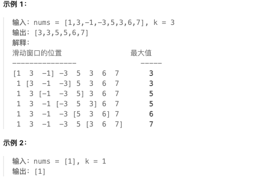

# 子串专题

## 🔍 子串基础知识

### 📖 定义

**子串**是字符串中连续的字符序列；**子数组**是数组中连续的元素序列。许多经典问题可在 O(n) 或 O(n log n) 时间内通过哈希、前缀和、单调队列或滑动窗口解决。

### 🎯 常见技巧
- **滑动窗口**：维护区间满足某种性质（如无重复、覆盖要求、固定长度等）
- **前缀和 + 哈希**：统计满足和为目标值的子数组个数
- **单调队列**：在滑动窗口中维护最大/最小值，O(1) 获得答案
- **双指针**：窗口伸缩的实现方式之一

---

## 📋 题目目录

| 题号 | 题目名称 | 难度 | 核心技巧 |
|------|----------|------|----------|
| 560 | 和为 K 的子数组 | 中等 | 前缀和 + 哈希 |
| 239 | 滑动窗口最大值 | 困难 | 单调队列 |

---

## 560. 和为 K 的子数组

**题目描述：**

给你一个整数数组 `nums` 和一个整数 `k`，请你统计并返回该数组中和为 `k` 的子数组的个数。子数组是数组中元素的连续非空序列。

**测试用例：**

```
示例 1：
输入：nums = [1,1,1], k = 2
输出：2

示例 2：
输入：nums = [1,2,3], k = 3
输出：2
```

**最简单实现：**

```python
from collections import defaultdict

def subarraySum(nums, k):
    """
    前缀和 + 哈希 统计和为k的子数组个数

    思路：
    1. 定义前缀和 prefixSum[i] = nums[0..i] 之和
    2. 对于每个位置的前缀和 curr，总有：如果存在 prev，使得 curr - prev = k，
       则 [prev_index+1 .. i] 这段子数组之和为 k
    3. 用哈希表 count 记录每个前缀和出现的次数，初始化 count[0] = 1（空前缀）

    时间复杂度：O(n)
    空间复杂度：O(n)
    """
    count = defaultdict(int)
    count[0] = 1
    curr = 0
    ans = 0

    for x in nums:
        curr += x
        ans += count[curr - k]
        count[curr] += 1
    return ans

# 测试
print(subarraySum([1,1,1], 2))  # 2
print(subarraySum([1,2,3], 3))  # 2
```

**解题思路详解：**
- 将问题从“求区间和等于 k”转换为“找前缀和差值为 k”
- `count[curr - k]` 表示以当前结尾、和为 k 的子数组个数
- 初始化 `count[0]=1` 代表从起点到当前位置正好等于 k 的情况

---

## 239. 滑动窗口最大值

**题目描述：**

给你一个整数数组 `nums`，有一个大小为 `k` 的滑动窗口从数组的最左侧移动到数组的最右侧。你只可以看到在滑动窗口内的 `k` 个数字。每次滑动窗口向右移动一位。返回滑动窗口中的最大值。



**测试用例：**

```
示例：
输入：nums = [1,3,-1,-3,5,3,6,7], k = 3
输出：[3,3,5,5,6,7]
```

**最简单实现（单调队列）：**

```python
from collections import deque

def maxSlidingWindow(nums, k):
    """
    单调队列：维护一个递减队列，队首始终为当前窗口最大值

    规则：
    - 入队：将队尾所有小于新元素的值弹出，再入队
    - 出队：当队首下标滑出窗口时弹出

    时间复杂度：O(n)
    空间复杂度：O(k)
    """
    if not nums or k == 0:
        return []

    q = deque()  # 存放下标，队列对应的值递减
    res = []

    for i, val in enumerate(nums):
        # 移除队尾所有小于当前值的元素（保持递减）
        while q and nums[q[-1]] <= val:
            q.pop()
        q.append(i)

        # 移除滑出窗口的队首
        if q[0] <= i - k:
            q.popleft()

        # 形成窗口后，记录最大值
        if i >= k - 1:
            res.append(nums[q[0]])
    return res

# 测试
print(maxSlidingWindow([1,3,-1,-3,5,3,6,7], 3))  # [3,3,5,5,6,7]
```

**思路要点：**
- 队列中下标对应的数值保持递减，队首永远是窗口最大值
- 每个元素最多进出队一次，保证 O(n)

---