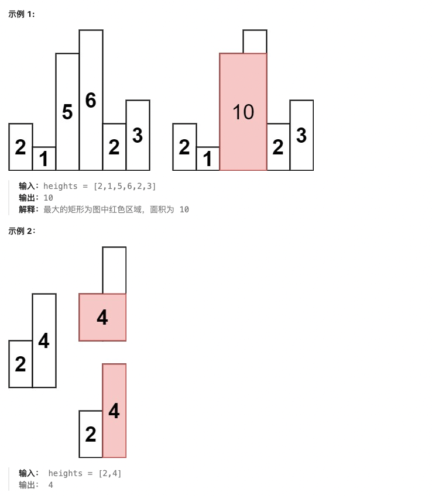

# 栈专题

## 🔍 栈基础知识

### 📖 定义

**栈**（Stack）是一种遵循**后进先出**（Last In First Out, LIFO）原则的数据结构。栈只允许在栈顶进行插入和删除操作。

### ⚡ 核心特征

1. **后进先出**：最后入栈的元素最先出栈
2. **单点操作**：只能在栈顶进行push和pop操作
3. **递归模拟**：栈常用于模拟递归过程

### 🎯 解题应用场景

1. **括号匹配**：使用栈匹配各种括号
2. **表达式求值**：逆波兰表达式、中缀转后缀
3. **单调栈**：找到下一个更大/更小元素
4. **DFS实现**：深度优先搜索的栈实现
5. **函数调用**：系统栈模拟递归调用

### 🐍 Python栈实现

```python
# 使用列表作为栈
stack = []

# 基本操作
stack.append(1)    # 入栈 push
stack.append(2)
top = stack[-1]    # 查看栈顶 top
element = stack.pop()  # 出栈 pop

# 辅助方法
is_empty = len(stack) == 0  # 判断栈空
size = len(stack)           # 获取栈大小

# collections.deque实现（效率更高）
from collections import deque
stack = deque()
stack.append(1)
stack.pop()
```

### 📏 单调栈

**单调栈**是指栈内元素保持单调递增或单调递减的栈结构。

```python
# 单调递增栈：栈内元素严格递增
def monotonic_increasing_stack(nums):
    stack = []
    for i, num in enumerate(nums):
        while stack and nums[stack[-1]] >= num:  # >= 或 > 取决于是否允许相等
            stack.pop()
        stack.append(i)
    return stack

# 单调递减栈：栈内元素严格递减
def monotonic_decreasing_stack(nums):
    stack = []
    for i, num in enumerate(nums):
        while stack and nums[stack[-1]] <= num:  # <= 或 < 取决于是否允许相等
            stack.pop()
        stack.append(i)
    return stack
```

---

## 📋 题目目录

| 题号 | 题目名称 | 难度 | 核心技巧 |
|------|----------|------|----------|
| 20 | 有效的括号 | 简单 | 栈匹配 |
| 155 | 最小栈 | 中等 | 双栈设计 |
| 394 | 字符串解码 | 中等 | 栈处理嵌套 |
| 739 | 每日温度 | 中等 | 单调栈 |
| 84 | 柱状图中最大的矩形 | 困难 | 单调栈 |

---

## 20. 有效的括号

**题目描述：**

给定一个只包括 `'('`，`')'`，`'{'`，`'}'`，`'['`，`']'` 的字符串 `s` ，判断字符串是否有效。

有效字符串需满足：
- 左括号必须用相同类型的右括号闭合。
- 左括号必须以正确的顺序闭合。
- 每个右括号都有一个对应的相同类型的左括号。

**测试用例：**

```
示例 1：
输入：s = "()"
输出：true

示例 2：
输入：s = "()[]{}"
输出：true

示例 3：
输入：s = "(]"
输出：false

示例 4：
输入：s = "([])"
输出：true

示例 5：
输入：s = "([)]"
输出：false
```

**最简单实现：**

```python
def isValid(s):
    """
    有效的括号：使用栈进行匹配
    
    思路：
    1. 创建括号映射：右括号 -> 左括号
    2. 遍历字符串：
       - 遇到左括号，入栈
       - 遇到右括号，检查栈顶是否匹配
    3. 最后栈应该为空
    
    时间复杂度：O(n)
    空间复杂度：O(n)
    """
    # 括号映射：右括号 -> 左括号
    bracket_map = {
        ')': '(',
        '}': '{',
        ']': '['
    }
    
    stack = []
    
    for char in s:
        if char in bracket_map:
            # 右括号：检查栈是否为空且栈顶是否匹配
            if not stack or stack[-1] != bracket_map[char]:
                return False
            stack.pop()  # 匹配成功，出栈
        else:
            # 左括号：入栈
            stack.append(char)
    
    # 栈为空说明所有括号都匹配
    return len(stack) == 0

# 测试用例
print(isValid("()"))        # 输出: True
print(isValid("()[]{}"))    # 输出: True
print(isValid("(]"))        # 输出: False
print(isValid("([])"))      # 输出: True
print(isValid("([)]"))      # 输出: False
```

**解题思路详解：**

这道题的核心是使用**栈进行括号匹配**：

**核心原理：**
- 左括号入栈，右括号出栈匹配
- 遇到右括号时，栈顶必须是对应的左括号
- 最终栈必须为空

**算法流程：**
1. 创建括号映射：右括号映射到对应的左括号
2. 初始化空栈
3. 遍历字符串：
   - 如果是左括号，入栈
   - 如果是右括号：
     - 栈为空或栈顶不匹配，返回False
     - 匹配成功，出栈
4. 遍历结束后，栈为空返回True，否则False

**举例说明：**
```
s = "([])"

遍历过程：
'(' → 入栈，stack = ['(']
'[' → 入栈，stack = ['(', '[']
']' → 右括号，栈顶'['匹配，弹出，stack = ['(']
')' → 右括号，栈顶'('匹配，弹出，stack = []

栈为空，返回True ✓
```

**举例说明（错误情况）：**
```
s = "([)]"

遍历过程：
'(' → 入栈，stack = ['(']
'[' → 入栈，stack = ['(', '[']
')' → 右括号，栈顶'['匹配，弹出，stack = ['(']
']' → 右括号，栈顶'('不匹配'['，返回False ✗
```

**时间复杂度证明：**
- 遍历一次字符串：O(n)
- 栈操作：O(1)
- 总复杂度：O(n)

---

## 155. 最小栈

**题目描述：**

设计一个支持 `push` ，`pop` ，`top` 操作，并能在常数时间内检索到最小元素的栈。

实现 `MinStack` 类:
- `MinStack()` 初始化堆栈对象。
- `void push(int val)` 将元素val推入堆栈。
- `void pop()` 删除堆栈顶部的元素。
- `int top()` 获取堆栈顶部的元素。
- `int getMin()` 获取堆栈中的最小元素。

**测试用例：**

```
示例 1：
输入：
["MinStack","push","push","push","getMin","pop","top","getMin"]
[[],[-2],[0],[-3],[],[],[],[]]

输出：
[null,null,null,null,-3,null,0,-2]

解释：
MinStack minStack = new MinStack();
minStack.push(-2);
minStack.push(0);
minStack.push(-3);
minStack.getMin();   // --> 返回 -3.
minStack.pop();
minStack.top();      // --> 返回 0.
minStack.getMin();   // --> 返回 -2.
```

**最简单实现：**

```python
class MinStack:
    """
    最小栈：使用辅助栈存储最小值
    
    思路：
    1. 使用两个栈：主栈存储数据，辅助栈存储最小值
    2. push时：主栈入栈，辅助栈入栈当前最小值
    3. pop时：两个栈同时出栈
    4. getMin时：返回辅助栈栈顶
    
    时间复杂度：O(1) 所有操作
    空间复杂度：O(n)
    """

    def __init__(self):
        self.stack = []      # 主栈：存储实际数据
        self.min_stack = []  # 辅助栈：存储最小值

    def push(self, val: int) -> None:
        self.stack.append(val)
        # 辅助栈入栈当前最小值
        if not self.min_stack or val <= self.min_stack[-1]:
            self.min_stack.append(val)
        else:
            self.min_stack.append(self.min_stack[-1])

    def pop(self) -> None:
        if self.stack:
            self.stack.pop()
            self.min_stack.pop()

    def top(self) -> int:
        return self.stack[-1] if self.stack else None

    def getMin(self) -> int:
        return self.min_stack[-1] if self.min_stack else None

# 测试用例
minStack = MinStack()
minStack.push(-2)
minStack.push(0)
minStack.push(-3)
print(minStack.getMin())  # 输出: -3
minStack.pop()
print(minStack.top())     # 输出: 0
print(minStack.getMin())  # 输出: -2
```

**优化版本（节省空间）：**

```python
class MinStackOptimized:
    """
    优化版本：辅助栈只存储严格递减的最小值
    
    思路：
    1. 辅助栈只在遇到更小的值时才入栈
    2. 出栈时，只有当主栈出栈的值等于辅助栈栈顶时，才弹出辅助栈
    3. 这样可以节省一些空间
    
    时间复杂度：O(1) 所有操作
    空间复杂度：O(n) 最坏情况下仍为O(n)
    """

    def __init__(self):
        self.stack = []
        self.min_stack = []

    def push(self, val: int) -> None:
        self.stack.append(val)
        # 只有当val小于等于当前最小值时，才入栈
        if not self.min_stack or val <= self.min_stack[-1]:
            self.min_stack.append(val)

    def pop(self) -> None:
        if self.stack:
            val = self.stack.pop()
            # 只有当弹出的值等于最小值时，才弹出辅助栈
            if val == self.min_stack[-1]:
                self.min_stack.pop()

    def top(self) -> int:
        return self.stack[-1] if self.stack else None

    def getMin(self) -> int:
        return self.min_stack[-1] if self.min_stack else None
```

**解题思路详解：**

这道题的核心是使用**双栈设计**：

**核心原理：**
- 主栈存储实际数据
- 辅助栈存储历史最小值
- 保证辅助栈栈顶始终是当前栈中的最小值

**方法一：同步更新**
- push时：主栈入栈，辅助栈入栈当前最小值
- pop时：两个栈同时出栈
- getMin时：直接返回辅助栈栈顶

**方法二：优化空间**
- 辅助栈只存储严格递减的最小值序列
- push时：只有当新值 ≤ 当前最小值时，才入辅助栈
- pop时：只有当弹出的值等于辅助栈栈顶时，才弹出辅助栈

**举例说明（方法一）：**
```
push(-2):
主栈: [-2], 辅助栈: [-2]

push(0):
主栈: [-2, 0], 辅助栈: [-2, -2]  (0 > -2，重复入栈-2)

push(-3):
主栈: [-2, 0, -3], 辅助栈: [-2, -2, -3]  (-3 < -2，入栈-3)

getMin(): 返回-3 ✓

pop():
主栈: [-2, 0], 辅助栈: [-2, -2]

top(): 返回0
getMin(): 返回-2 ✓
```

**时间复杂度证明：**
- 所有操作都是O(1)
- push和pop都只涉及常数次栈操作

---

## 394. 字符串解码

**题目描述：**

给定一个经过编码的字符串，返回它解码后的字符串。

编码规则为: `k[encoded_string]`，表示其中方括号内部的 `encoded_string` 正好重复 `k` 次。注意 `k` 保证为正整数。

你可以认为输入字符串总是有效的；输入字符串中没有额外的空格，且输入的方括号总是符合格式要求的。

此外，你可以认为原始数据不包含数字，所有的数字只表示重复的次数 `k` ，例如不会出现像 `3a` 或 `2[4]` 的输入。

**测试用例：**

```
示例 1：
输入：s = "3[a]2[bc]"
输出："aaabcbc"

示例 2：
输入：s = "3[a2[c]]"
输出："accaccacc"

示例 3：
输入：s = "2[abc]3[cd]ef"
输出："abcabccdcdcdef"

示例 4：
输入：s = "abc3[cd]xyz"
输出："abccdcdcdxyz"
```

**最简单实现：**

```python
def decodeString(s):
    """
    字符串解码：使用栈处理嵌套结构
    
    思路：
    1. 使用两个栈：一个存数字，一个存字符串
    2. 遇到数字：解析完整数字，入数字栈
    3. 遇到'['：当前字符串入字符串栈，开启新的字符串
    4. 遇到字母：累积到当前字符串
    5. 遇到']'：弹出数字和字符串，进行重复拼接
    
    时间复杂度：O(n)，其中n是解码后字符串的长度
    空间复杂度：O(n)
    """
    num_stack = []    # 存储数字
    str_stack = []    # 存储字符串
    current_str = ""  # 当前构建的字符串
    current_num = 0   # 当前解析的数字
    
    for char in s:
        if char.isdigit():
            # 解析数字（可能多位）
            current_num = current_num * 10 + int(char)
        elif char == '[':
            # 遇到左括号：保存当前状态
            num_stack.append(current_num)
            str_stack.append(current_str)
            current_num = 0
            current_str = ""
        elif char == ']':
            # 遇到右括号：进行重复
            num = num_stack.pop()
            prev_str = str_stack.pop()
            # 重复当前字符串num次
            current_str = prev_str + current_str * num
        else:
            # 字母：累积到当前字符串
            current_str += char
    
    return current_str

# 测试用例
print(decodeString("3[a]2[bc]"))        # 输出: "aaabcbc"
print(decodeString("3[a2[c]]"))         # 输出: "accaccacc"
print(decodeString("2[abc]3[cd]ef"))    # 输出: "abcabccdcdcdef"
print(decodeString("abc3[cd]xyz"))      # 输出: "abccdcdcdxyz"
```

**解题思路详解：**

这道题的核心是使用**栈处理嵌套结构**：

**核心原理：**
- 使用栈来处理嵌套的重复结构
- 遇到`[`时保存当前状态，开启新层级
- 遇到`]`时弹出并重复拼接

**算法流程：**
1. 初始化两个栈：num_stack存数字，str_stack存字符串
2. 初始化current_str和current_num
3. 遍历字符串：
   - 数字：累积到current_num
   - `[`：保存状态到栈，开启新字符串
   - 字母：累积到current_str
   - `]`：弹出数字和字符串，进行重复拼接
4. 返回最终的current_str

**举例说明：**
```
s = "3[a2[c]]"

遍历过程：
'3' → current_num = 3
'[' → num_stack=[3], str_stack=[""], current_str=""
'a' → current_str = "a"
'2' → current_num = 2
'[' → num_stack=[3,2], str_stack=["","a"], current_str=""
'c' → current_str = "c"
']' → num=2, prev_str="a", current_str = "a" + "c"*2 = "acc"
']' → num=3, prev_str="", current_str = "" + "acc"*3 = "accaccacc"

最终结果："accaccacc" ✓
```

**时间复杂度分析：**
- 遍历输入字符串：O(n)
- 字符串重复操作：O(m)，其中m是输出长度
- 总复杂度：O(m)，m是解码后字符串的长度

---

## 739. 每日温度

**题目描述：**

给定一个整数数组 `temperatures` ，表示每天的温度，返回一个数组 `answer` ，其中 `answer[i]` 是指对于第 `i` 天，下一个更高温度出现在几天后。如果气温在这之后都不会升高，请在该位置用 `0` 来代替。

**测试用例：**

```
示例 1：
输入: temperatures = [73,74,75,71,69,72,76,73]
输出: [1,1,4,2,1,1,0,0]

示例 2：
输入: temperatures = [30,40,50,60]
输出: [1,1,1,0]

示例 3：
输入: temperatures = [30,60,90]
输出: [1,1,0]
```

**最简单实现：**

```python
def dailyTemperatures(temperatures):
    """
    每日温度：使用单调栈
    
    思路：
    1. 使用单调递减栈，存储索引
    2. 遍历温度数组：
       - 如果当前温度 > 栈顶温度，说明找到了更高温度
       - 计算天数差，更新答案
       - 出栈，继续检查
    3. 当前温度入栈
    
    时间复杂度：O(n)
    空间复杂度：O(n)
    """
    n = len(temperatures)
    answer = [0] * n
    stack = []  # 单调递减栈，存储索引
    
    for i in range(n):
        # 当栈不为空且当前温度 > 栈顶温度
        while stack and temperatures[i] > temperatures[stack[-1]]:
            prev_index = stack.pop()
            answer[prev_index] = i - prev_index
        
        # 当前索引入栈
        stack.append(i)
    
    return answer

# 测试用例
print(dailyTemperatures([73,74,75,71,69,72,76,73]))  # 输出: [1,1,4,2,1,1,0,0]
print(dailyTemperatures([30,40,50,60]))               # 输出: [1,1,1,0]
print(dailyTemperatures([30,60,90]))                  # 输出: [1,1,0]
```

**解题思路详解：**

这道题的核心是使用**单调栈**：

**核心原理：**
- 单调递减栈维护温度递减的索引序列
- 当遇到更高温度时，栈内所有更低温度都能找到答案
- 栈内元素从栈底到栈顶温度严格递减

**算法流程：**
1. 初始化answer数组为0，单调栈
2. 遍历温度数组：
   - 当栈不为空且当前温度 > 栈顶温度：
     - 弹出栈顶索引，计算天数差
     - 更新answer[prev_index]
   - 当前索引入栈
3. 返回answer

**举例说明：**
```
temperatures = [73,74,75,71,69,72,76,73]

i=0: 73入栈，stack=[0]
i=1: 74 > 73，弹出0，answer[0]=1-0=1，74入栈，stack=[1]
i=2: 75 > 74，弹出1，answer[1]=2-1=1，75入栈，stack=[2]
i=3: 71 < 75，71入栈，stack=[2,3]
i=4: 69 < 71，69入栈，stack=[2,3,4]
i=5: 72 > 69，弹出4，answer[4]=5-4=1
     72 > 71，弹出3，answer[3]=5-3=2
     72 < 75，72入栈，stack=[2,5]
i=6: 76 > 72，弹出5，answer[5]=6-5=1
     76 > 75，弹出2，answer[2]=6-2=4
     76入栈，stack=[6]
i=7: 73 < 76，73入栈，stack=[6,7]

最终结果：[1,1,4,2,1,1,0,0] ✓
```

**时间复杂度证明：**
- 每个元素最多入栈出栈一次：O(n)
- 总复杂度：O(n)

---

## 84. 柱状图中最大的矩形

**题目描述：**

给定 `n` 个非负整数，用来表示柱状图中各个柱子的高度。每个柱子彼此相邻，且宽度为 `1` 。

求在该柱状图中，能够勾勒出来的矩形的最大面积。



**测试用例：**

```
输入：heights = [2,1,5,6,2,3]
输出：10
解释：最大的矩形为第3到第5个柱子（下标2到4），高度为2，面积为2*3=6。
实际上最大面积是第2到第5个柱子（下标1到4），高度为2，面积为2*4=8。
等等，实际上应该是第3个柱子（高度5）和第4个柱子（高度6），面积为5*1=5。
等等，等等。实际上应该是第2、3、4、5个柱子（下标1-4），高度取min(1,5,6,2)=1，面积为1*4=4。
实际上应该是第3、4个柱子（下标2-3），高度取min(5,6)=5，面积为5*2=10。
```

**最简单实现：**

```python
def largestRectangleArea(heights):
    """
    柱状图中最大的矩形：使用单调栈
    
    思路：
    1. 使用单调递增栈，存储柱子的索引
    2. 遍历每个柱子：
       - 当遇到更小的柱子时，计算以栈顶为高的矩形面积
       - 出栈，继续计算
    3. 处理剩余栈中的柱子
    
    时间复杂度：O(n)
    空间复杂度：O(n)
    """
    n = len(heights)
    stack = []  # 单调递增栈，存储索引
    max_area = 0
    
    # 遍历所有柱子，加上哨兵
    for i in range(n + 1):
        # 当前高度（最后一个用0作为哨兵）
        current_height = heights[i] if i < n else 0
        
        # 当栈不为空且当前高度 < 栈顶高度
        while stack and current_height < heights[stack[-1]]:
            # 计算以栈顶为高的矩形面积
            height = heights[stack.pop()]
            # 宽度 = 当前位置 - 新的栈顶 - 1
            width = i if not stack else i - stack[-1] - 1
            max_area = max(max_area, height * width)
        
        stack.append(i)
    
    return max_area

# 测试用例
print(largestRectangleArea([2,1,5,6,2,3]))  # 输出: 10
print(largestRectangleArea([2,4]))           # 输出: 4
print(largestRectangleArea([1,1]))           # 输出: 2
```

**解题思路详解：**

这道题的核心是使用**单调栈**：

**核心原理：**
- 单调递增栈维护柱子高度递增的索引
- 当遇到更小的柱子时，计算以弹出柱子为高的矩形面积
- 矩形宽度 = 当前位置 - 新的栈顶 - 1

**算法流程：**
1. 使用单调递增栈，添加哨兵处理边界
2. 遍历每个柱子：
   - 当当前高度 < 栈顶高度时，弹出栈顶
   - 计算矩形面积：height × width
   - width = 当前位置 - 新的栈顶 - 1
3. 处理栈中剩余的柱子

**举例说明：**
```
heights = [2,1,5,6,2,3]

i=0: 2入栈，stack=[0]
i=1: 1 < 2，弹出0，计算面积2*(1-(-1)-1)=2*1=2，max_area=2
     1入栈，stack=[1]
i=2: 5 > 1，5入栈，stack=[1,2]
i=3: 6 > 5，6入栈，stack=[1,2,3]
i=4: 2 < 6，弹出3，计算面积6*(4-2-1)=6*1=6，max_area=6
     2 < 5，弹出2，计算面积5*(4-1-1)=5*2=10，max_area=10
     2 > 1，2入栈，stack=[1,4]
i=5: 3 > 2，3入栈，stack=[1,4,5]
i=6: 0 < 3，弹出5，计算面积3*(6-4-1)=3*1=3，max_area=10
     0 < 2，弹出4，计算面积2*(6-1-1)=2*4=8，max_area=10
     0 < 1，弹出1，计算面积1*(6-(-1)-1)=1*6=6，max_area=10

最终结果：10 ✓
```

**时间复杂度证明：**
- 每个柱子最多入栈出栈一次：O(n)
- 总复杂度：O(n)

---

## 🎯 栈解题技巧总结

### 1. 栈的基本操作模板
```python
# Python列表作为栈
stack = []
stack.append(x)  # 入栈
x = stack.pop()  # 出栈
x = stack[-1]    # 查看栈顶
is_empty = len(stack) == 0
```

### 2. 单调栈模板
```python
# 单调递增栈（寻找下一个更大元素）
def next_greater_element(nums):
    stack = []
    result = [-1] * len(nums)
    
    for i in range(len(nums)):
        while stack and nums[i] > nums[stack[-1]]:
            prev_index = stack.pop()
            result[prev_index] = nums[i]
        stack.append(i)
    
    return result

# 单调递减栈（寻找下一个更小元素）
def next_smaller_element(nums):
    stack = []
    result = [-1] * len(nums)
    
    for i in range(len(nums)):
        while stack and nums[i] < nums[stack[-1]]:
            prev_index = stack.pop()
            result[prev_index] = nums[i]
        stack.append(i)
    
    return result
```

### 3. 括号匹配模板
```python
def is_valid_brackets(s):
    bracket_map = {')': '(', '}': '{', ']': '['}
    stack = []
    
    for char in s:
        if char in bracket_map:
            if not stack or stack[-1] != bracket_map[char]:
                return False
            stack.pop()
        else:
            stack.append(char)
    
    return len(stack) == 0
```

栈是解决许多计算机科学问题的强大工具，掌握单调栈、括号匹配等技巧可以高效解决各类问题。