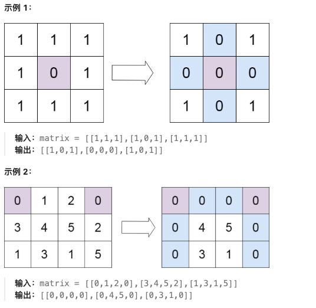
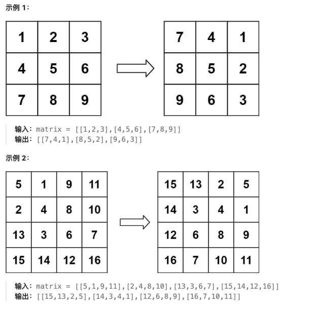
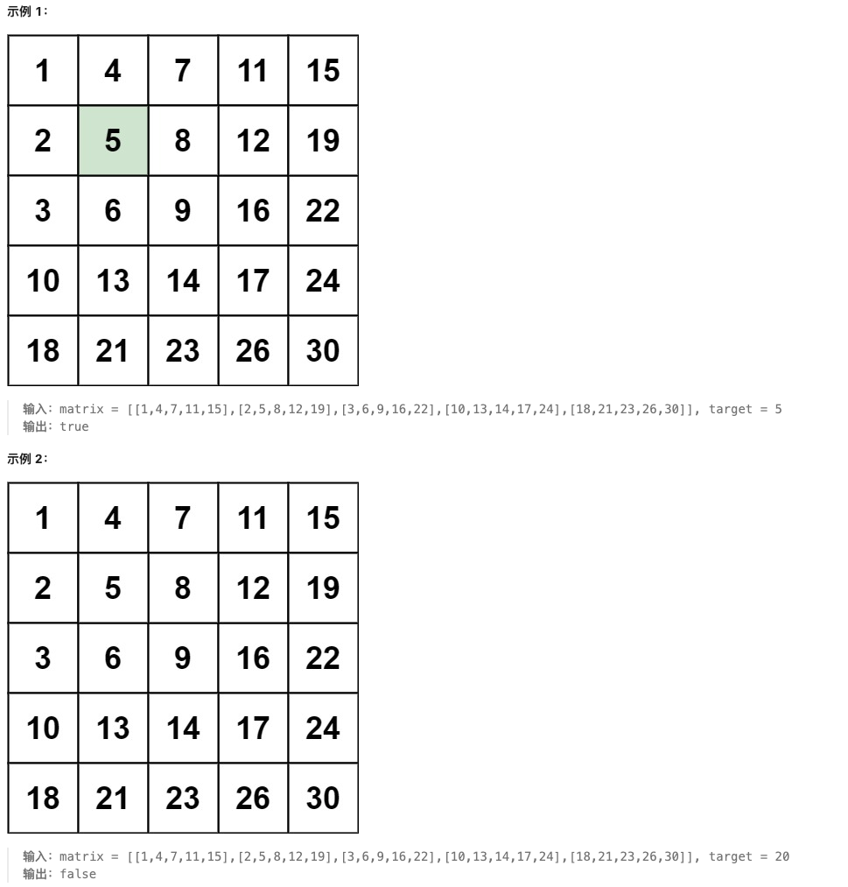

# 矩阵专题

## 🔍 矩阵基础知识

### 📖 定义

**矩阵**（Matrix）是一个二维数组，由m行n列的元素组成。矩阵问题通常涉及矩阵的遍历、旋转、搜索、变换等操作。在LeetCode中，矩阵通常用二维列表表示。

### ⚡ 核心特征

1. **二维结构**：矩阵是二维数组，需要两个索引访问元素
2. **行列操作**：可以按行或按列遍历
3. **原地操作**：很多题目要求原地修改，不能使用额外空间

### 🎯 常见解题技巧

1. **模拟遍历**：按特定顺序遍历矩阵（螺旋、对角线等）
2. **标记技巧**：使用特殊值标记需要处理的位置
3. **坐标变换**：旋转、翻转等操作的本质是坐标变换
4. **分治/递归**：将大矩阵分解为小矩阵处理
5. **二分查找**：在有序矩阵中查找元素

### 🐍 Python矩阵操作

```python
# 矩阵初始化
matrix = [[1, 2, 3],
          [4, 5, 6],
          [7, 8, 9]]

# 基本操作
rows = len(matrix)        # 行数
cols = len(matrix[0])     # 列数
element = matrix[i][j]    # 访问元素

# 遍历矩阵
for i in range(rows):
    for j in range(cols):
        print(matrix[i][j])

# 转置矩阵
transposed = [[matrix[j][i] for j in range(rows)] for i in range(cols)]
```

---

## 📋 题目目录

| 题号 | 题目名称 | 难度 | 核心技巧 |
|------|----------|------|----------|
| 73 | 矩阵置零 | 中等 | 标记技巧 |
| 54 | 螺旋矩阵 | 中等 | 模拟遍历 |
| 48 | 旋转图像 | 中等 | 坐标变换 |
| 240 | 搜索二维矩阵 II | 中等 | 二分查找/分治 |

---

## 73. 矩阵置零

**题目描述：**

给定一个 `m x n` 的矩阵，如果一个元素为 0 ，则将其所在行和列的所有元素都设为 0 。请使用 原地 算法。



**测试用例：**

```
示例 1：
输入：matrix = [[1,1,1],[1,0,1],[1,1,1]]
输出：[[1,0,1],[0,0,0],[1,0,1]]

示例 2：
输入：matrix = [[0,1,2,0],[3,4,5,2],[1,3,1,5]]
输出：[[0,0,0,0],[0,4,5,0],[0,3,1,0]]
```

**最简单实现：**

```python
def setZeroes(matrix):
    """
    矩阵置零：使用第一行和第一列作为标记
    
    思路：
    1. 使用第一行和第一列记录哪些行/列需要置零
    2. 先标记，后置零
    3. 需要单独处理第一行和第一列
    
    时间复杂度：O(m * n)
    空间复杂度：O(1)
    """
    if not matrix or not matrix[0]:
        return
    
    m, n = len(matrix), len(matrix[0])
    first_row_zero = False
    first_col_zero = False
    
    # 检查第一行是否有0
    for j in range(n):
        if matrix[0][j] == 0:
            first_row_zero = True
            break
    
    # 检查第一列是否有0
    for i in range(m):
        if matrix[i][0] == 0:
            first_col_zero = True
            break
    
    # 使用第一行和第一列作为标记
    for i in range(1, m):
        for j in range(1, n):
            if matrix[i][j] == 0:
                matrix[i][0] = 0  # 标记第i行需要置零
                matrix[0][j] = 0  # 标记第j列需要置零
    
    # 根据标记置零
    for i in range(1, m):
        if matrix[i][0] == 0:
            for j in range(1, n):
                matrix[i][j] = 0
    
    for j in range(1, n):
        if matrix[0][j] == 0:
            for i in range(1, m):
                matrix[i][j] = 0
    
    # 处理第一行和第一列
    if first_row_zero:
        for j in range(n):
            matrix[0][j] = 0
    
    if first_col_zero:
        for i in range(m):
            matrix[i][0] = 0

# 测试用例
matrix1 = [[1,1,1],[1,0,1],[1,1,1]]
setZeroes(matrix1)
print(matrix1)  # 输出: [[1,0,1],[0,0,0],[1,0,1]]

matrix2 = [[0,1,2,0],[3,4,5,2],[1,3,1,5]]
setZeroes(matrix2)
print(matrix2)  # 输出: [[0,0,0,0],[0,4,5,0],[0,3,1,0]]
```

**解题思路详解：**

这道题的核心是使用**标记技巧**实现O(1)空间复杂度：

**核心原理：**
- 如果matrix[i][j] == 0，则第i行和第j列都要置零
- 使用第一行和第一列作为标记，记录哪些行/列需要置零
- 需要单独处理第一行和第一列，避免标记被覆盖

**为什么使用第一行和第一列？**
- 这样可以实现O(1)空间复杂度
- 不需要额外的数组来记录需要置零的行和列

**算法流程：**
1. 检查第一行和第一列是否有0，记录标志
2. 遍历除第一行第一列外的元素：
   - 如果matrix[i][j] == 0，标记matrix[i][0] = 0和matrix[0][j] = 0
3. 根据标记置零：
   - 如果matrix[i][0] == 0，将第i行置零
   - 如果matrix[0][j] == 0，将第j列置零
4. 根据标志处理第一行和第一列

**举例说明：**
```
matrix = [[1,1,1],[1,0,1],[1,1,1]]

步骤1：检查第一行第一列
first_row_zero = False, first_col_zero = False

步骤2：标记
发现matrix[1][1] == 0
标记：matrix[1][0] = 0, matrix[0][1] = 0
matrix = [[1,0,1],[0,0,1],[1,1,1]]

步骤3：根据标记置零
第1行需要置零：matrix[1] = [0,0,0]
第1列需要置零：matrix[0][1]=0, matrix[1][1]=0, matrix[2][1]=0
matrix = [[1,0,1],[0,0,0],[1,0,1]]

最终结果：[[1,0,1],[0,0,0],[1,0,1]]
```

**时间复杂度证明：**
- 遍历矩阵：O(m * n)
- 置零操作：O(m * n)
- 总复杂度：O(m * n)

---

## 54. 螺旋矩阵

**题目描述：**

给你一个 `m` 行 `n` 列的矩阵 `matrix` ，请按照 **顺时针螺旋顺序** ，返回矩阵中的所有元素。


**测试用例：**

```
示例 1：
输入：matrix = [[1,2,3],[4,5,6],[7,8,9]]
输出：[1,2,3,6,9,8,7,4,5]

示例 2：
输入：matrix = [[1,2,3,4],[5,6,7,8],[9,10,11,12]]
输出：[1,2,3,4,8,12,11,10,9,5,6,7]
```

**最简单实现：**

```python
def spiralOrder(matrix):
    """
    螺旋矩阵：模拟遍历
    
    思路：
    1. 定义四个边界：top, bottom, left, right
    2. 按照右→下→左→上的顺序遍历
    3. 每完成一个方向，更新对应的边界
    4. 当边界相遇时停止
    
    时间复杂度：O(m * n)
    空间复杂度：O(1)（不考虑输出数组）
    """
    if not matrix or not matrix[0]:
        return []
    
    result = []
    top, bottom = 0, len(matrix) - 1
    left, right = 0, len(matrix[0]) - 1
    
    while top <= bottom and left <= right:
        # 向右遍历
        for j in range(left, right + 1):
            result.append(matrix[top][j])
        top += 1
        
        # 向下遍历
        for i in range(top, bottom + 1):
            result.append(matrix[i][right])
        right -= 1
        
        # 向左遍历（需要检查是否还有行）
        if top <= bottom:
            for j in range(right, left - 1, -1):
                result.append(matrix[bottom][j])
            bottom -= 1
        
        # 向上遍历（需要检查是否还有列）
        if left <= right:
            for i in range(bottom, top - 1, -1):
                result.append(matrix[i][left])
            left += 1
    
    return result

# 测试用例
print(spiralOrder([[1,2,3],[4,5,6],[7,8,9]]))  # 输出: [1,2,3,6,9,8,7,4,5]
print(spiralOrder([[1,2,3,4],[5,6,7,8],[9,10,11,12]]))  # 输出: [1,2,3,4,8,12,11,10,9,5,6,7]
```

**解题思路详解：**

这道题的核心是**模拟遍历**：

**核心原理：**
- 按照顺时针方向遍历：右→下→左→上
- 使用四个边界变量控制遍历范围
- 每完成一个方向，收缩对应的边界

**边界控制：**
- top, bottom：控制行的范围
- left, right：控制列的范围
- 当top > bottom或left > right时停止

**算法流程：**
1. 初始化边界：top=0, bottom=m-1, left=0, right=n-1
2. 循环直到边界相遇：
   - 向右：遍历top行，从left到right
   - 向下：遍历right列，从top+1到bottom
   - 向左：遍历bottom行，从right-1到left（需要检查top <= bottom）
   - 向上：遍历left列，从bottom-1到top+1（需要检查left <= right）
3. 每次完成一个方向后，更新对应边界

**举例说明：**
```
matrix = [[1,2,3],[4,5,6],[7,8,9]]

初始：top=0, bottom=2, left=0, right=2

第1轮：
向右：[1,2,3]，top=1
向下：[6,9]，right=1
向左：[8,7]，bottom=1（检查top <= bottom：1 <= 1）
向上：[4]，left=1（检查left <= right：1 <= 1）

第2轮：
向右：[5]，top=2
此时top=2 > bottom=1，停止

最终结果：[1,2,3,6,9,8,7,4,5]
```

**时间复杂度证明：**
- 每个元素只被访问一次：O(m * n)
- 总复杂度：O(m * n)

---

## 48. 旋转图像

**题目描述：**

给定一个 `n × n` 的二维矩阵 `matrix` 表示一个图像。请你将图像**顺时针旋转 90 度**。

你必须在 **原地** 旋转图像，这意味着你需要直接修改输入的二维矩阵。请不要 使用另一个矩阵来旋转图像。



**测试用例：**

```
示例 1：
输入：matrix = [[1,2,3],[4,5,6],[7,8,9]]
输出：[[7,4,1],[8,5,2],[9,6,3]]

示例 2：
输入：matrix = [[5,1,9,11],[2,4,8,10],[13,3,6,7],[15,14,12,16]]
输出：[[15,13,2,5],[14,3,4,1],[12,6,8,9],[16,7,10,11]]
```

**最简单实现：**

```python
def rotate(matrix):
    """
    旋转图像：先转置再翻转
    
    思路：
    1. 顺时针旋转90度 = 转置 + 水平翻转
    2. 转置：matrix[i][j] ↔ matrix[j][i]
    3. 水平翻转：matrix[i][j] ↔ matrix[i][n-1-j]
    
    时间复杂度：O(n²)
    空间复杂度：O(1)
    """
    n = len(matrix)
    
    # 第一步：转置矩阵
    for i in range(n):
        for j in range(i, n):  # 只遍历上三角，避免重复交换
            matrix[i][j], matrix[j][i] = matrix[j][i], matrix[i][j]
    
    # 第二步：水平翻转每一行
    for i in range(n):
        left, right = 0, n - 1
        while left < right:
            matrix[i][left], matrix[i][right] = matrix[i][right], matrix[i][left]
            left += 1
            right -= 1

# 测试用例
matrix1 = [[1,2,3],[4,5,6],[7,8,9]]
rotate(matrix1)
print(matrix1)  # 输出: [[7,4,1],[8,5,2],[9,6,3]]

matrix2 = [[5,1,9,11],[2,4,8,10],[13,3,6,7],[15,14,12,16]]
rotate(matrix2)
print(matrix2)  # 输出: [[15,13,2,5],[14,3,4,1],[12,6,8,9],[16,7,10,11]]
```

**方法二：直接旋转（四元素交换）**

```python
def rotate_direct(matrix):
    """
    直接旋转：一次交换四个元素
    
    思路：
    1. 顺时针旋转90度：matrix[i][j] → matrix[j][n-1-i]
    2. 可以一次交换四个位置：
       matrix[i][j] → matrix[j][n-1-i] → matrix[n-1-i][n-1-j] → matrix[n-1-j][i] → matrix[i][j]
    3. 只需要遍历1/4的区域
    
    时间复杂度：O(n²)
    空间复杂度：O(1)
    """
    n = len(matrix)
    
    # 遍历左上角的1/4区域
    for i in range(n // 2):
        for j in range((n + 1) // 2):
            # 一次交换四个位置
            temp = matrix[i][j]
            matrix[i][j] = matrix[n - 1 - j][i]
            matrix[n - 1 - j][i] = matrix[n - 1 - i][n - 1 - j]
            matrix[n - 1 - i][n - 1 - j] = matrix[j][n - 1 - i]
            matrix[j][n - 1 - i] = temp
```

**解题思路详解：**

这道题的核心是**坐标变换**：

**核心原理：**
- 顺时针旋转90度：`(i, j) → (j, n-1-i)`
- 可以通过转置+翻转实现
- 也可以直接通过四元素交换实现

**方法一：转置+翻转**
1. 转置：`matrix[i][j] ↔ matrix[j][i]`
2. 水平翻转：`matrix[i][j] ↔ matrix[i][n-1-j]`

**方法二：直接旋转**
- 一次交换四个位置，形成循环：
  - `matrix[i][j] → matrix[j][n-1-i]`
  - `matrix[j][n-1-i] → matrix[n-1-i][n-1-j]`
  - `matrix[n-1-i][n-1-j] → matrix[n-1-j][i]`
  - `matrix[n-1-j][i] → matrix[i][j]`

**举例说明（方法一）：**
```
matrix = [[1,2,3],[4,5,6],[7,8,9]]

步骤1：转置
[[1,4,7],
 [2,5,8],
 [3,6,9]]

步骤2：水平翻转每一行
[[7,4,1],
 [8,5,2],
 [9,6,3]] ✓
```

**时间复杂度证明：**
- 转置：O(n²)
- 翻转：O(n²)
- 总复杂度：O(n²)

---

## 240. 搜索二维矩阵 II

**题目描述：**

编写一个高效的算法来搜索 `m x n` 矩阵 `matrix` 中的一个目标值 `target` 。该矩阵具有以下特性：

- 每行的元素从左到右升序排列。
- 每列的元素从上到下升序排列。



**测试用例：**

```
示例 1：
输入：matrix = [[1,4,7,11],[2,5,8,12],[3,6,9,16],[10,13,14,17]], target = 5
输出：true

示例 2：
输入：matrix = [[1,4,7,11],[2,5,8,12],[3,6,9,16],[10,13,14,17]], target = 3
输出：false
```

**最简单实现：**

```python
def searchMatrix(matrix, target):
    """
    搜索二维矩阵II：从右上角开始搜索
    
    思路：
    1. 从右上角开始搜索
    2. 如果当前元素等于target，返回True
    3. 如果当前元素大于target，向左移动（排除当前列）
    4. 如果当前元素小于target，向下移动（排除当前行）
    5. 如果越界，返回False
    
    时间复杂度：O(m + n)
    空间复杂度：O(1)
    """
    if not matrix or not matrix[0]:
        return False
    
    m, n = len(matrix), len(matrix[0])
    i, j = 0, n - 1  # 从右上角开始
    
    while i < m and j >= 0:
        if matrix[i][j] == target:
            return True
        elif matrix[i][j] > target:
            j -= 1  # 向左移动，排除当前列
        else:
            i += 1  # 向下移动，排除当前行
    
    return False

# 测试用例
matrix = [[1,4,7,11],[2,5,8,12],[3,6,9,16],[10,13,14,17]]
print(searchMatrix(matrix, 5))   # 输出: True
print(searchMatrix(matrix, 3))   # 输出: False
```

**方法二：二分查找（每行）**

```python
def searchMatrix_binary(matrix, target):
    """
    二分查找：对每一行进行二分查找
    
    时间复杂度：O(m * log n)
    空间复杂度：O(1)
    """
    if not matrix or not matrix[0]:
        return False
    
    m, n = len(matrix), len(matrix[0])
    
    for i in range(m):
        left, right = 0, n - 1
        while left <= right:
            mid = (left + right) // 2
            if matrix[i][mid] == target:
                return True
            elif matrix[i][mid] < target:
                left = mid + 1
            else:
                right = mid - 1
    
    return False
```

**解题思路详解：**

这道题的核心是**利用矩阵的有序性**：

**核心原理：**
- 矩阵每行从左到右递增，每列从上到下递增
- 从右上角开始，可以同时排除一行或一列
- 每次比较都能缩小搜索范围

**为什么从右上角开始？**
- 右上角的元素是所在行的最大值，所在列的最小值
- 如果target < matrix[i][j]，可以排除第j列
- 如果target > matrix[i][j]，可以排除第i行
- 这样每次都能排除一行或一列

**算法流程：**
1. 从右上角(i=0, j=n-1)开始
2. 循环直到越界：
   - 如果matrix[i][j] == target，返回True
   - 如果matrix[i][j] > target，j--（向左移动）
   - 如果matrix[i][j] < target，i++（向下移动）
3. 如果越界，返回False

**举例说明：**
```
matrix = [[1,4,7,11],
          [2,5,8,12],
          [3,6,9,16],
          [10,13,14,17]]
target = 5

从右上角(0,3)开始：matrix[0][3] = 11 > 5，向左移动
(0,2)：matrix[0][2] = 7 > 5，向左移动
(0,1)：matrix[0][1] = 4 < 5，向下移动
(1,1)：matrix[1][1] = 5 == 5，找到！返回True
```

**时间复杂度证明：**
- 最多移动m+n步：O(m + n)
- 每次比较：O(1)
- 总复杂度：O(m + n)

---

## 🎯 矩阵解题技巧总结

### 1. 边界控制法
```python
# 用于螺旋遍历、旋转等
top, bottom = 0, m - 1
left, right = 0, n - 1
while top <= bottom and left <= right:
    # 处理逻辑
    # 更新边界
```

### 2. 标记技巧
```python
# 使用矩阵本身存储信息
# 例如：使用第一行第一列作为标记
matrix[i][0] = 0  # 标记第i行需要处理
matrix[0][j] = 0  # 标记第j列需要处理
```

### 3. 坐标变换
```python
# 旋转90度：转置 + 翻转
# 转置：matrix[i][j] ↔ matrix[j][i]
# 翻转：matrix[i][j] ↔ matrix[i][n-1-j]
```

### 4. 利用有序性
```python
# 在有序矩阵中搜索
# 从右上角或左下角开始，利用有序性缩小搜索范围
```

矩阵问题通常需要灵活运用这些技巧，结合具体问题特点选择最合适的解法。
