# 链表专题

## 🔍 链表基础知识

### 📖 定义

**链表**（Linked List）是一种线性数据结构，由一系列节点组成，每个节点包含数据和指向下一个节点的指针。与数组不同，链表的内存空间可以不连续。

### ⚡ 核心概念

1. **节点（Node）**：链表的基本单位，包含数据和指针
2. **头节点（Head）**：链表的第一个节点
3. **尾节点（Tail）**：链表的最后一个节点，next指针为null
4. **空链表**：head为null的链表

### 🎯 链表的类型

#### 1. 单链表（Singly Linked List）
```python
class ListNode:
    def __init__(self, val=0, next=None):
        self.val = val
        self.next = next
```

#### 2. 双链表（Doubly Linked List）
```python
class DoublyListNode:
    def __init__(self, val=0, prev=None, next=None):
        self.val = val
        self.prev = prev
        self.next = next
```

#### 3. 循环链表（Circular Linked List）
- 尾节点的next指向头节点

### 🐍 链表基本操作

#### 1. 创建链表
```python
def create_linked_list(arr):
    if not arr:
        return None
    head = ListNode(arr[0])
    current = head
    for val in arr[1:]:
        current.next = ListNode(val)
        current = current.next
    return head
```

#### 2. 遍历链表
```python
def traverse_linked_list(head):
    current = head
    while current:
        print(current.val, end=" -> ")
        current = current.next
    print("None")
```

#### 3. 查找元素
```python
def find_node(head, target):
    current = head
    while current:
        if current.val == target:
            return current
        current = current.next
    return None
```

#### 4. 插入节点
```python
def insert_after(node, new_val):
    new_node = ListNode(new_val)
    new_node.next = node.next
    node.next = new_node
```

#### 5. 删除节点
```python
def delete_after(node):
    if node and node.next:
        node.next = node.next.next
```

### 📏 链表应用场景

- **动态内存分配**：链表可以根据需要动态分配内存
- **频繁插入删除**：链表在中间位置插入删除效率高
- **实现其他数据结构**：栈、队列、哈希表等
- **LRU缓存**：使用双链表维护访问顺序

### 🏃‍♂️ 链表经典问题分类

- **基础操作**：反转、合并、删除节点
- **双指针技巧**：快慢指针、相交链表、回文判断
- **环检测**：Floyd判圈算法
- **复杂操作**：K组翻转、排序、深拷贝

---

## 📋 题目目录

| 题号 | 题目名称 | 难度 | 核心技巧 |
|------|----------|------|----------|
| 160 | 相交链表 | 简单 | 双指针 |
| 206 | 反转链表 | 简单 | 迭代/递归 |
| 234 | 回文链表 | 简单 | 快慢指针 |
| 141 | 环形链表 | 简单 | 快慢指针 |
| 142 | 环形链表 II | 中等 | 快慢指针+数学 |
| 21 | 合并两个有序链表 | 简单 | 双指针 |
| 2 | 两数相加 | 中等 | 模拟加法 |
| 19 | 删除倒数第N个结点 | 中等 | 双指针 |
| 24 | 两两交换节点 | 中等 | 迭代翻转 |
| 25 | K个一组翻转链表 | 困难 | 递归翻转 |
| 138 | 随机链表的复制 | 中等 | 哈希表/节点拆分 |
| 148 | 排序链表 | 中等 | 归并排序 |
| 23 | 合并K个升序链表 | 困难 | 分治/优先队列 |
| 146 | LRU缓存 | 中等 | 双链表+哈希表 |

---

## 160. 相交链表

**题目描述：**

给你两个单链表的头节点 `headA` 和 `headB` ，请你找出并返回两个单链表相交的起始节点。如果两个链表不存在相交节点，返回 `null`。

题目数据 **保证** 整个链式结构中不存在环。

注意，函数返回结果后，链表必须 **保持其原始结构**。


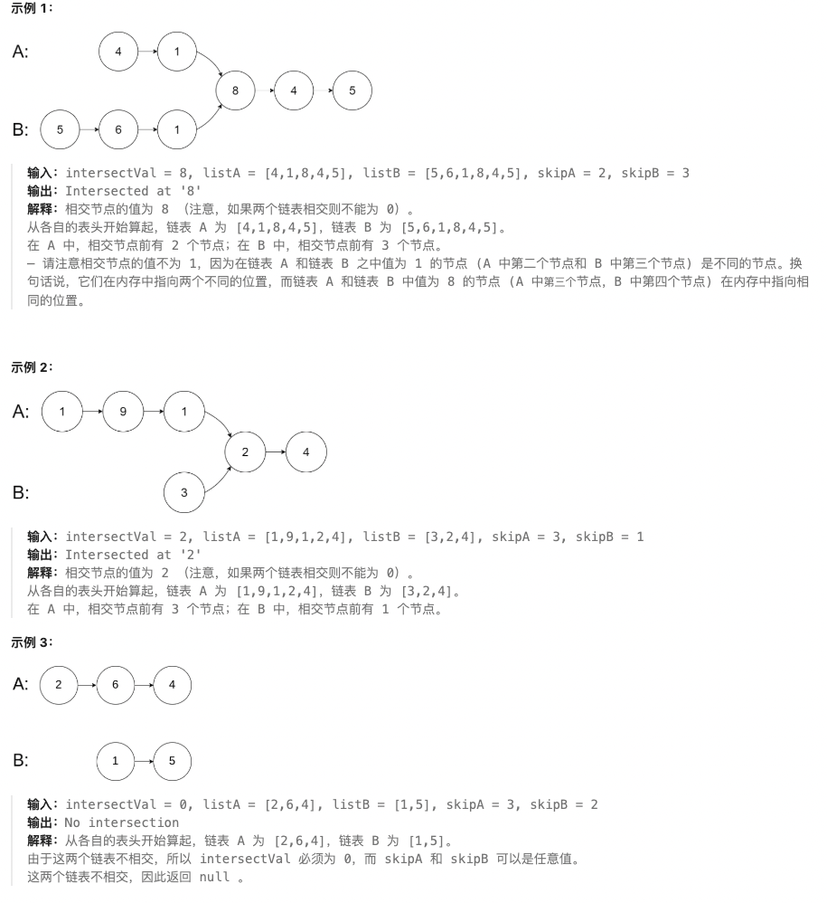

**测试用例：**

```
输入：intersectVal = 8, listA = [4,1,8,4,5], listB = [5,6,1,8,4,5], skipA = 2, skipB = 3
输出：Intersected at '8'
解释：相交节点的值为 8 （注意，如果两个链表相交则不能为 0）。
从各自的表头开始算起，链表 A 为 [4,1,8,4,5]，链表 B 为 [5,6,1,8,4,5]。
在 A 中，相交节点前有 2 个节点；在 B 中，相交节点前有 3 个节点。
```

**最简单实现：**

```python
def getIntersectionNode(headA, headB):
    """
    相交链表：双指针法

    思路：
    1. 使用两个指针pA和pB分别遍历两个链表
    2. 当pA到达链表A末尾时，转到链表B继续遍历
    3. 当pB到达链表B末尾时，转到链表A继续遍历
    4. 如果两个链表相交，指针会在相交点相遇
    5. 如果不相交，指针会同时到达null

    时间复杂度：O(m + n)
    空间复杂度：O(1)
    """
    if not headA or not headB:
        return None

    pA, pB = headA, headB

    # 当两个指针相等时，要么是相交点，要么都是None
    while pA != pB:
        # 如果pA到达末尾，转到headB
        pA = pA.next if pA else headB
        # 如果pB到达末尾，转到headA
        pB = pB.next if pB else headA

    return pA

# 哈希表方法
def getIntersectionNode_hash(headA, headB):
    """
    哈希表方法：存储访问过的节点

    时间复杂度：O(m + n)
    空间复杂度：O(m)
    """
    visited = set()

    # 遍历链表A，将所有节点存入集合
    current = headA
    while current:
        visited.add(current)
        current = current.next

    # 遍历链表B，查找第一个在集合中出现的节点
    current = headB
    while current:
        if current in visited:
            return current
        current = current.next

    return None

# 测试用例
# 构造相交链表
# A: 4 -> 1 -> 8 -> 4 -> 5
# B: 5 -> 6 -> 1 -> 8 -> 4 -> 5
# 相交点是值为8的节点

class ListNode:
    def __init__(self, val=0, next=None):
        self.val = val
        self.next = next

# 创建相交部分
intersect = ListNode(8, ListNode(4, ListNode(5)))

# 创建链表A
headA = ListNode(4, ListNode(1, intersect))

# 创建链表B
headB = ListNode(5, ListNode(6, ListNode(1, intersect)))

result = getIntersectionNode(headA, headB)
print(result.val if result else None)  # 输出: 8
```

**解题思路详解：**

这道题的核心是**双指针技巧**在链表中的应用：

**核心原理：**
- 如果两个链表相交，它们会有相同的尾部
- 让两个指针分别走完两个链表，如果相交则会在相交点相遇
- 双指针法可以消除链表长度差的影响

**双指针算法流程：**
1. 初始化两个指针pA和pB，分别指向headA和headB
2. 同时移动两个指针，当到达链表末尾时切换到另一个链表头
3. 如果相交，指针会在相交点相遇
4. 如果不相交，指针会同时到达None

**为什么有效？**
- 假设链表A长m，链表B长n，相交部分长c
- pA走的路径：m + n - c
- pB走的路径：n + m - c
- 总路径长度相等，相交时会同时到达交点

**举例说明：**
```
链表A：4 -> 1 -> 8 -> 4 -> 5
链表B：5 -> 6 -> 1 -> 8 -> 4 -> 5

pA路径：4 -> 1 -> 8 -> 4 -> 5 -> 5 -> 6 -> 1 -> 8 ✓
pB路径：5 -> 6 -> 1 -> 8 -> 4 -> 5 -> 4 -> 1 -> 8 ✓

相交点为8 ✓
```

**时间复杂度证明：**
- 每个指针最多走m+n步
- 总时间复杂度：O(m + n)

**空间复杂度证明：**
- 只使用两个指针变量
- 空间复杂度：O(1)

---

## 206. 反转链表

**题目描述：**

给你单链表的头节点 `head` ，请你反转链表，并返回反转后的链表。

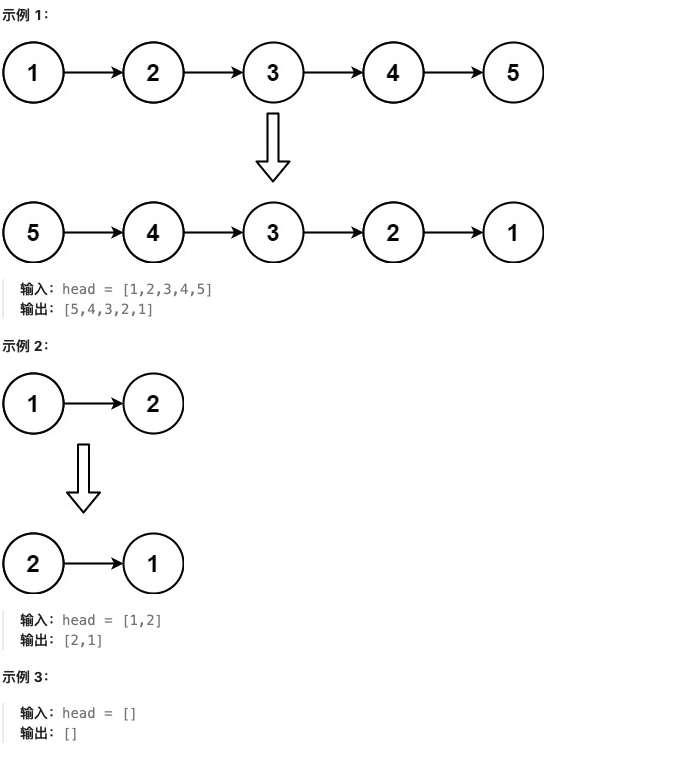

**测试用例：**

```
示例 1：
输入：head = [1,2,3,4,5]
输出：[5,4,3,2,1]

示例 2：
输入：head = [1,2]
输出：[2,1]

示例 3：
输入：head = []
输出：[]
```

**最简单实现：**

```python
def reverseList(head):
    """
    反转链表：迭代法

    思路：
    1. 使用三个指针：prev、curr、next_temp
    2. 逐个反转节点的next指针方向
    3. 移动指针继续处理下一个节点
    4. 返回新的头节点prev

    时间复杂度：O(n)
    空间复杂度：O(1)
    """
    prev = None
    curr = head

    while curr:
        # 保存下一个节点
        next_temp = curr.next
        # 反转当前节点的指针
        curr.next = prev
        # 移动prev和curr
        prev = curr
        curr = next_temp

    return prev

# 递归版本
def reverseList_recursive(head):
    """
    递归版本：反转链表

    思路：
    1. 递归到最后一个节点作为新头
    2. 反转当前节点和下一个节点的指针
    3. 返回新的头节点

    时间复杂度：O(n)
    空间复杂度：O(n)，递归栈空间
    """
    # 递归终止条件
    if not head or not head.next:
        return head

    # 递归反转后续链表
    new_head = reverseList_recursive(head.next)

    # 反转当前节点和下一个节点的指针
    head.next.next = head
    head.next = None

    return new_head

# 测试用例
# 创建链表：1 -> 2 -> 3 -> 4 -> 5
head = ListNode(1, ListNode(2, ListNode(3, ListNode(4, ListNode(5)))))
result = reverseList(head)
# 结果：5 -> 4 -> 3 -> 2 -> 1
current = result
while current:
    print(current.val, end=" -> ")
    current = current.next
print("None")
```

**解题思路详解：**

这道题的核心是**链表反转**的基本操作：

**核心原理：**
- 需要改变每个节点的next指针方向
- 从头到尾依次反转，或者递归到底层反转
- 迭代法空间效率更高，递归法代码更简洁

**迭代法流程：**
1. 初始化prev=None，curr=head
2. 保存curr.next到next_temp
3. 反转curr.next = prev
4. 移动prev=curr，curr=next_temp
5. 重复直到curr为None

**递归法流程：**
1. 递归到最后一个节点（新头）
2. 反转当前节点和后继节点的指针
3. 返回新头节点

**为什么有效？**
- 迭代法：逐步改变指针方向，空间O(1)
- 递归法：利用系统栈保存状态，代码简洁

**举例说明：**
```
原始链表：1 -> 2 -> 3 -> 4 -> 5

迭代过程：
初始：prev=None, curr=1
第一步：1.next=None, prev=1, curr=2
第二步：2.next=1, prev=2, curr=3
第三步：3.next=2, prev=3, curr=4
第四步：4.next=3, prev=4, curr=5
第五步：5.next=4, prev=5, curr=None

结果：5 -> 4 -> 3 -> 2 -> 1 ✓
```

**时间复杂度证明：**
- 每个节点只访问一次
- 时间复杂度：O(n)

**空间复杂度证明：**
- 迭代法：O(1)
- 递归法：O(n)递归栈空间

---

## 234. 回文链表

**题目描述：**

给你一个单链表的头节点 `head` ，请你判断该链表是否为回文链表。如果是，返回 `true` ；否则，返回 `false`。

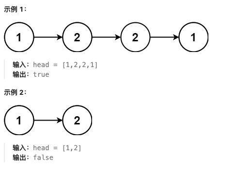

**测试用例：**

```
示例 1：
输入：head = [1,2,2,1]
输出：true

示例 2：
输入：head = [1,2]
输出：false
```

**最简单实现：**

```python
def isPalindrome(head):
    """
    回文链表：快慢指针 + 反转后半部分

    思路：
    1. 使用快慢指针找到链表中点
    2. 反转后半部分链表
    3. 比较前半部分和反转后的后半部分
    4. 恢复链表结构（可选）

    时间复杂度：O(n)
    空间复杂度：O(1)
    """
    if not head or not head.next:
        return True

    # 快慢指针找到中点，slow指针走一步，fast指针走两步，当fast指针走不动时slow指针就是中点
    slow, fast = head, head
    while fast.next and fast.next.next:
        slow = slow.next
        fast = fast.next.next

    # 反转后半部分
    second_half = reverse_list(slow.next)

    # 比较两半部分
    first_half = head
    second = second_half
    result = True

    while second:
        if first_half.val != second.val:
            result = False
            break
        first_half = first_half.val
        second = second.next

    # 恢复链表结构（可选）
    slow.next = reverse_list(second_half)

    return result

def reverse_list(head):
    """反转链表的辅助函数"""
    prev = None
    curr = head
    while curr:
        next_temp = curr.next
        curr.next = prev
        prev = curr
        curr = next_temp
    return prev

# 数组方法（空间O(n)）
def isPalindrome_array(head):
    """
    数组方法：转换为数组比较

    时间复杂度：O(n)
    空间复杂度：O(n)
    """
    vals = []
    current = head
    while current:
        vals.append(current.val)
        current = current.next

    return vals == vals[::-1]

# 测试用例
# 创建回文链表：1 -> 2 -> 2 -> 1
head1 = ListNode(1, ListNode(2, ListNode(2, ListNode(1))))
print(isPalindrome(head1))  # True

# 创建非回文链表：1 -> 2
head2 = ListNode(1, ListNode(2))
print(isPalindrome(head2))  # False
```

**解题思路详解：**

这道题的核心是**快慢指针**寻找中点，然后比较前后两半：

**核心原理：**
- 回文链表对称，前半部分等于反转后的后半部分
- 快慢指针可以找到链表中点
- 反转后半部分进行比较

**算法流程：**
1. 使用快慢指针找到链表中点
2. 反转后半部分链表
3. 同时遍历前后两半比较值
4. 恢复链表结构（面试可能要求）

**快慢指针寻找中点：**
- slow走一步，fast走两步
- 当fast无法继续时，slow在中点

**为什么有效？**
- O(1)空间复杂度找到中点
- 原地反转后半部分
- 同时遍历比较，效率高

**举例说明：**
```
链表：1 -> 2 -> 2 -> 1

快慢指针：
初始：slow=1, fast=1
第一步：slow=2, fast=2
第二步：fast无法前进，slow=2（中点）

反转后半部分：2 -> 1 变为 1 -> 2

比较：
前半部分：1 -> 2
后半部分：1 -> 2
1==1, 2==2 ✓
```

**时间复杂度证明：**
- 快慢指针：O(n)
- 反转链表：O(n)
- 比较过程：O(n)
- 总复杂度：O(n)

**空间复杂度证明：**
- 只使用常数个指针变量
- 空间复杂度：O(1)

---

## 141. 环形链表

**题目描述：**

给你一个链表的头节点 `head` ，判断链表中是否有环。

如果链表中有某个节点，可以通过连续跟踪 `next` 指针再次到达，则链表中存在环。为了表示给定链表中的环，评测系统内部使用整数 `pos` 来表示链表尾连接到链表中的位置（索引从 0 开始）。注意：`pos` **不作为参数进行传递** 。仅仅是为了标识链表的实际情况。

如果链表中存在环，则返回 `true` 。 否则，返回 false 。

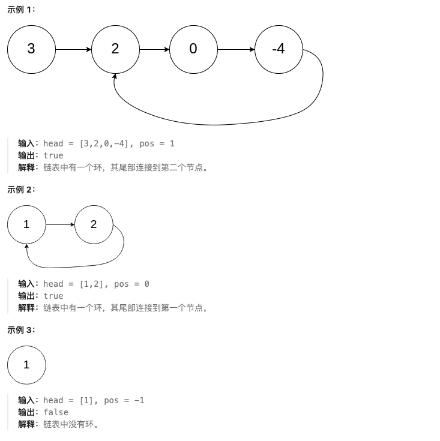

**测试用例：**

```
示例 1：
输入：head = [3,2,0,-4], pos = 1
输出：true
解释：链表中有一个环，其尾部连接到第二个节点。

示例 2：
输入：head = [1,2], pos = 0
输出：true
解释：链表中有一个环，其尾部连接到第一个节点。

示例 3：
输入：head = [1], pos = -1
输出：false
解释：链表中没有环。
```

**最简单实现：**

```python
def hasCycle(head):
    """
    环形链表：快慢指针（Floyd判圈算法）

    思路：
    1. 使用快慢指针，slow每次走一步，fast每次走两步
    2. 如果有环，快慢指针会在环内相遇
    3. 如果无环，fast会到达链表末尾

    时间复杂度：O(n)
    空间复杂度：O(1)
    """
    if not head or not head.next:
        return False

    slow, fast = head, head.next

    while fast and fast.next:
        if slow == fast:
            return True
        slow = slow.next
        fast = fast.next.next

    return False

# 哈希表方法
def hasCycle_hash(head):
    """
    哈希表方法：记录访问过的节点

    时间复杂度：O(n)
    空间复杂度：O(n)
    """
    visited = set()

    current = head
    while current:
        if current in visited:
            return True
        visited.add(current)
        current = current.next

    return False

# 测试用例
# 创建有环链表：3 -> 2 -> 0 -> -4 -> 2（环）
head = ListNode(3)
head.next = ListNode(2)
head.next.next = ListNode(0)
head.next.next.next = ListNode(-4)
head.next.next.next.next = head.next  # 创建环

print(hasCycle(head))  # True

# 创建无环链表：1 -> 2
head2 = ListNode(1, ListNode(2))
print(hasCycle(head2))  # False
```

**解题思路详解：**

这道题的核心是**Floyd判圈算法**（快慢指针）：

**核心原理：**
- 在环形跑道上，快跑者总会追上慢跑者
- 如果链表有环，快慢指针会在环内相遇
- 如果无环，快指针会先到达终点

**算法流程：**
1. 初始化slow=head，fast=head.next
2. slow每次走一步，fast每次走两步
3. 如果slow == fast，说明有环
4. 如果fast到达None，说明无环

**为什么有效？**
- 快指针每次比慢指针多走一步
- 在环中，快指针会从后面追上慢指针
- 数学证明：相遇时快指针比慢指针多走整数圈

**举例说明：**
```
有环链表：1 -> 2 -> 3 -> 4 -> 2（环）

slow: 1 -> 2 -> 3 -> 4 -> 2 -> 3
fast: 1 -> 3 -> 2 -> 4 -> 2 -> 4

当slow到达2时，fast已经在环中循环
最终fast从后面追上slow ✓
```

**时间复杂度证明：**
- 最坏情况遍历整个链表
- 时间复杂度：O(n)

**空间复杂度证明：**
- 只使用两个指针变量
- 空间复杂度：O(1)

---

## 142. 环形链表 II

**题目描述：**

给定一个链表的头节点 `head` ，返回链表开始入环的第一个节点。如果链表无环，则返回 `null`。

如果链表中有某个节点，可以通过连续跟踪 `next` 指针再次到达，则链表中存在环。为了表示给定链表中的环，评测系统内部使用整数 `pos` 来表示链表尾连接到链表中的位置（索引从 0 开始）。如果 `pos` 是 -1，则在该链表中没有环。注意：`pos` **不作为参数进行传递**，仅仅是为了标识链表的实际情况。

**不允许修改** 链表。

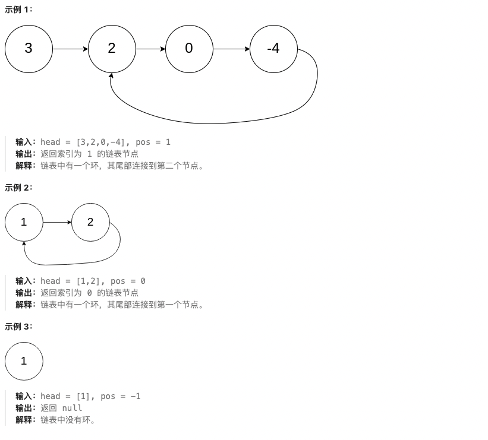

**测试用例：**

```
示例 1：
输入：head = [3,2,0,-4], pos = 1
输出：返回索引为 1 的链表节点
解释：链表中有一个环，其尾部连接到第二个节点。

示例 2：
输入：head = [1,2], pos = 0
输出：返回索引为 0 的链表节点
解释：链表中有一个环，其尾部连接到第一个节点。

示例 3：
输入：head = [1], pos = -1
输出：返回 null
```

**最简单实现：**

```python
def detectCycle(head):
    """
    环形链表 II：快慢指针 + 数学推导

    思路：
    1. 使用快慢指针判断是否有环
    2. 如果有环，找到相遇点
    3. 将一个指针重置到头节点，两个指针同时前进
    4. 相遇点即为环的入口

    时间复杂度：O(n)
    空间复杂度：O(1)
    """
    if not head or not head.next:
        return None

    # 第一阶段：快慢指针找相遇点
    slow, fast = head, head
    has_cycle = False

    while fast and fast.next:
        slow = slow.next
        fast = fast.next.next
        if slow == fast:
            has_cycle = True
            break

    if not has_cycle:
        return None

    # 第二阶段：找环的入口
    # 将slow重置到head，fast保持在相遇点
    # 两个指针同时前进，相遇点即为环入口
    slow = head
    while slow != fast:
        slow = slow.next
        fast = fast.next

    return slow

# 哈希表方法
def detectCycle_hash(head):
    """
    哈希表方法：记录访问过的节点

    时间复杂度：O(n)
    空间复杂度：O(n)
    """
    visited = set()

    current = head
    while current:
        if current in visited:
            return current
        visited.add(current)
        current = current.next

    return None

# 测试用例
# 创建有环链表：3 -> 2 -> 0 -> -4 -> 2（环入口是2）
head = ListNode(3)
head.next = ListNode(2)
head.next.next = ListNode(0)
head.next.next.next = ListNode(-4)
head.next.next.next.next = head.next  # 环入口是第二个节点

result = detectCycle(head)
print(result.val if result else None)  # 输出: 2
```

**解题思路详解：**

这道题的核心是**快慢指针的数学推导**：

**核心原理：**
- 快慢指针相遇后，一个指针回到起点
- 两个指针同时前进，相遇点即为环入口
- 利用数学关系消除环的影响

**算法流程：**
1. 快慢指针找相遇点（判断有环）
2. 一个指针回到head，另一个保持相遇点
3. 同时前进一步，相遇点即为环入口

**数学证明：**
- 设头到环入口距离为a
- 环入口到相遇点距离为b
- 相遇点到环入口距离为c
- 快指针走过：a + b + k*(b+c)
- 慢指针走过：a + b
- 快指针速度是慢指针2倍：2(a+b) = a + b + k(b+c)
- 化简得：a = (k-1)(b+c) + c

**举例说明：**
```
链表：1 -> 2 -> 3 -> 4 -> 2（环入口是2）

快慢指针相遇：
slow: 1 -> 2 -> 3 -> 4 -> 2 -> 3
fast: 1 -> 3 -> 2 -> 4 -> 2 -> 4

相遇点：4

重置slow到head：
slow: 1 -> 2
fast: 4 -> 2

相遇点：2（环入口）✓
```

**时间复杂度证明：**
- 第一阶段：O(n)
- 第二阶段：O(n)
- 总复杂度：O(n)

**空间复杂度证明：**
- 只使用常数个指针
- 空间复杂度：O(1)

---

## 21. 合并两个有序链表

**题目描述：**

将两个升序链表合并为一个新的 **升序** 链表并返回。新链表是通过拼接给定的两个链表的所有节点组成的。

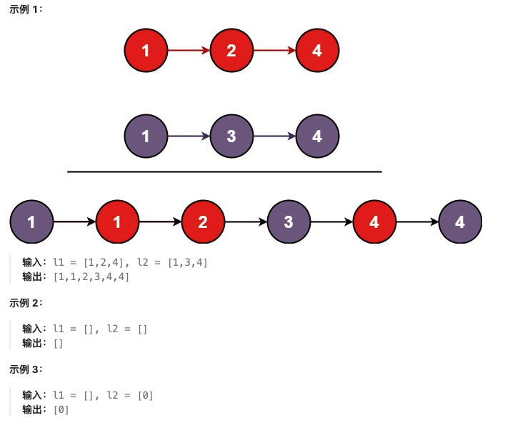

**测试用例：**

```
示例 1：
输入：l1 = [1,2,4], l2 = [1,3,4]
输出：[1,1,2,3,4,4]

示例 2：
输入：l1 = [], l2 = []
输出：[]

示例 3：
输入：l1 = [], l2 = [0]
输出：[0]
```

**最简单实现：**

```python
def mergeTwoLists(list1, list2):
    """
    合并两个有序链表：递归法

    思路：
    1. 比较两个链表头节点的值
    2. 递归合并剩余部分
    3. 返回合并后的链表

    时间复杂度：O(m + n)
    空间复杂度：O(m + n)，递归栈空间
    """
    # 递归终止条件
    if not list1:
        return list2
    if not list2:
        return list1

    # 选择较小值的节点作为新头
    if list1.val <= list2.val:
        list1.next = mergeTwoLists(list1.next, list2)
        return list1
    else:
        list2.next = mergeTwoLists(list1, list2.next)
        return list2

# 迭代版本
def mergeTwoLists_iterative(list1, list2):
    """
    迭代版本：双指针

    时间复杂度：O(m + n)
    空间复杂度：O(1)
    """
    # 创建哑节点作为新链表的头
    dummy = ListNode(-1)
    current = dummy

    while list1 and list2:
        if list1.val <= list2.val:
            current.next = list1
            list1 = list1.next
        else:
            current.next = list2
            list2 = list2.next
        current = current.next

    # 处理剩余节点
    current.next = list1 if list1 else list2

    return dummy.next

# 测试用例
# 创建链表1：1 -> 2 -> 4
list1 = ListNode(1, ListNode(2, ListNode(4)))

# 创建链表2：1 -> 3 -> 4
list2 = ListNode(1, ListNode(3, ListNode(4)))

result = mergeTwoLists(list1, list2)
# 结果：1 -> 1 -> 2 -> 3 -> 4 -> 4
current = result
while current:
    print(current.val, end=" -> ")
    current = current.next
print("None")
```

**解题思路详解：**

这道题的核心是**双指针技巧**在有序链表中的应用：

**核心原理：**
- 两个有序链表，需要保持顺序合并
- 递归法：每次选择较小头节点
- 迭代法：使用哑节点简化操作

**递归法流程：**
1. 递归终止：某个链表为空
2. 比较两个头节点，选择较小的
3. 递归合并剩余部分

**迭代法流程：**
1. 创建哑节点作为新链表头
2. 同时遍历两个链表，比较值
3. 连接较小值的节点
4. 处理剩余节点

**为什么有效？**
- 递归法：代码简洁，符合直觉
- 迭代法：空间效率高，避免栈溢出
- 都保证了合并后的有序性

**举例说明：**
```
list1: 1 -> 2 -> 4
list2: 1 -> 3 -> 4

合并过程：
比较1和1，取第一个1，剩余：2->4 和 1->3->4
比较2和1，取1，剩余：2->4 和 3->4
比较2和3，取2，剩余：4 和 3->4
比较4和3，取3，剩余：4 和 4
比较4和4，取4，剩余：None 和 4
取最后一个4

结果：1 -> 1 -> 2 -> 3 -> 4 -> 4 ✓
```

**时间复杂度证明：**
- 每个节点只访问一次
- 时间复杂度：O(m + n)

**空间复杂度证明：**
- 递归法：O(m + n)栈空间
- 迭代法：O(1)

---

## 2. 两数相加

**题目描述：**

给你两个 **非空** 的链表，表示两个非负的整数。它们每位数字都是按照 **逆序** 的方式存储的，并且每个节点只能存储 **一位** 数字。

请你将两个数相加，并以相同形式返回一个表示和的链表。

你可以假设除了数字 0 之外，这两个数都不会以 0 开头。

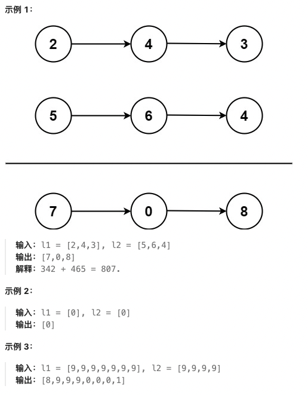

**测试用例：**

```
示例 1：
输入：l1 = [2,4,3], l2 = [5,6,4]
输出：[7,0,8]
解释：342 + 465 = 807.

示例 2：
输入：l1 = [0], l2 = [0]
输出：[0]

示例 3：
输入：l1 = [9,9,9,9,9,9,9], l2 = [9,9,9,9]
输出：[8,9,9,9,0,0,0,1]
```

**最简单实现：**

```python
def addTwoNumbers(l1, l2):
    """
    两数相加：模拟加法过程

    思路：
    1. 使用哑节点简化链表操作
    2. 同时遍历两个链表，模拟加法过程
    3. 处理进位carry，注意最后可能还有进位
    4. 返回哑节点的下一个节点

    时间复杂度：O(max(m,n))
    空间复杂度：O(max(m,n))
    """
    # 创建哑节点
    dummy = ListNode(0)
    current = dummy

    carry = 0

    # 同时遍历两个链表
    while l1 or l2 or carry:
        # 获取当前位的值
        val1 = l1.val if l1 else 0
        val2 = l2.val if l2 else 0

        # 计算和与进位
        total = val1 + val2 + carry
        carry = total // 10
        digit = total % 10

        # 创建新节点
        current.next = ListNode(digit)
        current = current.next

        # 移动指针
        if l1:
            l1 = l1.next
        if l2:
            l2 = l2.next

    return dummy.next

# 测试用例
# 创建链表1：2 -> 4 -> 3 (表示342)
l1 = ListNode(2, ListNode(4, ListNode(3)))

# 创建链表2：5 -> 6 -> 4 (表示465)
l2 = ListNode(5, ListNode(6, ListNode(4)))

result = addTwoNumbers(l1, l2)
# 结果：7 -> 0 -> 8 (表示807)
current = result
while current:
    print(current.val, end=" -> ")
    current = current.next
print("None")
```

**解题思路详解：**

这道题的核心是**模拟手工加法过程**：

**核心原理：**
- 链表逆序存储，正好符合加法从低位开始
- 需要处理进位，注意最高位可能产生进位
- 使用哑节点简化边界情况处理

**算法流程：**
1. 创建哑节点和当前指针
2. 初始化进位carry为0
3. 同时遍历两个链表和进位
4. 计算当前位和与新进位
5. 创建新节点存储当前位
6. 移动指针继续处理

**为什么有效？**
- 链表逆序存储天然适合加法
- 进位处理完整，不会遗漏
- 哑节点避免处理空链表的边界情况

**举例说明：**
```
l1: 2 -> 4 -> 3 (342)
l2: 5 -> 6 -> 4 (465)

加法过程：
  342
+ 465
------
  807

链表计算：
位0：2+5+0=7, 进位0 -> 7
位1：4+6+0=10, 进位1 -> 0
位2：3+4+1=8, 进位0 -> 8

结果：7 -> 0 -> 8 ✓
```

**时间复杂度证明：**
- 遍历较长链表的所有节点
- 时间复杂度：O(max(m,n))

**空间复杂度证明：**
- 新链表长度最多为max(m,n)+1
- 空间复杂度：O(max(m,n))

---

## 19. 删除链表的倒数第 N 个结点

**题目描述：**

给你一个链表，删除链表的倒数第 `n` 个结点，并且返回链表的头结点。

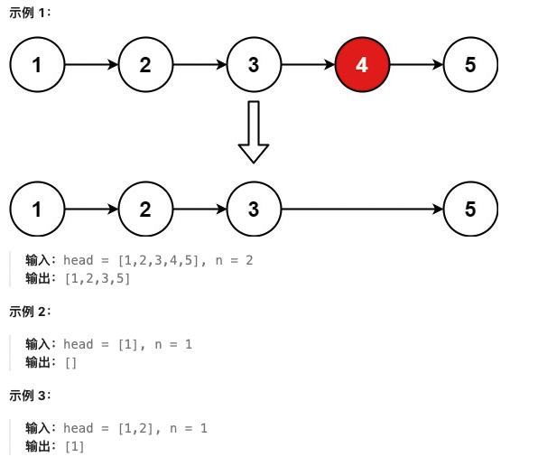

**测试用例：**

```
示例 1：
输入：head = [1,2,3,4,5], n = 2
输出：[1,2,3,5]

示例 2：
输入：head = [1], n = 1
输出：[]

示例 3：
输入：head = [1,2], n = 1
输出：[1]
```

**最简单实现：**

```python
def removeNthFromEnd(head, n):
    """
    删除倒数第N个结点：双指针法

    思路：
    1. 使用哑节点处理头节点删除的情况
    2. 快指针先走n步
    3. 快慢指针同时前进，保持n步距离
    4. 快指针到达末尾时，慢指针指向要删除节点的前一个

    时间复杂度：O(L)，L为链表长度
    空间复杂度：O(1)
    """
    # 创建哑节点
    dummy = ListNode(0, head)

    # 快慢指针
    fast = dummy
    slow = dummy

    # 快指针先走n+1步（因为有哑节点）
    for _ in range(n + 1):
        fast = fast.next

    # 快慢指针同时前进
    while fast:
        fast = fast.next
        slow = slow.next

    # 删除节点：slow.next就是要删除的节点
    slow.next = slow.next.next

    return dummy.next

# 测试用例
# 创建链表：1 -> 2 -> 3 -> 4 -> 5
head = ListNode(1, ListNode(2, ListNode(3, ListNode(4, ListNode(5)))))

result = removeNthFromEnd(head, 2)
# 结果：1 -> 2 -> 3 -> 5
current = result
while current:
    print(current.val, end=" -> ")
    current = current.next
print("None")
```

**解题思路详解：**

这道题的核心是**双指针技巧**找到倒数第n个节点：

**核心原理：**
- 快指针先走n步建立距离
- 快慢指针同时前进，距离保持n
- 快指针到达末尾时，慢指针指向目标

**算法流程：**
1. 创建哑节点处理边界情况
2. 快指针先走n+1步（哑节点算一步）
3. 快慢指针同时前进
4. 快指针为None时，删除slow.next

**为什么有效？**
- 快指针先走n步建立领先距离
- 同时前进保持距离不变
- 当快指针到达末尾，慢指针正好在目标前

**举例说明：**
```
链表：1 -> 2 -> 3 -> 4 -> 5, n=2

快指针先走3步（n+1）：到达3
慢指针在哑节点

同时前进：
快：3 -> 4 -> 5 -> None
慢：哑 -> 1 -> 2 -> 3

删除slow.next（值为4）
结果：1 -> 2 -> 3 -> 5 ✓
```

**时间复杂度证明：**
- 单次遍历链表
- 时间复杂度：O(L)

**空间复杂度证明：**
- 只使用常数个指针
- 空间复杂度：O(1)

---

## 24. 两两交换链表中的节点

**题目描述：**

给你一个链表，两两交换其中相邻的节点，并返回交换后链表的头节点。你必须在不修改节点内部的值的情况下完成本题（即，只能进行节点交换）。

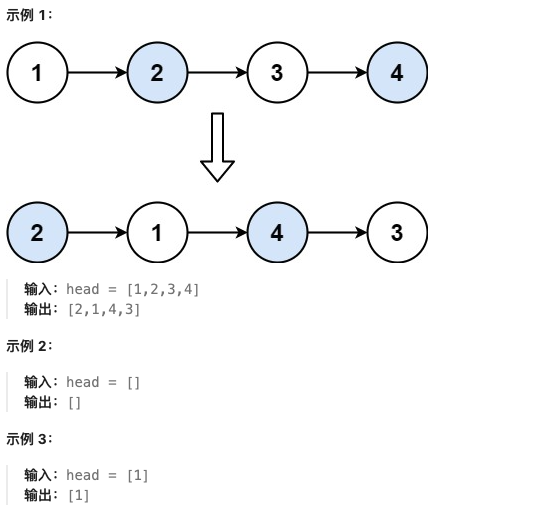

**测试用例：**

```
示例 1：
输入：head = [1,2,3,4]
输出：[2,1,4,3]

示例 2：
输入：head = []
输出：[]

示例 3：
输入：head = [1]
输出：[1]
```

**最简单实现：**

```python
def swapPairs(head):
    """
    两两交换节点：迭代法

    思路：
    1. 使用哑节点简化操作
    2. 每次交换一对相邻节点
    3. 更新指针指向下一对
    4. 返回哑节点的下一个节点

    时间复杂度：O(n)
    空间复杂度：O(1)
    """
    # 创建哑节点
    dummy = ListNode(0, head)
    current = dummy

    while current.next and current.next.next:
        # 保存要交换的两个节点
        first = current.next
        second = current.next.next

        # 交换节点
        first.next = second.next  # first指向second的下一个
        second.next = first       # second指向first
        current.next = second     # current指向second

        # 移动到下一对
        current = first

    return dummy.next

# 递归版本
def swapPairs_recursive(head):
    """
    递归版本：两两交换

    时间复杂度：O(n)
    空间复杂度：O(n)，递归栈空间
    """
    # 递归终止条件
    if not head or not head.next:
        return head

    # 保存下一对的头节点
    next_pair = head.next.next

    # 交换当前一对
    new_head = head.next
    new_head.next = head
    head.next = swapPairs_recursive(next_pair)

    return new_head

# 测试用例
# 创建链表：1 -> 2 -> 3 -> 4
head = ListNode(1, ListNode(2, ListNode(3, ListNode(4))))

result = swapPairs(head)
# 结果：2 -> 1 -> 4 -> 3
current = result
while current:
    print(current.val, end=" -> ")
    current = current.next
print("None")
```

**解题思路详解：**

这道题的核心是**链表节点的原地交换**：

**核心原理：**
- 不能修改节点值，只能改变next指针
- 每次处理两个相邻节点
- 需要正确维护前后节点的连接

**迭代法流程：**
1. 创建哑节点简化边界处理
2. 遍历链表，每次处理一对节点
3. 重新连接：current -> second -> first -> ...
4. 移动current到下一对起始位置

**递归法流程：**
1. 递归处理后半部分
2. 交换当前一对节点
3. 返回新的头节点

**为什么有效？**
- 哑节点避免处理头节点的特殊情况
- 每次交换只改变必要的指针
- 递归法利用系统栈，代码更简洁

**举例说明：**
```
链表：1 -> 2 -> 3 -> 4

第一对交换：
current(哑) -> 1 -> 2 -> 3 -> 4
变为：
current(哑) -> 2 -> 1 -> 3 -> 4

第二对交换：
current(1) -> 3 -> 4
变为：
current(1) -> 4 -> 3

最终结果：2 -> 1 -> 4 -> 3 ✓
```

**时间复杂度证明：**
- 每个节点访问一次
- 时间复杂度：O(n)

**空间复杂度证明：**
- 迭代法：O(1)
- 递归法：O(n)栈空间

---

## 25. K 个一组翻转链表

**题目描述：**

给你链表的头节点 `head` ，每 `k` 个节点一组进行翻转，请你返回修改后的链表。

`k` 是一个正整数，它的值小于或等于链表的长度。如果节点总数不是 `k` 的整数倍，那么请将最后剩余的节点保持原有顺序。

你不能只是单纯的改变节点内部的值，而是需要实际进行节点交换。

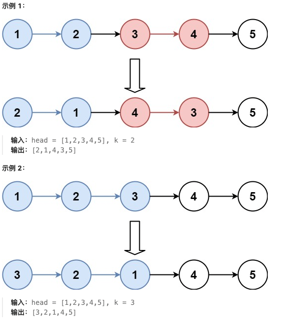

**测试用例：**

```
示例 1：
输入：head = [1,2,3,4,5], k = 2
输出：[2,1,4,3,5]

示例 2：
输入：head = [1,2,3,4,5], k = 3
输出：[3,2,1,4,5]
```

**最简单实现：**

```python
def reverseKGroup(head, k):
    """
    K个一组翻转链表：递归法

    思路：
    1. 检查剩余节点是否够k个
    2. 如果够k个，反转这k个节点
    3. 递归处理剩余部分
    4. 连接反转后的组

    时间复杂度：O(n)
    空间复杂度：O(1)，除了递归栈
    """
    def reverse_list(start, end):
        """反转链表的辅助函数"""
        prev = None
        curr = start
        while curr != end:
            next_temp = curr.next
            curr.next = prev
            prev = curr
            curr = next_temp
        return prev

    # 检查是否够k个节点
    count = 0
    current = head
    while current and count < k:
        current = current.next
        count += 1

    if count < k:
        return head

    # 反转前k个节点
    new_head = reverse_list(head, current)

    # 递归处理剩余部分
    head.next = reverseKGroup(current, k)

    return new_head

# 迭代版本
def reverseKGroup_iterative(head, k):
    """
    迭代版本：K组翻转

    时间复杂度：O(n)
    空间复杂度：O(1)
    """
    def reverse_list(start, end):
        prev = end
        curr = start
        while curr != end:
            next_temp = curr.next
            curr.next = prev
            prev = curr
            curr = next_temp
        return prev

    # 创建哑节点
    dummy = ListNode(0, head)
    prev_group_end = dummy

    while True:
        # 找到当前组的结束位置
        group_start = prev_group_end.next
        group_end = prev_group_end

        for _ in range(k):
            group_end = group_end.next
            if not group_end:
                return dummy.next

        # 反转当前组
        next_group_start = group_end.next
        new_group_start = reverse_list(group_start, next_group_start)

        # 连接前后组
        prev_group_end.next = new_group_start
        group_start.next = next_group_start

        # 更新prev_group_end
        prev_group_end = group_start

# 测试用例
# 创建链表：1 -> 2 -> 3 -> 4 -> 5
head = ListNode(1, ListNode(2, ListNode(3, ListNode(4, ListNode(5)))))

result = reverseKGroup(head, 2)
# 结果：2 -> 1 -> 4 -> 3 -> 5
current = result
while current:
    print(current.val, end=" -> ")
    current = current.next
print("None")
```

**解题思路详解：**

这道题的核心是**分段反转链表**：

**核心原理：**
- 每k个节点为一组进行反转
- 剩余不足k个的节点保持原序
- 需要找到每组的起始和结束位置

**递归法流程：**
1. 检查剩余节点是否够k个
2. 如果够k个，反转当前组
3. 递归处理下一组
4. 连接反转后的各组

**迭代法流程：**
1. 使用哑节点简化操作
2. 循环处理每一组
3. 反转当前组并正确连接

**为什么有效？**
- 递归法：自然的分治思想
- 迭代法：更好的空间效率
- 都保证了不足k个节点的原序

**举例说明：**
```
链表：1 -> 2 -> 3 -> 4 -> 5, k=2

第一组：1 -> 2 反转为 2 -> 1
第二组：3 -> 4 反转为 4 -> 3
剩余：5 保持原序

结果：2 -> 1 -> 4 -> 3 -> 5 ✓
```

**时间复杂度证明：**
- 每个节点只访问常数次
- 时间复杂度：O(n)

**空间复杂度证明：**
- 递归法：O(n/k)栈空间
- 迭代法：O(1)

---

## 138. 随机链表的复制

**题目描述：**

给你一个长度为 n 的链表，每个节点包含一个额外增加的随机指针 `random` ，该指针可以指向链表中的任何节点或空节点。

构造这个链表的 **深拷贝**。 深拷贝应该正好由 n 个 **全新** 节点组成，其中每个新节点的值都设为其对应的原节点的值。新节点的 `next` 指针和 `random` 指针也都应指向复制链表中的新节点，并使原链表和复制链表中的这些指针能够表示相同的链表状态。复制链表中的指针都不应指向原链表中的节点 。

例如，如果原链表中有 X 和 Y 两个节点，其中 X.random --> Y 。那么在复制链表中对应的两个节点 x 和 y ，同样有 x.random --> y 。

返回复制链表的头节点。

用一个由 n 个节点组成的链表来表示输入/输出中的链表。每个节点用一个 `[val, random_index]` 表示：

- `val`：一个表示 `Node.val` 的整数。
- `random_index`：随机指针指向的节点索引（范围从 **0** 到 **n-1**）；如果不指向任何节点，则为 **null** 。

你的代码 **只** 接受原链表的头节点 `head` 作为传入参数。

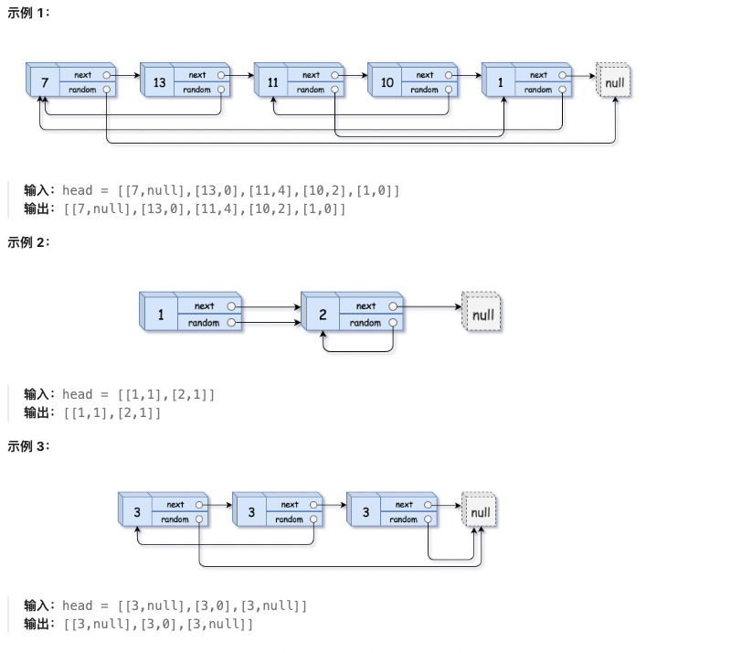

**测试用例：**

```
示例 1：
输入：head = [[7,null],[13,0],[11,4],[10,2],[1,0]]
输出：[[7,null],[13,0],[11,4],[10,2],[1,0]]

示例 2：
输入：head = [[1,1],[2,1]]
输出：[[1,1],[2,1]]

示例 3：
输入：head = [[3,null],[3,0],[3,null]]
输出：[[3,null],[3,0],[3,null]]
```

**最简单实现：**

```python
class Node:
    def __init__(self, val=0, next=None, random=None):
        self.val = val
        self.next = next
        self.random = random

def copyRandomList(head):
    """
    随机链表的复制：哈希表法

    思路：
    1. 使用哈希表存储原节点到新节点的映射
    2. 第一次遍历：创建所有新节点，建立映射关系
    3. 第二次遍历：设置新节点的next和random指针
    4. 返回新链表的头节点

    时间复杂度：O(n)
    空间复杂度：O(n)
    """
    if not head:
        return None

    # 哈希表：原节点 -> 新节点
    node_map = {}

    # 第一次遍历：创建新节点
    current = head
    while current:
        node_map[current] = Node(current.val)
        current = current.next

    # 第二次遍历：设置指针
    current = head
    while current:
        new_node = node_map[current]
        if current.next:
            new_node.next = node_map[current.next]
        if current.random:
            new_node.random = node_map[current.random]
        current = current.next

    return node_map[head]

# 节点拆分法（空间O(1)）
def copyRandomList_split(head):
    """
    节点拆分法：原地复制，空间O(1)

    时间复杂度：O(n)
    空间复杂度：O(1)
    """
    if not head:
        return None

    # 第一步：在原链表每个节点后插入新节点
    current = head
    while current:
        new_node = Node(current.val, current.next)
        current.next = new_node
        current = new_node.next

    # 第二步：设置random指针
    current = head
    while current:
        if current.random:
            current.next.random = current.random.next
        current = current.next.next

    # 第三步：拆分链表
    old_head = head
    new_head = head.next
    old_current = old_head
    new_current = new_head

    while old_current:
        old_current.next = old_current.next.next
        if new_current.next:
            new_current.next = new_current.next.next

        old_current = old_current.next
        new_current = new_current.next

    return new_head

# 测试用例
# 创建随机链表
node1 = Node(7)
node2 = Node(13)
node3 = Node(11)
node4 = Node(10)
node5 = Node(1)

node1.next = node2
node2.next = node3
node3.next = node4
node4.next = node5

node2.random = node1
node3.random = node5
node4.random = node3
node5.random = node1

result = copyRandomList(node1)
print("复制成功")
```

**解题思路详解：**

这道题的核心是**深拷贝包含随机指针的链表**：

**核心原理：**
- 需要复制next和random两个指针
- 不能破坏原链表结构
- 哈希表法：空间换时间
- 节点拆分法：空间优化到O(1)

**哈希表法流程：**
1. 创建原节点到新节点的映射
2. 复制所有节点，建立映射关系
3. 设置新节点的next和random指针

**节点拆分法流程：**
1. 在每个原节点后插入新节点
2. 设置新节点的random指针
3. 拆分原链表和新链表

**为什么有效？**
- 哈希表法：清晰简单，易于理解
- 节点拆分法：巧妙利用链表结构
- 都保证了深拷贝的完整性

**举例说明：**
```
原链表：
A(7) -> B(13) -> C(11)
|       |        |
null    A       null

复制后：
A'(7) -> B'(13) -> C'(11)
|        |        |
null     A'      null

哈希表：{A:A', B:B', C:C'}
```

**时间复杂度证明：**
- 三次遍历链表
- 时间复杂度：O(n)

**空间复杂度证明：**
- 哈希表法：O(n)
- 节点拆分法：O(1)

---

## 148. 排序链表

**题目描述：**

给你链表的头结点 `head` ，请将其按 **升序** 排列并返回 **排序后的链表** 。

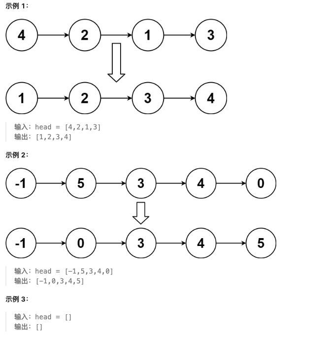

**测试用例：**

```
示例 1：
输入：head = [4,2,1,3]
输出：[1,2,3,4]

示例 2：
输入：head = [-1,5,3,4,0]
输出：[-1,0,3,4,5]

示例 3：
输入：head = []
输出：[]
```

**最简单实现：**

```python
def sortList(head):
    """
    排序链表：归并排序

    思路：
    1. 使用归并排序的思想
    2. 快慢指针找到链表中点
    3. 递归排序左右两半
    4. 合并两个有序链表

    时间复杂度：O(n log n)
    空间复杂度：O(log n)，递归栈空间
    """
    def merge_two_lists(l1, l2):
        """合并两个有序链表的辅助函数"""
        dummy = ListNode(0)
        current = dummy

        while l1 and l2:
            if l1.val <= l2.val:
                current.next = l1
                l1 = l1.next
            else:
                current.next = l2
                l2 = l2.next
            current = current.next

        current.next = l1 if l1 else l2
        return dummy.next

    def find_middle(head):
        """快慢指针找中点"""
        slow, fast = head, head.next
        while fast and fast.next:
            slow = slow.next
            fast = fast.next.next
        return slow

    # 递归终止条件
    if not head or not head.next:
        return head

    # 找到中点
    middle = find_middle(head)

    # 分割链表
    right_head = middle.next
    middle.next = None

    # 递归排序左右两半
    left_sorted = sortList(head)
    right_sorted = sortList(right_head)

    # 合并两个有序链表
    return merge_two_lists(left_sorted, right_sorted)

# 自底向上归并排序（空间O(1)）
def sortList_bottom_up(head):
    """
    自底向上归并排序：空间O(1)

    时间复杂度：O(n log n)
    空间复杂度：O(1)
    """
    def merge(l1, l2):
        dummy = ListNode(0)
        curr = dummy
        while l1 and l2:
            if l1.val <= l2.val:
                curr.next = l1
                l1 = l1.next
            else:
                curr.next = l2
                l2 = l2.next
            curr = curr.next
        curr.next = l1 or l2
        return dummy.next

    if not head or not head.next:
        return head

    # 计算链表长度
    length = 0
    node = head
    while node:
        length += 1
        node = node.next

    # 自底向上归并
    dummy = ListNode(0, head)
    sub_length = 1

    while sub_length < length:
        prev = dummy
        curr = dummy.next

        while curr:
            # 找到第一段
            head1 = curr
            for _ in range(1, sub_length):
                if curr:
                    curr = curr.next

            if not curr:
                break

            # 找到第二段
            head2 = curr.next
            curr.next = None  # 断开第一段
            curr = head2

            for _ in range(1, sub_length):
                if curr:
                    curr = curr.next

            next_head = None
            if curr:
                next_head = curr.next
                curr.next = None  # 断开第二段

            # 合并两段
            merged = merge(head1, head2)
            prev.next = merged

            # 移动到下一组
            while prev.next:
                prev = prev.next
            curr = next_head

        sub_length *= 2

    return dummy.next

# 测试用例
# 创建链表：4 -> 2 -> 1 -> 3
head = ListNode(4, ListNode(2, ListNode(1, ListNode(3))))

result = sortList(head)
# 结果：1 -> 2 -> 3 -> 4
current = result
while current:
    print(current.val, end=" -> ")
    current = current.next
print("None")
```

**解题思路详解：**

这道题的核心是**链表的归并排序**：

**核心原理：**
- 归并排序适合链表：可以原地排序
- 自顶向下：递归分治
- 自底向上：迭代，空间O(1)

**自顶向下流程：**
1. 快慢指针找到中点
2. 递归排序左右两半
3. 合并两个有序链表

**自底向上流程：**
1. 从长度1开始，两两合并
2. 逐步增大子链表长度
3. 直到整个链表有序

**为什么有效？**
- 归并排序稳定，适合链表
- 自底向上避免递归栈空间
- 充分利用链表的特性

**举例说明：**
```
链表：4 -> 2 -> 1 -> 3

第一次分割：
左：4 -> 2    右：1 -> 3

递归排序：
左：2 -> 4    右：1 -> 3

合并：
1 -> 2 -> 3 -> 4 ✓
```

**时间复杂度证明：**
- 归并排序的标准复杂度
- 时间复杂度：O(n log n)

**空间复杂度证明：**
- 自顶向下：O(log n)栈空间
- 自底向上：O(1)

---

## 23. 合并 K 个升序链表

**题目描述：**

给你一个链表数组，每个链表都已经按升序排列。

请你将所有链表合并到一个升序链表中，返回合并后的链表。

**测试用例：**

```
示例 1：
输入：lists = [[1,4,5],[1,3,4],[2,6]]
输出：[1,1,2,3,4,4,5,6]

示例 2：
输入：lists = []
输出：[]

示例 3：
输入：lists = [[]]
输出：[]
```

**最简单实现：**

```python
def mergeKLists(lists):
    """
    合并K个有序链表：分治法

    思路：
    1. 使用分治的思想，将k个链表两两合并
    2. 递归地将问题分解为子问题
    3. 最终合并为一个有序链表

    时间复杂度：O(n log k)，n为总节点数
    空间复杂度：O(log k)，递归栈空间
    """
    def merge_two_lists(l1, l2):
        """合并两个有序链表"""
        if not l1:
            return l2
        if not l2:
            return l1

        if l1.val <= l2.val:
            l1.next = merge_two_lists(l1.next, l2)
            return l1
        else:
            l2.next = merge_two_lists(l1, l2.next)
            return l2

    def merge_lists(lists, left, right):
        """递归合并链表数组"""
        if left > right:
            return None
        if left == right:
            return lists[left]

        mid = (left + right) // 2
        left_merged = merge_lists(lists, left, mid)
        right_merged = merge_lists(lists, mid + 1, right)

        return merge_two_lists(left_merged, right_merged)

    if not lists:
        return None

    return merge_lists(lists, 0, len(lists) - 1)

# 优先队列法
import heapq

def mergeKLists_heap(lists):
    """
    优先队列法：使用最小堆

    时间复杂度：O(n log k)
    空间复杂度：O(k)
    """
    if not lists:
        return None

    # 创建最小堆
    heap = []
    for i, lst in enumerate(lists):
        if lst:
            heapq.heappush(heap, (lst.val, i, lst))

    dummy = ListNode(0)
    current = dummy

    while heap:
        # 弹出最小值
        val, idx, node = heapq.heappop(heap)

        # 添加到结果链表
        current.next = node
        current = current.next

        # 如果还有下一个节点，加入堆
        if node.next:
            heapq.heappush(heap, (node.next.val, idx, node.next))

    return dummy.next

# 测试用例
# 创建三个有序链表
list1 = ListNode(1, ListNode(4, ListNode(5)))
list2 = ListNode(1, ListNode(3, ListNode(4)))
list3 = ListNode(2, ListNode(6))

lists = [list1, list2, list3]
result = mergeKLists(lists)
# 结果：1 -> 1 -> 2 -> 3 -> 4 -> 4 -> 5 -> 6
current = result
while current:
    print(current.val, end=" -> ")
    current = current.next
print("None")
```

**解题思路详解：**

这道题的核心是**多路归并**问题：

**核心原理：**
- k个有序链表的合并
- 分治法：将问题分解为子问题
- 优先队列：维护k个链表的当前最小值

**分治法流程：**
1. 递归地将k个链表分成两半
2. 分别合并左右两半
3. 合并两个有序链表的结果

**优先队列法流程：**
1. 将k个链表头节点加入最小堆
2. 每次取出最小值节点
3. 将该节点的下一个节点加入堆

**为什么有效？**
- 分治法：时间复杂度最优
- 优先队列：实现简单，适合小k值
- 都保证了最终结果的有序性

**举例说明：**
```
三个链表：
[1,4,5], [1,3,4], [2,6]

分治合并：
第一轮：合并[1,4,5]和[1,3,4] -> [1,1,3,4,4,5]
第二轮：合并[1,1,3,4,4,5]和[2,6] -> [1,1,2,3,4,4,5,6]

结果：[1,1,2,3,4,4,5,6] ✓
```

**时间复杂度证明：**
- 分治法：O(n log k)
- 优先队列：O(n log k)
- 都是最优复杂度

**空间复杂度证明：**
- 分治法：O(log k)栈空间
- 优先队列：O(k)堆空间

---

## 146. LRU 缓存

**题目描述：**

请你设计并实现一个满足 **LRU (最近最少使用) 缓存** 约束的数据结构。

实现 `LRUCache` 类：

- `LRUCache(int capacity)` 以 **正整数** 作为容量 `capacity` 初始化 LRU 缓存
- `int get(int key)` 如果关键字 `key` 存在于缓存中，则返回关键字的值，否则返回 -1 。
- `void put(int key, int value)` 如果关键字 `key` 已经存在，则变更其数据值 `value` ；如果不存在，则向缓存中插入该组 `key-value` 。如果插入操作导致关键字数量超过 `capacity` ，则应该 **逐出** 最久未使用的关键字。

函数 `get` 和 `put` 必须以 **O(1)** 的平均时间复杂度运行。

**测试用例：**

```
示例：

输入
["LRUCache", "put", "put", "get", "put", "get", "put", "get", "get", "get"]
[[2], [1, 1], [2, 2], [1], [3, 3], [2], [4, 4], [1], [3], [4]]

输出
[null, null, null, 1, null, -1, null, -1, 3, 4]

解释
LRUCache lRUCache = new LRUCache(2);
lRUCache.put(1, 1); // 缓存是 {1=1}
lRUCache.put(2, 2); // 缓存是 {1=1, 2=2}
lRUCache.get(1);    // 返回 1
lRUCache.put(3, 3); // 该操作会使得关键字 2 作废，缓存是 {1=1, 3=3}
lRUCache.get(2);    // 返回 -1 (未找到)
lRUCache.put(4, 4); // 该操作会使得关键字 1 作废，缓存是 {4=4, 3=3}
lRUCache.get(1);    // 返回 -1 (未找到)
lRUCache.get(3);    // 返回 3
lRUCache.get(4);    // 返回 4
```

**最简单实现：**

```python
class LRUCache:
    """
    LRU缓存：双链表 + 哈希表

    思路：
    1. 使用双链表维护访问顺序：最近访问的在头部
    2. 使用哈希表存储key到节点的映射
    3. get操作：将节点移到头部，返回值
    4. put操作：更新或插入，超出容量时删除尾部节点

    时间复杂度：O(1)
    空间复杂度：O(capacity)
    """

    class DoublyLinkedNode:
        def __init__(self, key=0, val=0):
            self.key = key
            self.val = val
            self.prev = None
            self.next = None

    def __init__(self, capacity: int):
        self.capacity = capacity
        self.cache = {}  # key -> node

        # 创建哑节点
        self.head = self.DoublyLinkedNode()
        self.tail = self.DoublyLinkedNode()
        self.head.next = self.tail
        self.tail.prev = self.head

    def _remove_node(self, node):
        """从链表中移除节点"""
        node.prev.next = node.next
        node.next.prev = node.prev

    def _add_to_head(self, node):
        """将节点添加到头部"""
        node.next = self.head.next
        node.prev = self.head
        self.head.next.prev = node
        self.head.next = node

    def _move_to_head(self, node):
        """将节点移到头部"""
        self._remove_node(node)
        self._add_to_head(node)

    def _remove_tail(self):
        """移除尾部节点"""
        node = self.tail.prev
        self._remove_node(node)
        return node

    def get(self, key: int) -> int:
        if key not in self.cache:
            return -1

        node = self.cache[key]
        self._move_to_head(node)
        return node.val

    def put(self, key: int, value: int) -> None:
        if key in self.cache:
            # 更新值，移到头部
            node = self.cache[key]
            node.val = value
            self._move_to_head(node)
        else:
            # 新增节点
            node = self.DoublyLinkedNode(key, value)
            self.cache[key] = node
            self._add_to_head(node)

            # 检查容量
            if len(self.cache) > self.capacity:
                # 移除尾部节点
                tail_node = self._remove_tail()
                del self.cache[tail_node.key]

# 测试用例
cache = LRUCache(2)

cache.put(1, 1)
cache.put(2, 2)
print(cache.get(1))    # 返回 1
cache.put(3, 3)        # 移除 key 2
print(cache.get(2))    # 返回 -1
cache.put(4, 4)        # 移除 key 1
print(cache.get(1))    # 返回 -1
print(cache.get(3))    # 返回 3
print(cache.get(4))    # 返回 4
```

**解题思路详解：**

这道题的核心是**LRU缓存的实现**：

**核心原理：**
- LRU：最近最少使用的淘汰策略
- 需要O(1)时间的get和put操作
- 双链表维护访问顺序，哈希表提供快速查找

**数据结构设计：**
1. 双链表：维护访问顺序
2. 哈希表：key到节点的映射
3. 哑节点：简化边界操作

**get操作：**
1. 从哈希表查找节点
2. 不存在返回-1
3. 存在则移到头部，返回值

**put操作：**
1. 如果key存在，更新值并移到头部
2. 如果不存在，创建新节点添加到头部
3. 如果超出容量，删除尾部节点

**为什么有效？**
- 双链表：O(1)删除任意节点
- 哈希表：O(1)查找节点
- 组合使用达到LRU的所有要求

**举例说明：**
```
容量为2的LRU缓存：

put(1,1): 头[1]尾
put(2,2): 头[2,1]尾
get(1):   头[1,2]尾 (1移到头部)
put(3,3): 头[3,1]尾 (2被淘汰)
put(4,4): 头[4,3]尾 (1被淘汰)

访问顺序：4 -> 3 ✓
```

**时间复杂度证明：**
- 所有操作都是O(1)
- 双链表和哈希表的操作都是常数时间

**空间复杂度证明：**
- 存储capacity个节点
- 空间复杂度：O(capacity)

---

## 🎯 链表解题技巧总结

### 1. 双指针技巧

#### 快慢指针
```python
# 找中点
slow = fast = head
while fast and fast.next:
    slow = slow.next
    fast = fast.next.next

# 环检测
slow = fast = head
while fast and fast.next:
    slow = slow.next
    fast = fast.next.next
    if slow == fast:
        return True
```

#### 相交链表
```python
pA, pB = headA, headB
while pA != pB:
    pA = pA.next if pA else headB
    pB = pB.next if pB else headA
return pA
```

#### 删除倒数第N个
```python
fast = slow = dummy
for _ in range(n + 1):
    fast = fast.next
while fast:
    fast = fast.next
    slow = slow.next
slow.next = slow.next.next
```

### 2. 链表反转

#### 迭代反转
```python
def reverse_list(head):
    prev = None
    curr = head
    while curr:
        next_temp = curr.next
        curr.next = prev
        prev = curr
        curr = next_temp
    return prev
```

#### 递归反转
```python
def reverse_list_recursive(head):
    if not head or not head.next:
        return head
    new_head = reverse_list_recursive(head.next)
    head.next.next = head
    head.next = None
    return new_head
```

### 3. 哑节点技巧

```python
# 处理头节点特殊情况
dummy = ListNode(0, head)
current = dummy
# ... 操作 ...
return dummy.next
```

### 4. 归并排序链表

```python
def sortList(head):
    if not head or not head.next:
        return head

    # 找中点
    slow = head
    fast = head.next
    while fast and fast.next:
        slow = slow.next
        fast = fast.next.next

    # 分割
    right_head = slow.next
    slow.next = None

    # 递归排序
    left = sortList(head)
    right = sortList(right_head)

    # 合并
    return merge(left, right)
```

### 💡 解题技巧

1. **边界条件处理**：
   - 空链表：`if not head`
   - 单节点：`if not head.next`
   - 哑节点：简化头节点操作

2. **快慢指针应用**：
   - 找中点：快指针走两步，慢指针走一步
   - 环检测：快慢相遇则有环
   - 倒数第N个：快指针先走N步

3. **递归思维**：
   - 反转链表：递归到底层反转
   - 两两交换：递归处理剩余部分
   - K组翻转：递归处理下一组

4. **原地操作**：
   - 反转链表：只改变指针，不改变值
   - 节点交换：只改变next指针
   - 深拷贝：正确处理random指针

5. **时间空间优化**：
   - 空间O(1)：使用双指针
   - 时间O(n)：单次遍历
   - 递归优化：改为迭代避免栈溢出

链表是数据结构的基础，掌握指针操作和常见技巧，能解决很多实际问题！🚀
